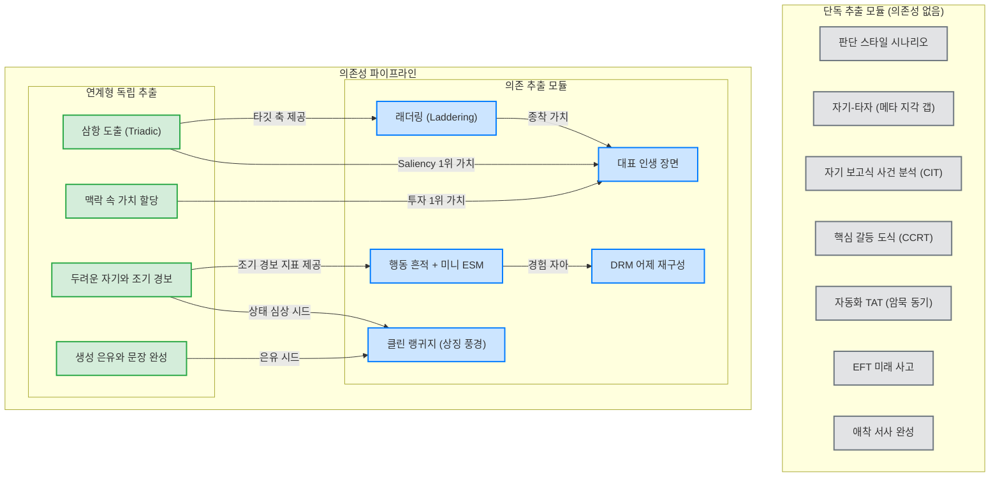

# Extracting the Human Mind

> 문서 지도·배경·동기는 **README** 문서를 참조한다. 이 문서는 설계 원칙과 구체 방법을 담는다.

---

## 1. 데이터 추출

### 1-0. 추출의 최적화 목표

**목적은 LLM 시뮬레이션이며, 심리검사 결과 수집이 아니다.** 따라서 추출이 최적화하는 것은 LLM이 사용하기 좋게 가공된 구조가 아니라, **원시 데이터 자체가 LLM이 시뮬레이션에 실제로 사용할 수 있는 신호가** 되는 것이다.

- **원시 데이터 사후 가공 불가:** 태그·요약·라벨로 미리 소화시키는 순간, 설계자의 편향이 영구적으로 주입되고 미래의 발전된 LLM에 대해 데이터가 진부화된다. 원본 텍스트의 유지는 타협 불가한 제약이다.
- **원시 데이터의 활용 가능성:** 추출 방법의 원시 데이터가 LLM에게 해석되지 않거나 환각을 유발한다면 그 방법은 무용지물이다. 원시 데이터가 LLM에게 유효하지 않다면 원시 데이터를 다듬는 것이 아니라 **추출 방법 자체를** 수정하거나 버린다.

**사용성은 추출 단계에서 확보하며, 가공으로 올리지 않는다.** 단, 방법이 기여하지 않는 것처럼 보일 때 즉각적으로 폐기하지는 않는다.

현재 LLM의 성능이 부족하여 무용하다고 판단되는 경우에도 향후 더 나은 모델에서 재검증한다. 판정은 모델의 한계와 방법론의 한계를 구분하여 수행하며, 검증 모드의 예측 기여도를 통해 결정한다.

좋은 원시 데이터 추출의 6가지 핵심 조건은 다음과 같다.

1. **본인 언어 그대로 (Verbatim):** 정규화·요약·환언을 금지한다. 예외적으로 래더링과 클린 랭귀지 기법에서만 한정적으로 시스템이 개입하며, 클린 랭귀지도 질문 문장을 상수로 고정하여 청결도를 구조로 강제한다.
2. **사후 개입 배제 (No Prodding):** 답변이 극단적으로 짧거나 모호하더라도 꼬리질문(Tail-questions)으로 캐묻지 않는다. 꼬리질문은 필연적으로 편향을 주입한다. 무성의한 답변 방어는 꼬리질문이 아닌 UI/UX 스캐폴딩(제출 지연, 미세 긍정 피드백 등)으로만 해결한다.
3. **투사적 구조 보존 (Anti-Steering):** 서사를 요구할 때, 팩트나 감정을 강제로 나누어 적게끔 입력 폼을 분할하지 않는다. 무엇을 장황하게 적고 무엇을 누락하는지(서사적 불균형성) 자체가 데이터다. (단, CIT, CCRT 등 본래 방어 기제를 해체하기 위해 고안된 구조화 면접 기법은 예외로 한다).
4. **완전성 (양극 모두 포함):** 삼항 도출의 경우 음극과 양극을 모두 본인의 언어로 확보해야 하나의 축이 완성된다.
5. **무오염 (설계자 프레임 배제):** 고정된 메뉴에서 선택하게 하지 않는다. 선택지를 제공하는 순간 사용자의 고유한 언어 데이터가 훼손된다.
6. **생태학적 타당성 (맥락 포함):** 탈맥락 단어가 아닌 구체적 맥락 속에서의 선택을 확보한다. 일/관계/자기 맥락 태그를 측정 메타데이터로 첨부한다.

### 1-0-1. 구조화 추출의 압도적 토큰 효율성

LLM의 컨텍스트 윈도우 한계와 비용 문제를 해결하는 것이 본 프로젝트의 핵심 경쟁력이다. 비구조화 대화는 막대한 토큰을 소모하지만 신호의 밀도가 낮다. 본 프로젝트의 16종 배터리 구조화 추출은 자유 인터뷰 대비 매우 적은 토큰만 사용하면서도 핵심 심리 기전을 밀도 있게 추출한다. 이는 LLM이 노이즈에 방해받지 않고 핵심에 집중하게 만든다.

**토큰 추정치 산출 근거 (1인 기준 `raw_store.yaml` 덤프량):**
- **자유 인터뷰 (Stanford 1000명 연구 등):** 약 2시간 분량의 비구조화 대화는 **15,000-20,000 토큰을** 소모한다. 그러나 대화의 90% 이상은 '음...', '오늘 날씨가...' 같은 노이즈이며 진짜 심리적 신호(Signal)는 극소수이다.
- **구조화 추출 16종 배터리 (본 프로젝트):**
  - **[삼항 도출]** 요소 3개 + 음극/양극 단문 (**약 100 토큰**)
  - **[래더링]** 3-4단계 why 사슬 + 경계 예외 (**약 150 토큰**)
  - **[두려운 자기]** 상태 + 조기경보 + 방어행동 + 현실검증 (**약 200 토큰**)
  - **[인생 장면]** 3-5개 장면의 객관적 묘사와 주관적 의미 (**약 200 토큰**)
  - **[가치 할당]** 할당 내역 5개 + 전환 조건 (**약 150 토큰**)
  - **[은유/SCT]** 완성된 단문 (**약 50 토큰**)
  - **[판단 시나리오]** 결핍 정보 + 타이브레이커 (**약 100 토큰**)
  - **[자기-타자]** 자아/타자 프레임 비교 (**약 100 토큰**)
  - **[CIT 사건분석]** 문제 정의 + 대응 행동 (**약 150 토큰**)
  - **[CCRT 관계도식]** 소망 + 타인반응 + 자기반응 (**약 150 토큰**)
  - **[미니 ESM]** 1회당 약 50토큰 × 10회 누적 (**약 500 토큰**)
  - **[자동화 TAT]** 표준 장면 6개의 4구성 투사 서술 (**약 250 토큰**)
  - **[DRM 어제 재구성]** 에피소드별 회고 서술 1회분 (**약 300 토큰**)
  - **[EFT 미래 사고]** 평범한 미래 장면 + 연속성 서술 (**약 200 토큰**)
  - **[애착 서사 완성]** 표준 줄기 1~2개의 이어쓰기 (**약 200 토큰**)
  - **[클린 랭귀지]** 8~12턴 풍경 전개(템플릿 ID + 원문 시퀀스) (**약 300 토큰**)
- **합계:** 모든 메서드를 거쳐도 총량은 1인당 **약 2,700-3,300 토큰에** 불과하다.
- **결론:** 자유 인터뷰 대비 **약 1/6의 토큰(비용)**만 사용하면서도, 신호 대 잡음비(SNR)가 극도로 높은 순수 무의식 구조만 덤프한다. 이는 LLM이 노이즈 속에서 헤매지 않고 핵심 심리 기전에만 집중하게 만든다.

### 1-0-2. 16개 메서드 도메인 매핑

인간의 마음을 4개의 층위로 나누고, 각 메서드가 담당하는 영역을 매핑한다.

| 층위 | 심리적 도메인 설명 | 담당 추출 메서드 |
| :--- | :--- | :--- |
| **L1. 인지 구조** | 세상을 바라보고 분류하는 필터. "어떤 언어와 은유로 현실을 해석하는가?" | **1. 삼항 도출**, **2. 생성 은유 / 문장 완성**, **14. 클린 랭귀지(상징 풍경)** |
| **L2. 동기 및 가치** | 행동을 일으키는 엔진. "무엇을 원하며, 충돌 시 무엇을 포기하는가?" | **3. 래더링**, **4. 맥락 속 가치 할당**, **5. 판단 스타일 시나리오**, **12. 자동화 TAT(암묵 동기)** |
| **L3. 자아 서사** | 스스로를 어떻게 규정하는가. "나는 누구이며, 어떻게 무너지는가?" | **6. 대표 인생 장면(+기원 장면)**, **7. 두려운 자기와 조기 경보**, **8. 자기–타자**, **15. EFT 미래 사고(미래 극)** |
| **L4. 행동·관계 패턴** | 실제 외부 세계와 부딪치며 나타나는 궤적. "어떻게 반복해서 실패하는가?" | **9. 핵심 갈등 도식**, **10. 자기 보고식 사건 분석**, **11. 행동 흔적 + 미니 ESM**, **13. DRM 어제 재구성(기억하는 자아)**, **16. 애착 서사 완성(가설-투사)** |

> **TAT·DRM의 위치:** **자동화 TAT**는 L2에서 기존 메서드(자기귀인 가치)와 달리 *암묵 동기*를 전담해, 같은 층위 안에 espoused/implicit 대조축을 만든다. **DRM**은 L4에서 ESM(경험하는 자아)과 짝을 이뤄 *기억하는 자아*를 더해, 같은 층위 안에 경험/기억 대조축을 만든다. 둘 다 본 프로젝트의 핵심 테제(표명–실제 갭)를 *동기*와 *기억* 축으로 확장한다.
>
> **신규 3종(14~16)의 위치:** **클린 랭귀지**는 L1에서 단발 은유([생성 은유](<생성 은유와 문장 완성.md>))를 넘어 *상징 풍경을 입체적으로 전개*하는 모달리티를 더한다. **EFT**는 L3에서 [대표 인생 장면](<일화적 미래 사고 (EFT).md>)이 다루는 과거 서사의 *미래 극*을 채워, 자아 서사를 과거–현재–미래로 완성한다. **애착 서사 완성**은 L4에서 *회상*이 아닌 *가설-투사* 계열(TAT와 동축)로, 관계 단절 상황의 디폴트 반응을 자기합리화 편향 없이 포획한다. 단, EFT는 비어 있던 미래 축을 채우는 반면 애착 서사는 *증분(incremental)* 추가이므로, 증분 타당도 미달 시 우선 제거 대상이다([검증 모드](<검증 모드.md>) A4).

이 배터리는 사용자가 중요하게 생각하는 가치(L2)와 실제 갈등 상황에서의 행동(L4) 간의 불일치를 교차 검증하여, 모순을 지닌 입체적인 인간을 시뮬레이션할 수 있도록 한다.

### 1-0-3. 마음의 4사분면 이론적 근거

이 구조는 Dan McAdams의 성격의 3층위 모델을 재구성한 것이다. 기질적 특질은 배제하고, 인지 구조(L1)와 동기 및 가치(L2)를 분리했다. 행동 및 관계 패턴(L4)을 추가하여 일시적 행동의 역동성을 포착한다. 이는 인지, 동기, 실행, 서사적 의미 부여로 이어지는 유기적 성격을 시뮬레이션하는 이론적 뼈대가 된다.

### 1-0-4. 추출 파이프라인 의존성 도표

16가지 심리 추출 방법론과 검증 관문 간의 선후 관계를 시각화한 구조다. 독립 추출 모듈은 선행 조건 없이 수행 가능하며, 의존 추출 모듈은 선행 데이터가 있어야 활성화된다. 충분한 원시 데이터가 누적되어야 최종 활용 모드로 넘어갈 수 있다.

### 1-0-5. 모듈별 예상 소요 시간 (UX 피로도 관리)

전체 파이프라인을 한 번에 수행하는 것은 권장하지 않는다. 모듈별 예상 소요 시간을 참고하여 세션을 나누어 진행해야 이탈(Drop-off)을 방지할 수 있다.

- **Core Heavy (15-20분):** 삼항 도출
- **Medium (5-10분):** 자기-타자, 판단 스타일 시나리오, 래더링, 대표 인생 장면, CIT, CCRT, 자동화 TAT(8-12분), DRM 어제 재구성(6-10분), EFT 미래 사고(5-8분), 클린 랭귀지(8-15분, 동적)
- **Light (3-8분):** 생성 은유와 문장 완성, 맥락 속 가치 할당, 두려운 자기와 조기 경보, 애착 서사 완성(4-7분)
- **Micro (초 단위):** 행동 흔적 + 미니 ESM (1회당 15-30초)

> **신규 2종 배치 주의:** **자동화 TAT**는 인지 부하가 높으므로(투사 서술) 삼항 도출과 같은 세션에 몰지 않는다. **DRM**은 하루의 끝에 1회 수행하는 저빈도 모듈로, 같은 기간 ESM이 쌓여 있어야 경험–기억 갭 분석이 활성화된다(의존 모듈).
>
> **신규 3종 배치 주의:** **클린 랭귀지**는 반복 질문이 긴 동적 모듈이므로 무거운 세션 끝에 붙이지 않고 턴 상한(8~12)으로 이탈을 관리한다. **애착 서사 완성**은 Light이나 정서적으로 민감할 수 있어(유기/단절 자극) 무거운 세션 직후 배치를 피한다. **EFT**는 [대표 인생 장면](<일화적 미래 사고 (EFT).md>)과 짝지어 과거–미래 서사를 같은 세션에서 잇는 것이 자연스럽다.

동적 검사인 래더링과 클린 랭귀지를 제외한 나머지 정적 검사에서는 추출 단계에서 LLM을 대화형 챗봇으로 사용하지 않는다.

### 1-1. 추출 방법 카탈로그

각 기법의 구체적 산출물은 사용자의 원본 텍스트(verbatim)와 필수 태그로 구성된다. (상세 내용은 각 문서를 참조한다.)

- **[삼항 도출](<삼항 도출.md>):** 이질적인 요소와 그 이유, 나머지 두 요소의 공통점과 그 이유를 추출한다.
- **[래더링](<래더링.md>):** 삼항에서 파생된 중심 가치에 대해 연속적인 "왜" 질문을 던져 표면에서 종착 가치까지의 사슬을 도출한다.
- **[두려운 자기와 조기 경보](<두려운 자기와 조기 경보.md>):** 회피하고자 하는 최악의 상태와 그 상태로 향할 때의 초기 징후, 방어 행동을 추출한다.
- **[대표 인생 장면](<대표 인생 장면.md>):** 결정적인 인생 에피소드를 시기, 객관적 묘사, 주관적 의미로 구조화하여 타임라인 형태로 매핑한다.
- **[맥락 속 가치 할당](<맥락 속 가치 할당.md>):** 한정된 자원을 사용자가 직접 정의한 가치들에 분배하게 하고 우선순위가 뒤집히는 조건(전환 조건)을 포착한다.
- **[생성 은유와 문장 완성](<생성 은유와 문장 완성.md>):** 추상적 개념을 설명하는 은유와 미완성 문장에 대한 무의식적 투사를 수집한다.
- **[판단 스타일 시나리오](<판단 스타일 시나리오.md>):** 딜레마 상황에서 추가로 필요한 결핍 정보와 최종 판단 기준(타이브레이커)을 파악한다.
- **[자기–타자](<자기–타자.md>):** 동일한 개념에 대한 자신의 정의와 타인이 추정할 자신의 정의 간의 괴리를 포착한다.
- **[자기 보고식 사건 분석](<자기 보고식 사건 분석 (CIT).md>):** 실제 겪은 위기 상황에서의 문제 지각 방식과 실제 대응 행동을 분석한다.
- **[핵심 갈등 도식](<핵심 갈등 도식 (CCRT).md>):** 대인 갈등에서 소망, 상대방의 반응, 본인의 대응 반응 패턴을 구조화한다.
- **[행동 흔적 + 미니 ESM](<행동 흔적 + 미니 ESM.md>):** 일상적인 소규모 표집을 통해 회고가 아닌 현재 시점의 실제 행동 데이터를 축적한다.
- **[자동화 주제통각검사 (TAT)](<자동화된 주제통각검사 (TAT).md>):** 모호한 텍스트 장면에 대한 투사 서술에서 자기보고가 닿지 못하는 암묵 동기(성취·친화·권력)를 verbatim으로 수집한다.
- **[어제 하루 재구성 (DRM)](<어제 하루 재구성 (DRM).md>):** 하루의 끝에 어제를 에피소드로 재구성하여, ESM(경험하는 자아)과 짝지을 *기억하는 자아*를 수집한다(의존: ESM).
- **[일화적 미래 사고 (EFT)](<일화적 미래 사고 (EFT).md>):** 가장 평범한 미래의 하루를 묘사하게 하여 자아 서사의 *미래 극*과 미래 자아 연속성을 verbatim으로 수집한다.
- **[애착 서사 완성 (성인 SSB)](<애착 서사 완성 (성인 SSB).md>):** 관계 단절 표준 줄기에 대한 이어쓰기로, 회상이 아닌 *가설-투사*를 통해 유기 상황의 디폴트 반응을 수집한다.
- **[클린 랭귀지 인터뷰](<클린 랭귀지 인터뷰.md>):** 고정 12개 클린 질문 템플릿만으로 사용자의 상징 풍경을 입체적으로 전개시킨다. LLM은 질문을 생성하지 않고 템플릿·슬롯만 선택한다(의존: 시드 상징).

모달 패턴이나 언어 스타일 등은 별도로 묻지 않고 원본 텍스트에서 파생되는 신호로 취급한다.

### 1-2. 추출 위생

추출된 데이터의 질을 담보하기 위한 규칙이다.

- **무오염:** 유도 질문이나 설계자가 만든 객관식 옵션을 배제한다.
- **도메인 사후 태깅 (Post-hoc Domain Tagging) 및 General 옵션:** 인간의 심리와 행동 패턴은 삶의 영역(도메인)에 따라 이중성을 띠므로 수집된 데이터는 도메인(Work, Relation, Self)이 분류되어야 한다. 
  다만, 처음부터 도메인을 강제하면 무의식적 투사가 제한되는 기법들(CIT, 대표 인생 장면, CCRT, EFT 등)의 경우 질문 단계에서는 중립적이고 자유로운 발문을 사용하고, **답변 제출 직후 사용자에게 "방금 적어주신 이 경험은 삶의 어느 영역에 가장 가깝습니까?"라고 물어 사후에 도메인을 태깅**하도록 유도한다.
  이때 하나의 영역으로 특정하기 어렵거나 복합적인 맥락을 띠는 경우를 대비하여 반드시 **'해당 없음 / 복합적 (General)'** 옵션을 제공해야 하며, 억지로 도메인에 끼워 맞추게 해서는 안 된다.
- **동적 모듈 청결 강제:** LLM이 루프 안에 있는 동적 추출(래더링·클린 랭귀지)은 청결도를 신뢰가 아니라 구조로 강제한다. 클린 랭귀지의 경우 ① 질문 문장을 12개 상수 템플릿으로 고정, ② 슬롯에 들어간 단어가 사용자 직전 발화의 부분문자열인지 기계 검증(아니면 거부·재생성), ③ 질문 선택은 *고정 순서가 아니라* 사용자가 띄운 상징·강조를 따르는 **클린 선택 정책**으로 묶고(선택을 없애지 않되 근거를 사용자에 정박 — 고정 순서로 박제하면 클린 랭귀지가 아니라 템플릿 설문지가 된다), ④ 매 턴 (템플릿·주의 상징·선택 근거)를 로그로 남겨 선택이 사용자를 따랐는지 검증의 셔플 대조군으로 *사후 측정*한다(사전 차단 아님).
- **피로 및 순서 효과 통제:** 피로로 인한 응답 질 저하를 막기 위해 인지 부하가 높은 모듈의 순서를 적절히 배치한다.
- **중도 이탈 내성:** 진행 중단 시에도 기존 수집된 데이터는 온전하게 활용되도록 설계한다.
- **적응형 측정:** 이전 데이터를 기반으로 후속 문항을 구성하되, 외부 해석의 주입 없이 원본만을 기반으로 한다.

> [!NOTE]
> 설계 과정에서 밀리초 단위의 반응 속도 측정 등도 고려 대상이었으나, 웹 환경의 제약 등을 이유로 최종적으로는 제외하기로 결정했다.

### 1-4. 원시 데이터 저장소 (Raw Store)

덮어쓰기가 허용되지 않는 원천 로그 파일 형태로 관리된다. 모든 해석, 신뢰도 점수, 파생 메타데이터는 이 저장소에서 배제되며, 전적으로 2단계(활용)에서 동적으로 생성된다. (구체적인 데이터 포맷과 스키마 예제는 **[`examples/raw_store.template.yaml`](<examples/raw_store.template.yaml>)** 문서를 참조한다.)

---

## 2. 데이터 활용

원시 데이터를 용도별로 조합하여 프롬프트를 구성한다. 모든 해석과 분류는 이 단계에서 진행된다.

### 2-0. 활용 원칙

- **단일 프롬프트 배제:** 다량의 원시 데이터를 한 번에 주입하는 대신 인지 엔진을 백그라운드에 가동하여 모순을 처리하고 입체적인 시뮬레이션을 수행한다.
- **엄격한 단계 준수:** 추출 직후 반드시 검증 관문을 통과해야만 활용 모드로 진입할 수 있다. 오염 전 데이터를 확보하기 위함이다.
- **도메인별 권한 제어:** 도메인(일/관계/자기) 단위로 충분한 데이터가 누적되었을 때만 관련 활용 기능이 열린다.
- **소스 및 빌드 분리:** 생성된 분석 결과나 가공물은 가설이며, 원본 데이터는 불변으로 유지된다. 가공물은 언제든 재생성될 수 있다.
- **프라이버시 존중:** 멀티 에이전트 시뮬레이션 등 타인의 데이터가 주입될 경우 데이터 제공자의 세밀한 동의 권한 설정에 기반한다.

### 2-0-1. 인지 엔진 아키텍처 (Cognitive Engine)

단일 프롬프트가 유발하는 페르소나 붕괴를 막고 인간의 입체적인 내면을 구현하기 위해 다중 에이전트 시스템인 **[인지 엔진을](<인지 엔진.md>)** 도입한다. 이 아키텍처의 핵심은 **"원본 데이터의 보존"이며**, 하위 에이전트들이 데이터를 임의로 요약하지 않고 공용 칠판(Blackboard)에 놓인 원본(`raw_store.yaml`)을 각자의 렌즈로 해석한다.

1. **본능/방어 에이전트 (Id):** 위협 상황 스캔 (CCRT, 두려운 자기, CIT, 애착 서사 완성 참조)
2. **가치/규범 에이전트 (Superego):** 이상향과 가치관 평가 (래더링, 가치 할당 참조)
3. **프레임/은유 에이전트 (Schema):** 상황의 구조적 의미 해석 (생성 은유, 인생 장면, 클린 랭귀지, EFT 미래 사고 참조)
4. **현실/습관 에이전트 (Somatic):** 실제 과거 행동 팩트 체크 (행동 흔적, 미니 ESM 참조)

이 4개의 하위 에이전트가 제출한 모순된 의견들은 통합 에이전트(Self)에 의해 조율되며, 최종적으로 활용 모드의 성격(상담, 분석 등)에 맞게 행동과 내적 갈등을 렌더링한다.

### 2-1. [상담·동행 모드](<상담·동행 모드.md>)

대화형 인터페이스를 기반으로 하며, 분석 결과를 명시적으로 표출하지 않고 사용자가 자신의 감정을 정리할 수 있도록 질문과 공감 형태로 동행한다.

### 2-2. [분석 모드](<분석 모드.md>)

대화형 모드와 대비되어 데이터를 명시적으로 인용하고 결합한다. 모순되는 가치와 행동 패턴을 냉철하게 분석하여 If-Then 형태의 예측적 통찰을 제공한다.

### 2-3. [멀티 에이전트 시뮬레이션](<멀티 에이전트 시뮬레이션.md>)

관찰형 모드로서 각 인물의 데이터를 독립적인 에이전트로 인스턴스화하여 상호작용시킨다.

### 2-4. [검증 모드](<검증 모드.md>)

전체 방법론의 메타 기능이다. 추출된 데이터가 대상을 정확히 모사하는지를 실제 데이터와 교차 검증하여 성능을 객관화한다.

---

## 3. 시스템 공통

### 3-1. 저장 구조

원시 데이터는 불변의 단일 원천 데이터로 존재하며, 이를 가공한 형태의 파일이나 상태 데이터, 그리고 검증 과정에서의 예측과 실제 결과는 별도의 시계열이나 파일 형식으로 파생 저장된다.

### 3-2. 가로지르는 안전 장치

- **루핑 효과 (Looping Effect):** 사용자가 시스템의 출력 결과에 자신을 맞추어 나가는 현상을 막기 위해, 시스템의 출력이 절대적인 진리가 아닌 "현재 시점의 가설"임을 UI 상에 명시적으로 노출한다.
- **조기 경보의 부작용 통제:** 지나친 자기감시와 불안을 유발하지 않도록, 두려운 자기와 연관된 데이터 표출의 임계치를 엄격하게 관리한다.

### 3-3. 프라이버시 거버넌스

다자간 데이터 주입에 따른 프라이버시, 관계 추론, 과신의 위험성 및 이와 관련된 운영 규칙은 실험 주의서에 상세히 기록하고 철저하게 준수한다.

### 3-4. 상태 관리 및 피드백

- **타임스케일 분리:** 종착 가치·construct는 `decay: slow`, if-then은 medium, ESM 상태는 fast로 갱신 주기를 나누어 상태를 관리한다.
- **피드백 루프:** 모든 모드의 출력에 사용자 피드백을 수집하고, 이는 추후 파인튜닝 신호로 누적된다.

---

## 결론

데이터 추출 단계는 사용자의 언어를 있는 그대로 수집하고 보존하는 역할을 하며, 데이터 활용 단계는 이 불변의 원시 데이터를 기반으로 다양한 형태의 모델을 생성한다. 그리고 검증 모드가 전체 시스템의 유효성을 지속적으로 검증하는 구조를 갖는다.
