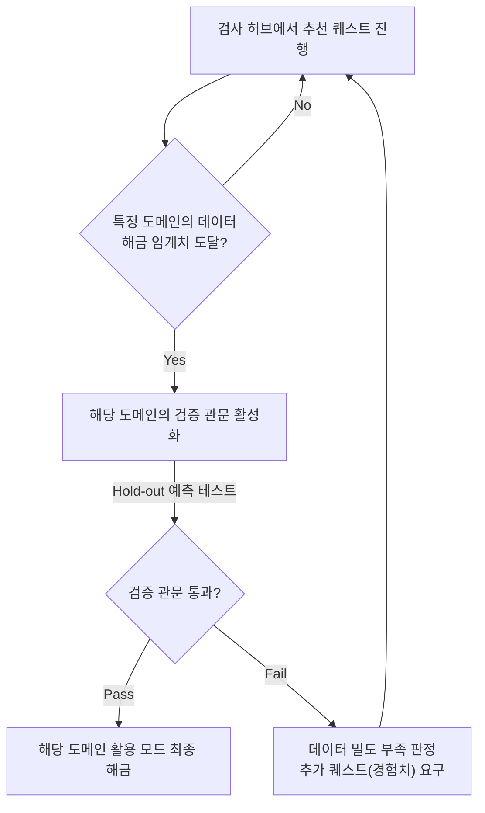

# MVP 기획

> **세 줄 요약:**
> - 사용자가 앱에 접속하여 심리 검사를 받고 결과를 해금하는 전체 서비스 이용 흐름을 정의한다.
> - 추출된 데이터가 어떻게 활용 모드와 검증 모드로 연결되는지 단일 웹 서비스 관점에서 보여준다.
>
> **설계 핵심:**
> - **목적:** PART 1(추출)과 PART 2(활용) 방법론을 엮는 단일 제품 흐름 정의
> - **초점:** 화면 흐름·구조·UX 원칙 (상세 IA 및 스키마는 아키텍처 문서에서 분담)

---

## 1. 제품 비전과 가설

이 MVP가 시험하는 단 하나의 질문: **"본인 언어 그대로의 원시 심리 데이터를 LLM에 제공하면, 그 사람을 유의미하게 이해하고 시뮬레이션할 수 있는가?"** 제품의 모든 화면은 이 가설을 **체험하게** 하고, 검증 모드가 이 가설을 **측정한다**.

- **핵심 사용자 가치:** "나(혹은 나와 친구)를 데이터로 두고, 대화·분석·시뮬레이션을 구동한다."
- **핵심 연구 가치:** 검증 원장(test ledger)에 예측, 실제, 불일치를 누적하여 방법론의 타당성을 데이터로 판정한다.

---

## 2. 전체 사용자 여정

```
[랜딩] → [이름 기입·식별 태그 발급] → [실험 주의서 동의] 
   → (선택) [소셜 허브: 태그 교환 및 권한 토글 동의]
   → [검사 허브] (추천 퀘스트 기반 진행, 도메인별 경험치 누적)
   → [도메인별 해금 임계치 도달]
   → ★[검증 관문 — 필수·오염 전·다방면] ★
   → [활용 해금 연출] (※ 검증 실패 시 추가 퀘스트 유도)
   → [모드 허브] → 대화 | 분석 | 시뮬레이션
        ├─ 데이터 선택: 나 / 나+친구(들)
        ├─ 결과 출력 → 결과 피드백(필수)
        └─ (선택) 내 데이터 JSON 복사/내보내기
```

핵심 순서는 **추출 → 검증 → 활용**이다. 검증이 통과되지 않으면 활용이 불가하다(루핑 오염 차단).

---

## 3. 화면별 상세 설계 및 UX 원칙

### 3-1. 랜딩, 계정, 그리고 소셜 연동

- **마찰 최소화:** 이름 기입 시 고유 식별 태그(`User#1234`)를 발급한다.
- **소셜 연동 UX:** 친구 추가는 복잡한 가입 없이 **"내 태그 복사"** 버튼을 눌러 메신저로 전달하고, 상대방이 앱 내에서 "친구 태그 붙여넣기"를 통해 수락하는 방식으로 진행한다.
- **용도별 토글 동의:** 친구 수락 시, 데이터 제공자는 내 데이터를 상대방이 어디까지 사용할지(분석 허용 / 시뮬레이션 허용 / 타인 예측 검증 허용) 토글로 권한을 세밀하게 제어한다.

### 3-2. 검사 허브 및 게이미피케이션

심리 검사의 피로도를 낮추기 위해 **RPG 게임과 같은 게이미피케이션 UI**를 도입한다.

- **도메인별 경험치(XP) 시스템:** 전체 진행률 대신 일 / 관계 / 자기 맥락(Domain)별로 **100 XP 만점의 게이지 바**를 두어 시각적인 달성감을 부여한다. 특정 도메인이 100 XP에 도달하면 해당 도메인의 검증 관문이 자동으로 열린다.
- **XP 보상 테이블:** 각 검사를 완료할 때마다 정해진 경험치를 부여한다.
    - 삼항 도출: +40 XP
    - 래더링: +30 XP
    - 맥락 속 가치 할당: +30 XP
    - 핵심 갈등 도식 (CCRT): 에피소드당 +20 XP
    - 그 외 단일 폼 검사들: +10~20 XP
- **다음 퀘스트 추천 (DAG 기반):** 수많은 검사 중 길을 잃지 않도록 메인 화면에 "오늘의 추천 검사"를 표출한다. 현재 선택된 도메인에서 가장 높은 XP를 주면서 선행 조건이 충족된, 아직 진행하지 않은 검사를 최상단에 추천한다.
- **세션 자동 임시저장 및 이탈 복구:** 호흡이 긴 검사 중 이탈을 대비한 안전장치를 마련한다.
    - **클라이언트 캐싱:** 입력 유실 방지를 위해 폼 입력 시마다 브라우저 `LocalStorage`에 실시간으로 캐싱한다.
    - **백엔드 임시저장:** 선형적인 텍스트 폼 모듈은 마지막 입력 후 3초(Debounce)가 지나면 백엔드로 페이로드를 전송하여 DB에 임시 상태로 자동 저장한다. 단, 복합 렌더링 상태를 갖는 모듈은 스키마 오류 방지를 위해 백엔드 임시저장을 생략하고 로컬스토리지 복구에만 의존한다.
    - **복구 UX:** 재진입 시 진행 중인 검사가 있음을 알리는 바텀 시트를 표출하고, 수락 시 해당 데이터를 폼에 채워 복구한다.

### 3-3. 검사 진행 화면

- **심미적 안정:** 한 화면에 단일 입력, 큰 글씨, 명확한 '다음' 버튼을 제공하여 점진적 노출을 유도한다.
- **AI 필터링 예외 처리:** '두려운 자기' 등 민감한 답변 작성 시 LLM의 윤리/안전 필터에 걸려 에러가 발생할 수 있다. 이때 앱이 멈추지 않고, AI 안전 필터에 의해 해석이 차단되었음을 알리는 팝업과 함께 **뒤로 가기**를 지원한다.

### 3-4. 도메인별 해금



- **해금 임계치:** 도메인당 핵심 축 조합을 필수 퀘스트로 설정한다.
- **관문 통과 조건:** 정확도 점수 합격이 아니라 **최소 배터리(기본 hold-out 예측 + 라인업 1라운드)를 오염 없이 적재 완료**하면 통과로 간주한다. LLM이 맞히든 틀리든 데이터는 축적된다. 낮은 정확도는 방법론의 한계를 보여주는 증거로 저장된다. 데이터 부족이 의심될 경우 추가 검사를 유도하되 관문 자체를 차단하지는 않는다.

### 3-5. 활용 모드 허브

해금된 도메인 데이터를 활용하여 3대 모드에 진입한다.

- **대화/상담 모드:** 감정 정리 및 데이터 기반 동행을 제공한다.
- **분석 모드:** 도메인 간 모순을 교차 결합해 보여주는 냉철한 구조화 통찰을 제공한다.
- **시뮬레이션 샌드박스:** 나와 친구의 데이터를 각각의 에이전트로 생성하여 가상 상황에서 턴 단위 상호작용을 관전한다.

### 3-6. 데이터 내보내기/가져오기

- 아키텍처 상 '로컬 스탠드얼론' 버전을 구동하는 유저를 위해 명시적 내보내기를 지원한다.
- **JSON 포맷 제공:** 사용자의 원본 데이터를 JSON 포맷으로 제공한다.
- **복사 버튼:** 파일 다운로드 방식보다 직관적인 **텍스트 전체 복사 버튼**을 두어, 메신저 등으로 친구에게 데이터를 텍스트 형태로 전달하고 바로 가져올 수 있게 한다. 프라이버시를 위해 본인 데이터만 복사되도록 한다.

---

## 4. 횡단 관심사

### 4-1. ESM (행동 흔적) 유도 UX

출시 직후 실제 행동(enacted) 데이터는 비어 있다.

- **행동 데이터 전용 배지:** ESM 없이 도출된 결과물에는 회고 데이터만으로 만든 가설이며, 실제 행동 기록(ESM)으로 아직 검증되지 않았음을 명시하는 배지를 단다.
- **저마찰 푸시:** ESM 수집을 일일 푸시나 "오늘 한 줄" 기능의 1탭 위젯으로 유도한다. ESM 데이터가 쌓일수록 새로운 고급 분석이 해금되는 구조를 설계한다.

### 4-2. 결과 피드백 필수 수집

모든 분석/시뮬레이션/대화 결과의 끝에는 전개가 실제 본인답게 느껴지는지(정확/부분적/빗나감)를 묻는 피드백 탭을 배치한다. 이는 향후 파인튜닝의 라벨이자 검증 모드의 보조 신호로 사용된다.

---

## 5. MVP 최소 컷

가장 작은 규모로 출시할 경우의 기준은 다음과 같다.

1. 이름/태그 발급 → 검사 허브 (1개 도메인 한정)
2. 추출 방법 **3종** 한정 (CCRT + 삼항 도출 + 래더링)
3. **검증 관문 (필수)** - 예측 실패 시 막고, 통과 시 해금한다.
4. **분석 모드 (자기분석 및 관계분석 1종)**
5. 결과 피드백 및 JSON 텍스트 클립보드 복사 기능.

이 최소 컷만으로도 "원시 추출 ➔ 검증 ➔ LLM 시뮬레이션 이해 ➔ 누적" 이라는 전체 과학적 루프가 온전히 작동한다.
