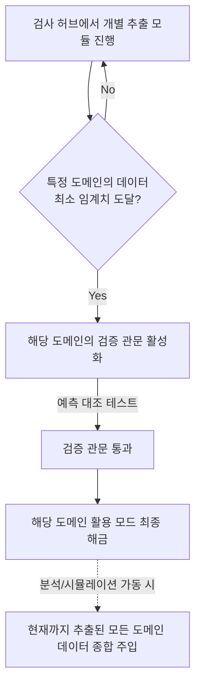

# MVP 기획 (Product Plan)

> **한 줄 정체성:** [Extracting the human mind](<Extracting the human mind.md>)의 추출(PART 1)·활용(PART 2) 방법론을, *이름 기입 → 검사 → 해금 → 모드 → 검증*의 단일 웹 흐름으로 구현하는 최소 제품. 이 문서는 화면 흐름·구조·UX 원칙만 다루며, 구체적 프로그래밍 구현은 범위 밖이다.

---

## 1. 제품 비전과 가설

이 MVP가 시험하는 단 하나의 질문: **"본인 언어 그대로의 raw 심리 데이터를 LLM에 먹이면, 그 사람을 유의미하게 이해·시뮬레이션할 수 있는가?"** 제품의 모든 화면은 이 가설을 *체험시키고*, 검증 모드가 이 가설을 *측정한다*.

* **핵심 사용자 가치:** "나(혹은 나와 친구)를 데이터로 두고, 대화·분석·시뮬레이션을 돌려본다."
* **핵심 연구 가치:** 검증 원장(test ledger)에 (예측, 실제, 불일치)를 누적해 방법론의 sanity를 데이터로 판정한다.

---

## 2. 범위 (Scope)

### 2-1. MVP 안 (In)

* 이름 기입 + 경량 계정 생성
* 심리검사 플로우(추출 방법 일부) + 진행률·해금
* 모드 3종: 대화(상담)·분석·시뮬레이션 + 검증
* 나 / 친구 데이터 선택 주입
* 결과 단위 피드백 수집(파인튜닝용)
* 내 raw 데이터 내보내기(export)

### 2-2. MVP 밖 (Out)

* Generative Agents 풀스택(영속 기억·반추·장기 계획) — [멀티 에이전트 시뮬레이션](<멀티 에이전트 시뮬레이션.md>) §1-4
* 본격적 ESM 장기 누적 인프라 — 초기엔 *선택적·저빈도*로만(아래 §6-4, [행동 흔적 + 미니 ESM](<행동 흔적 + 미니 ESM.md>))
* 실제 모델 파인튜닝 파이프라인 — MVP는 피드백 *수집*까지만
* 임베딩 앙상블·rank aggregation 등 [삼항 도출](<삼항 도출.md>)의 고급 결정론 알고리즘 — MVP는 경량 버전으로 대체 가능

---

## 3. 전체 사용자 여정 (User Journey)

```
[랜딩] → [이름 기입·계정] → [실험 주의서 동의] → [검사 허브]
   → (추출 방법들을 순차/선택 진행, 도메인별 진행률 누적)
   → [도메인별 적정량 도달]
   → ★[검증 관문 — 필수·오염 전·다방면] ★
   → [활용 해금 연출]
   → [모드 허브] → 대화 | 분석 | 시뮬레이션
        ├─ 데이터 선택: 나 / 나+친구(들) (제공자별 용도 토글 동의)
        ├─ 결과 출력 → 결과 피드백(필수)
        └─ (선택) 내 데이터 내보내기
   → (활용 후 검증 재진입 가능 — contaminated 플래그하되 보존)
```

핵심 순서는 **추출 → 검증 → 활용**이다.

* **검사가 모드의 선행 조건:** 데이터 없이는 모드가 의미 없으므로 해금 게이트로 "먼저 충분히 추출"을 강제한다.
* **검증이 활용의 선행 조건:** 활용(분석·시뮬레이션)을 보는 순간 사용자 응답이 그 모델에 동화(looping)되어 검증이 오염된다. 따라서 *가장 깨끗한 검증 데이터*를 활용 이전에 확보한다. 이 1차 검증 데이터는 프로젝트의 핵심 자산이다([검증 모드](<검증 모드.md>)).

---

## 4. 화면별 설계

### 4-1. 랜딩 · 계정

* 이름 기입 + 최소 계정(친구 연결을 위한 식별자). 무거운 회원가입 절차 없이 *마찰 최소화*.
* 첫 진입 시 [실험 주의서](<실험 주의서.md>)의 핵심 고지·동의 문구를 1회 제시(특히 친구 데이터·과신·공유 리스크).

### 4-2. 검사 허브 (Test Hub)

추출 방법들을 카드로 배열. 각 카드 = 하나의 추출 방법([삼항 도출](<삼항 도출.md>), [래더링](<래더링.md>), [생성 은유와 문장 완성](<생성 은유와 문장 완성.md>), [맥락 속 가치 할당](<맥락 속 가치 할당.md>), [두려운 자기와 조기 경보](<두려운 자기와 조기 경보.md>), [판단 스타일 시나리오](<판단 스타일 시나리오.md>), [자기–타자](<자기–타자.md>), [대표 인생 장면](<대표 인생 장면.md>), [자기 보고식 사건 분석 (CIT)](<자기 보고식 사건 분석 (CIT).md>), [핵심 갈등 도식 (CCRT)](<핵심 갈등 도식 (CCRT).md>)).

* **진행률 표시:** 전체 진행률 + 도메인(일/관계/자기) 커버리지를 별도 게이지로. 한 맥락만 채우는 걸 막는다(추출 위생 §1-2 커버리지).
* **권장 순서:** 고정보·저부담 방법을 앞에(피로·순서 효과 통제). 삼항→래더링은 의존 관계가 있으므로 순서를 안내한다.
* **중도 이탈 내성:** 어디서 끊어도 그때까지가 온전한 데이터셋(graceful degradation). 다음에 이어서 가능.

### 4-3. 검사 진행 화면 (유려함의 정의)

"유려함"을 UX 원칙으로 조작적 정의한다 — *피로도 높은 검사를 끝까지 헤쳐나가게 하는 것*.

* **마찰 최소:** 한 화면에 한 과제(progressive disclosure). 큰 글씨, 단일 입력, 명확한 '다음'.
* **심미적 안정:** 절제된 여백·타이포·모션. 한 입력당 인지 부하를 낮춘다.
* **방법별 인터랙션 보존:** 각 추출 방법의 *방법론적 제약*은 UI로 보존한다 — 은유·SCT는 비가역 원-바이-원(편집 불가), 가치 할당은 합계 100 강제, 두려운 자기는 단계별 직면, 삼항은 본인 raw 기반 동적 옵션.
* **진행감·종료감:** 남은 양을 과하게 드러내 압박하지 않되, 한 방법을 끝낼 때마다 작은 완료 피드백을 준다.

### 4-4. 도메인별 해금 (Per-Domain Unlock)

해금은 *도메인 단위*다. 아래 플로우차트는 단일 도메인의 해금 과정을 보여준다.



* **규칙:** 각 도메인(일/관계/자기)은 자기 도메인의 추출이 **최소치를 넘어야** 그 도메인에 대한 활용이 열린다. 일 도메인만 최소치를 넘으면 '일' 관련 활용만 가능하고, 관계 활용은 잠겨 있다.
* **단, 활용 시 데이터 주입은 종합적:** 어떤 도메인의 활용이든, 프롬프트에는 *추출된 모든 도메인의 데이터를 종합해* 넣는다. 해금은 도메인별로 게이팅하지만, 사람은 도메인을 넘나들며 일관되므로 해석은 전 도메인을 본다.
* **검증 관문은 그다음:** 적어도 한 도메인이 최소치를 넘으면 → 그 도메인에 대한 [검증 모드](<검증 모드.md>)를 통과해야 → 해당 도메인 활용이 최종 해금된다.
* **해금 임계(잠정 수치, 운영 데이터로 보정):** 도메인당 핵심 축(삼항 1축+래더링 1사슬) + 개방 방법 N종. 정확한 도메인별 최소치는 운영 데이터로 보정.
* 해금 후에도 검사 허브는 열려 있어 추가 추출·다른 도메인 해금이 가능하다.

### 4-5. 모드 허브 (Mode Hub)

* 활용 모드 3종: **대화·분석·시뮬레이션.** (검증은 활용과 나란한 모드가 아니라 *진입 전 관문*이며, 활용 후에는 *재진입 가능*하다 — §3, [검증 모드](<검증 모드.md>).)
* 공통 상단에 **데이터 선택기:** 나(기본) / 친구(들).
* **제공자 단위 용도별 토글 동의:** 친구를 데이터로 넣을 때, 그 친구가 *자신의 raw를 어느 용도에 허용했는지*를 토글 단위로 확인한다 — 분석 허용 / 시뮬레이션 허용 / 검증(타인 예측) 허용을 각각 켜고 끌 수 있다. 한 사람이 "분석엔 써도 되지만 시뮬레이션엔 쓰지 마"를 표현할 수 있어야 한다. 허용되지 않은 용도에는 그 사람 데이터가 주입되지 않는다.

### 4-6. 모드별 화면

| 모드 | 형식 | 데이터 | 산출 | 참조 |
|---|---|---|---|---|
| 대화(상담) | 대화형 | 나 / 나+친구 | 감정 정리·동행(분석 비노출) | [상담·동행 모드](<상담·동행 모드.md>) |
| 분석 | 대화형 | 나(자기분석) / 나+친구(관계분석) | 구조화 통찰(인용·결합) | [분석 모드](<분석 모드.md>) |
| 시뮬레이션 | 관찰형 | 나+친구(각자 개별 주입) | 상황 생성 + 턴제 상호작용 | [멀티 에이전트 시뮬레이션](<멀티 에이전트 시뮬레이션.md>) |
| *검증(관문/재진입)* | 봉인-대조형 | 나 / 친구 | 예측 vs 실제 + 누적 원장 | [검증 모드](<검증 모드.md>) |

> 검증은 표에 함께 두되 *활용 모드가 아니다* — 추출과 활용 사이의 필수 관문이고(오염 전 1차), 활용 후 재진입 시 `contaminated`로 플래깅된다.

* **시뮬레이션 입력:** 사용자가 상황 프롬프트를 넣으면 → 환경이 생성되고 → 에이전트(각자 자기 raw)들이 상호작용한 결과를 관찰. 사용자는 등장인물이 아니라 설계자·관찰자.
* **혼자 vs 함께:** 혼자면 자기 분석·자기 대화·자기 예측. 친구를 넣으면 상호작용·관계·가설 상황 분석으로 자동 전환.

### 4-7. 결과 피드백 (필수 · 파인튜닝용)

* **모든 모드의 모든 결과**에 피드백을 받는다(정확/부분/빗나감 + 선택적 한 줄, 1탭 중심).
* 피드백은 비강제처럼 느껴지되 수집은 빠짐없이 — 향후 파인튜닝의 라벨이자 검증 모드의 보조 신호.

### 4-8. 데이터 내보내기 (Export)

* 사용자는 자신의 raw를 언제든 내보낼 수 있다(`raw_store` 일부/전체). 내보낸 데이터로 *본인 LLM 계정에서* 직접 대화 가능.
* 내보내기는 본인 데이터에 한정. 친구 raw는 내보내기에 포함하지 않는다(다자 프라이버시).

---

## 5. 검증(테스트) 기능의 제품화

[검증 모드](<검증 모드.md>)의 방법론을 MVP 화면으로 구체화.

* **진입 시점:** 추출 직후 *필수 관문*(오염 전 1차) + 활용 후 *재진입*(contaminated 플래그). 고정 문항이 아니라 *현재 프로토콜*(갱신 가능)이 제시됨.
* **한 라운드:** (1)LLM이 raw로 사용자 응답을 *봉인 예측* → (2)사용자가 프로브에 실제 응답 → (3)봉인 공개·나란히 대조 → (4)사용자가 적중 라벨링.
* **1차 분량:** 빠른 1회 테스트가 아니라, 오염 없는 핵심 데이터를 *다방면으로 충분히* 수집한다(프로젝트 핵심 자산).
* **누적·집계:** 모든 라운드가 검증 원장에 적재되어, "raw 기반 예측이 콜드/얕은 베이스라인을 능가하는가" 곡선을 만든다. 오염 전/후를 분리 집계하되 둘 다 보존.
* **정직성 장치:** 예측 봉인(엿보기 차단), 베이스라인 동시 비교, 체리피킹 금지(빗나간 결과도 적재). 결과는 *개인이 아니라 방법론*을 평가함을 명시.

---

## 6. 횡단 관심사 (Cross-cutting)

### 6-1. 프라이버시·동의 (제공자 단위 용도 토글)

[실험 주의서](<실험 주의서.md>)의 고지·동의를 진입·친구주입·검증 타인예측의 각 분기에 배치한다. 친구 raw 사용은 **데이터 제공자 단위의 용도별 토글 동의**로 관리한다 — 각 사용자가 자기 데이터를 분석/시뮬레이션/검증 각각에 허용할지 직접 켜고 끈다. 다른 사람의 활용 화면은 그 토글 상태를 실시간 존중해, 허용 안 된 용도엔 주입하지 않는다.

### 6-2. looping effect 완화

분석·시뮬레이션 결과 카피는 "원래 이런 사람"이 아니라 "최근 데이터에서 자주 나타난, 바뀔 수 있는 경향"으로 표기. 상담 모드는 ~10턴 1회 프레임 가시화.

### 6-3. 안전·게이팅

feared_self 등 민감 데이터는 평시 비노출, 강한 부정 상태 표명 시에만 제한 활성. 위기 신호 시 전문 자원 안내 분기.

### 6-4. ESM 분리 + 지속 유도

출시 직후 enacted 데이터는 비어 있다. 두 가지로 대응한다.

* **결과 분리:** ESM(enacted) 없이 나온 활용·검증 결과는 *별도로 표기·분리*한다. "이 분석은 회고 데이터만으로 만든 가설이며, 실제 행동 기록(ESM)으로 아직 검증되지 않았습니다" 배지를 단다. ESM이 쌓이면 비로소 espoused/enacted 갭 분석이 켜진다.
* **디자인으로 ESM 유도(쪼기):** ESM 수집을 수동적 옵션이 아니라 *능동적으로 계속 유도하는 UX*로 설계한다 — 가벼운 일일 푸시, 검사 허브의 ESM 진행 게이지, "오늘 한 줄" 1탭 위젯, ESM이 쌓일수록 잠금 해제되는 분석(예: "행동 일관성 리포트는 ESM 14일 후 열림"). 단, 저마찰·자기조절 빈도 원칙([행동 흔적 + 미니 ESM](<행동 흔적 + 미니 ESM.md>))과 feared_self 비노출 게이팅은 유지해, 유도가 자기감시 압박이 되지 않게 한다.

---

## 7. MVP 최소 컷 (가장 작게 출시한다면)

전부를 한 번에 만들지 않는다. 다음이 *작동하는 가설 검증 루프*의 최소 단위다.

1. 이름·동의 → 검사 허브 (1개 도메인만, 예: 일)
2. 추출 방법 **3~4종**만(삼항+래더링+은유/SCT+가치 할당) — 가장 정보 밀도 높은 조합
3. **검증 관문(오염 전 1차)** — 봉인 예측 vs 실제 + 베이스라인 비교, 원장 적재
4. 해금 → **분석 모드(자기분석)** 1종
5. 결과 피드백 수집 + raw export

→ 이 컷만으로도 "raw → 검증(오염 전) → LLM 이해 → 누적"의 핵심 순환이 닫힌다. 대화·시뮬레이션·친구 주입·다도메인·ESM은 그다음 이터레이션. **검증 관문을 최소 컷에 반드시 포함**하는 이유: 오염 전 검증 데이터가 이 프로젝트의 존재 이유이기 때문이다.

---

## 8. 남은 운영 결정

설계 원칙은 [Extracting the human mind](<Extracting the human mind.md>)에 정리돼 있고, MVP 차원에서 *데이터를 모아야 정해지는* 운영 수치만 열려 있다.

* **도메인별 해금 최소치:** 일/관계/자기 각 도메인이 활용을 여는 추출 임계치의 정확한 값. 학습곡선 ablation([검증 모드](<검증 모드.md>) §1-5)으로 보정.
* **검증 1차 배터리 분량·일정:** 라인업 미끼 풀 구성, 자기복제 천장 재검사 간격([검증 모드](<검증 모드.md>) §2-2).
* **ESM 도입 시점:** 출시 대비 언제부터 ESM 표집을 켤지.

> 핵심 설계 원칙(목적=LLM 시뮬레이션, raw-ness=불변 제약, 추출 방법=가변·검증 ablation이 생사 판정)은 확정됐다. 검증 관문이 *방법 채택/폐기*의 데이터 근거가 된다(§5).
