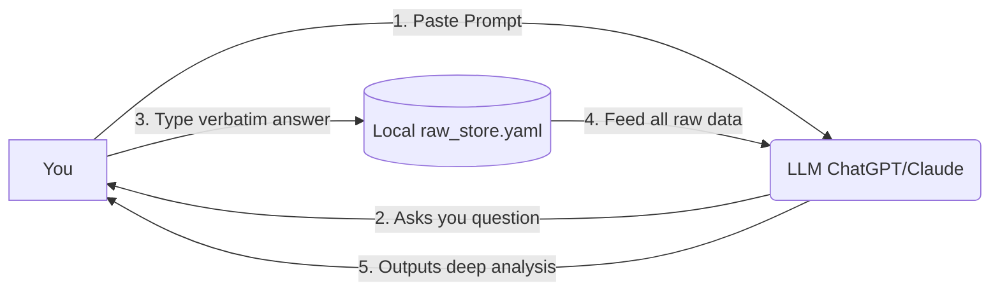

# Quickstart Guide

## First: what this repository is (and isn't)

> [!IMPORTANT]
> **This is a methodology wiki (protocol), not a runnable app.**
> There is no server to start, no CLI to install, no UI to open. 
> 
> *If you want to build a real app based on this wiki, please refer to the [아키텍처 (App Blueprint)](<아키텍처.md>).*

What you get here is a set of structured extraction methods — interview protocols that you run manually with an LLM of your choice — and a local YAML file where you store the verbatim results.

### The Pipeline


*(Your answers go into the local file, NOT back into the LLM during the extraction phase!)*

---

## Step 1 — Read the method you want to run

Pick one extraction method from the wiki. Good starting points:

| Method | What it extracts | Document |
|---|---|---|
| CCRT | Core relationship conflict pattern | [핵심 갈등 도식 (CCRT)](핵심%20갈등%20도식%20(CCRT).md) |
| Laddering | Terminal values behind a preference | [래더링](래더링.md) |
| Feared Self | What collapse looks like for you | [두려운 자기와 조기 경보](두려운%20자기와%20조기%20경보.md) |
| Triadic Elicitation | Personal construct axes | [삼항 도출](삼항%20도출.md) |

Each document has a `UI 프롬프트` section — that's the exact prompt you paste into an LLM to run the session.

---

## Step 2 — Create your local raw_store.yaml

Create a file at any path you like. Suggested location:

```
my-data/raw_store.yaml
```

**Do not put this inside the cloned repo folder if you plan to push.** See [Step 3](#step-3--keep-your-data-off-git).

Start the file with:

```yaml
entries: []
```

After each extraction session, append one entry. The format depends on the method — see `examples/raw_store.template.yaml` for all field shapes, and below for a worked CCRT example.

---

## Step 3 — Keep your data off git

Your `raw_store.yaml` contains verbatim personal responses. **Do not commit it.**

If you work inside the cloned repo, add this to `.gitignore`:

```
my-data/
raw_store.yaml
**/raw_store.yaml
```

A `.gitignore` with these entries is included in this repository.

---

## Step 4 — Run an analysis

Once you have a few entries, paste this into your LLM along with the full contents of your `raw_store.yaml`:

```
You are analyzing the psychological raw store below.
Do not add interpretations beyond what the data supports.
Do not label, score, or categorize. Stay close to the verbatim.

Tasks:
1. Identify any recurring pattern across the entries (wish, response, outcome).
2. Note where the person's stated values and their actual response diverge.
3. If a feared-self entry exists, check whether any CCRT response-self pattern resembles it.

Raw store:
[paste your raw_store.yaml here]
```

See `examples/analysis_prompt.md` for more prompt templates.

---

## Worked example: one CCRT session

**The extraction prompt** (from the CCRT document — paste into any LLM):

> 최근 6개월 이내의 실제 관계 장면 하나를 떠올려주세요. 당신이 상대에게 무언가를 원했는데 잘 안 됐던 순간입니다. 구체적으로: 그 장면에서 당신이 원한 게 뭐였나요? (상대가 어떻게 해주길 바랐나요?) 상대는 실제로 어떻게 했나요? 그 순간 당신은 어떻게 반응했나요? 이런 패턴이 다른 관계에서도 반복됩니까?

**Your verbatim answers go into raw_store.yaml — no summarizing, no paraphrasing:**

```yaml
entries:
  - id: ccrt0001
    ts: 2026-06-20T14:00:00+09:00
    method: ccrt
    object_tag: "동료"           # relationship type only, no name
    raw_wish: "내가 힘든 걸 굳이 말 안 해도 알아봐 주길"
    raw_response_other: "전혀 눈치 못 채고 평소처럼 일 얘기만 함"
    raw_response_self: "혼자 서운해하다 더 무뚝뚝하게 굴어서 사이가 멀어짐"
    raw_recurrence: "있음 — 가족이랑도 늘 이런 식으로 멀어짐"
```

**What NOT to do** — don't pre-interpret before storing:

```yaml
# ❌ wrong — this is your analysis, not verbatim
raw_wish: "인정 욕구가 강함, 의존적 성향"

# ✓ correct — verbatim first, LLM interprets later
raw_wish: "내가 힘든 걸 굳이 말 안 해도 알아봐 주길"
```

The key principle: the `raw_*` fields store **what you actually said**, not what it means. The LLM reads the verbatim and does the synthesis in the analysis step.

---

## Field naming convention

| Field prefix | Meaning |
|---|---|
| `raw_*` | Verbatim response — never paraphrase |
| `id` | Method prefix + 4-digit serial (e.g. `ccrt0001`, `l0001`, `t0001`) |
| `ts` | ISO 8601 timestamp |
| `method` | `ccrt` / `laddering` / `triadic` / `feared_self` / `esm` / etc. |
| `object_tag` | **Relationship type only (e.g. "동료", "부모").**<br>⚠️ *CRITICAL: Never use real names (e.g. "John") to preserve privacy and structural anonymity.* |

Full field shapes for all methods → `examples/raw_store.template.yaml`
