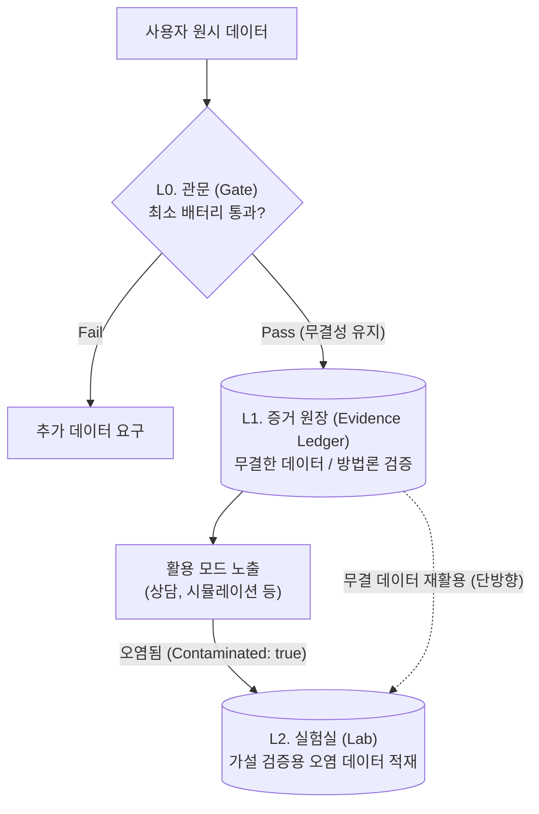

# 검증 모드 (Sanity / Predictive-Validity Test Mode)

> **세 줄 요약:**
> - 사용자의 데이터를 LLM에게 주고 "이 사람이 앞으로 어떻게 행동할지" 예측하게 한 뒤, 실제 행동과 비교한다.
> - 예측이 얼마나 정확한지 수치화하여 우리가 수집한 데이터와 방법론이 진짜로 효과가 있는지 증명한다.
> - 오염(사후 합리화)을 막기 위해 철저히 블라인드 테스트 방식으로 진행되며 결과를 누적 기록한다.
>
> **설계 핵심:** 
> - **목적:** 데이터 기반 예측이 베이스라인을 이긴다는 본 프로젝트의 근본 전제 입증
> - **메커니즘:** 활용 모드 해금 전 필수 관문, 오염 없는 증거 원장 적재, 다각적 가설 테스트 실험실
> - **특징:** 예측 대상과 오염 규칙을 엄격히 분리 (L1 원장 vs L2 실험실)

---

## 1. 방법론 (Methodology)

### 1-0. 검증 모드의 세 레이어 (Three Layers)

> **왜 분리하는가:** "검증"이라는 한 단어가 서로 다른 세 가지를 가리키면서 기능이 뒤섞였다. 무엇이 *재판대에 오르는가*(데이터 / 방법론 / 가설)와 *오염 규칙*(무결성 절대 / 무관 / 고의 오염 허용)이 레이어마다 다르다. 이 표가 이 문서 전체의 척추다.

| | **L0. 관문 (Gate)** | **L1. 증거 원장 (Evidence Ledger)** | **L2. 실험실 (Lab)** |
|---|---|---|---|
| 재판 대상 | 이 사용자의 **데이터** | 우리 **방법론** | 임의의 **가설** |
| 질문 | "충분히 모았나?" | "원시 데이터가 베이스라인을 이기고 천장에 닿나?" | "X가 참인가?" |
| 단위 | 개인 (per-user) | 전체 집계 (aggregate) | 실험별 |
| 성공 기준 | 최소 배터리 적재 완료 | 정규화 정확도 → 1 수렴 | 가설 confirm / refute |
| **오염 규칙** | 무관 | **무결성 절대** (봉인·오염 전·홀드아웃) | **레이어 내 고의 오염 허용** |
| 본 문서 위치 | §2-1, §2-2 | §1-1~1-7, §2-3, §2-4 | §6 (실험 레지스트리) |
| 정체 | 운영 체크포인트 | 해자(moat) | 열린 연구 플랫폼 |



**레이어 간 데이터 흐름 규칙 (절대 원칙):**

1. **L1은 오직 무결한 데이터만 받는다.** 봉인(§4-1)을 깬 프로브 또는 사용자에게 예측을 먼저 보여준 프로브(L-10 역방향 추론 등)는 **L1 원장에 절대 적재하지 않고** L2에서만 산다. *외부 앵커(규범 피드백 등)를 주입하는 프로브는 추출 철학(앵커링 금지)상 L2에서도 두지 않는다 — §6-0-2 참조.*
2. **L2는 L1의 무결성을 빌려 쓸 수 있다(단방향).** L2 실험은 L1에 쌓인 깨끗한 (예측, 실제) 쌍을 *재활용*해 새 조건으로 재실행할 수 있다(§6-0-4 ♻️ Semi). 그러나 L2에서 생성된 오염 데이터는 L1으로 역류하지 못한다.
3. **L0은 L1의 적재량만 본다.** 관문 통과 = "L1에 무결 데이터가 최소 배터리만큼 쌓였다"이지, "정확도가 높다"가 아니다(§2-2).
4. **활용 → L2 (오염 수확, 단방향).** 활용 모드(상담·분석·시뮬레이션)에서 나온 모든 데이터는 정의상 오염 후이므로 `contaminated: true`로 **L2에만** 수확된다 — looping 자산이자 구조화 추출이 놓친 새 신호원이다. **L1 역류 절대 금지.** 깨끗한 데이터를 빌려 쓰는 규칙 2와 대칭을 이루는, *오염된 데이터를 거꾸로 수확*하는 흐름이다. 단, 활용 로그(특히 상담)는 민감 데이터이므로 [실험 주의서](<실험 주의서.md>)의 **`연구 수확 허용` 토글에** 명시적 동의한 사용자에 한해 수확한다.

> 용어 정의 — "무결/clean"은 *활용 노출 전(pre-utilization)을* 뜻하지, *측정 반응성 0*을 뜻하지 않는다. 본 문서의 `contaminated: false`는 "사용자가 활용 모드 출력(분석·시뮬레이션)을 아직 보지 않았다"는 *조작적* 정의일 뿐이다. **추출·검증 행위 자체가 이미 개입**(측정 반응성, §5)이므로 *진정으로 순결한* baseline은 존재하지 않는다. 따라서 해자 주장에서 L1을 "순결한 ground truth"라고 부르지 않고 **"활용 전(pre-utilization) 기준선"** 으로 부른다. 이 구분은 두 가지를 강제한다: (a) clean/contaminated는 활용 노출 여부의 **이분 플래그로 유지**(메인 파이프라인 단순성), (b) *추출 자체의* 반응성은 별도 연속 변수(아래 §2-4 `reactivity_index`)로 *측정*하되 L1 분석의 0점으로 가정하지 않는다. 활용 노출의 looping 크기를 연속 측정하는 것은 C-01이 담당한다.

#### 1-0-1. 오염 전파 규칙 (Contamination Propagation Pseudocode)

§6-0-1 3-b의 "오염 프로브 노출 이후 강등" 규칙을 구현 수준으로 명세한다. 핵심 질문: 강등은 *어디까지* 소급되는가, *다음 세션*에도 이어지는가?

```
[세션 내 오염 전파]
session_contaminated = False

for probe in session.probes (시간순):
    if probe.type == PT-13 or probe.contaminates == True:
        session_contaminated = True  # 이 시점부터 강등 시작
    
    if session_contaminated:
        probe.contaminated = True    # 현재 및 이후 프로브 강등
        route → L2 only
    else:
        probe.contaminated = False   # 이전 프로브는 그대로 L1 적재
        route → L1 (무결)

→ 소급 적용 없음: PT-13 이전에 완료된 프로브는 이미 L1에 적재되었으므로 강등하지 않는다.
→ §6-0-1 rule 3-b의 "오염 프로브를 항상 뒤에 배치" 규칙이 이 소급 불가를 보장한다.

[세션 경계 처리]
session_end:
    session_contaminated = False  # 다음 세션은 깨끗하게 시작
    user.has_seen_pt13 = True     # 사용자 프로필에 기록 (영구)

next_session:
    session_contaminated = False  # PT-13 이전 세션의 오염이 다음 세션으로 이월되지 않음
    if user.has_seen_pt13:
        → C-01(looping 관찰)에 자동 플래그
        → PT-13은 재실행하지 않아도 됨 (이미 노출됨)

[모순 케이스 처리]
케이스: 동일 세션에서 PT-1(blind hold-out)이 L1에 적재된 뒤 같은 세션에서 PT-13이 실행됨
→ PT-1 기록은 L1에 그대로 유지 (소급 강등 없음, §6-0-1 rule 3-b가 순서 보장)
→ PT-13 이후 프로브들만 contaminated: true

케이스: PT-13 없이 활용 모드(상담/분석/시뮬) 이후 검증 세션 재진입
→ 활용 모드 데이터는 정의상 contaminated: true
→ 활용 이후 검증 세션은 무결 start 가능하나, C-01로 looping 효과 추적 필수
```

---

### 1-1. 무엇을 검증하는가 (The Claim Under Test) — **L1 증거 원장**

> 이하 §1-1~§1-7은 **L1(증거 원장)** 의 방법론이다. 무결성 절대 원칙이 적용된다.

**검증의 위치 — 추출 → 검증 → 활용.** 검증은 일반적인 기능 메뉴가 아니라, *추출 완료 직후 및 활용 진입 전에 반드시 통과해야 하는 관문*이다(L0). 사용자가 분석이나 시뮬레이션 결과를 *확인하기 이전*에 예측 정답을 수집해야 순환(looping) 오염이 없는 검증 데이터를 확보할 수 있다. 이 1차 검증 데이터는 이 프로젝트에서 가장 중요한 자산이므로 *오염 없이, 최대한 많이, 다방면으로* 추출한다. 활용을 경험한 뒤 검증에 재진입하는 것도 허용하되, 그 데이터는 `contaminated: true`로 플래깅한다 — **버리지 않는다.** looping 효과 자체를 측정하는 별개의 귀중한 데이터다(이 오염 데이터는 L2 실험 자산이다).


이 시스템은 세 개의 의심을 받는다. 검증 모드는 이 셋 중 어느 것이 참인지 데이터로 가른다.

1. **방법론이 sane하다:** 원시 데이터가 충분하면 LLM이 사람을 유의미하게 예측한다.
2. **LLM의 한계다:** 원시 데이터를 줘도 LLM은 사람을 예측 못 한다(데이터는 충분하나 추론이 부족).
3. **심리검사의 한계다:** 어떤 추출을 해도 사람은 이 정도 데이터로는 예측 불가다(과제 자체가 불가능).

핵심은 **예측 타당도(predictive validity)** 다. "그럴듯한가"가 아니라 "*보지 못한 응답을 맞히는가*"로 평가한다. 그럴듯함(face validity)은 바넘 효과로 부풀려지므로 신뢰하지 않는다.

> **추론 경로 고정 (헤드라인 숫자의 단일 출처):** L1 증거 원장의 정규화 정확도는 **반드시 단일 프롬프트(single-prompt) 추론으로 산출한다.** 인지 엔진(4+1 멀티에이전트)을 헤드라인 예측에 쓰면, 모든 정확도가 *아직 정당화되지 않은 아키텍처*(E-01 미해결)에 교란되어 "데이터·방법론의 기여"와 "엔진의 기여"를 분리할 수 없다. 따라서:
> - **L1 원장(해자 지표) = 단일 프롬프트 고정.** 데이터·추출 방법론의 순수 기여만 측정한다.
> - **인지 엔진은 E-시리즈(§6 E-01~E-03)에서만 별도 평가**되며, 그 산출물은 "엔진 vs 단일 프롬프트" 비교 실험으로만 적재한다(엔진이 단일 프롬프트를 이기는지가 별도 가설).
> - **활용 모드(상담·분석·시뮬)는 엔진을 쓰지만, 그 로그는 정의상 `contaminated`라 L1에 안 들어간다**(§1-0). 즉 배포 경로(엔진)와 검증 헤드라인 경로(단일 프롬프트)는 의도적으로 분리되며, 그 외적타당도 갭은 E-시리즈로 측정해 메운다.

### 1-2. 핵심 패러다임 — Hold-out 예측 (Blind Prediction)

측정과 평가를 분리하는 것이 핵심이다.

1. **홀드아웃 단위 = 에피소드(기본), 마스킹(보조).** 정답 누수를 막는 1차 수단은 *지움*이 아니라 *통째로 빼두기*다. 특정 프로브의 정답과 관련된 **에피소드(예: CCRT 한 사건, 가치할당 한 시나리오) 전체를 컨텍스트에서 제외**하고 나머지 원시 데이터로 예측한다. 비구조화 텍스트 등 에피소드 경계가 불분명한 경우에 한해 저비용 소형 모델(예: gpt-4o-mini)을 **마스킹 전처리기(Masking Preprocessor)** 로 보조 투입해 타겟 힌트를 블라인드 처리한다.
2. **누수 검증 게이트 (마스킹/홀드아웃의 전제조건):** 마스킹·에피소드 제외가 실제로 통했는지를 *예측 전에* 검증한다. **제3의 누수 프로브(leakage probe)** — 가려진 컨텍스트만 받은 별도 LLM(또는 인간)이 타겟 정답을 *역추론*할 수 있는지 시도 → 우연 이상으로 맞히면 누수 실패로 그 라운드를 **L1 적재에서 제외**한다. 이 게이트를 통과한 라운드만 hold-out 정확도로 집계한다.
3. **예측:** 메인 예측 LLM은 마스킹·에피소드 제외된 나머지 원시 데이터만 보고 그 프로브에 대한 사용자의 응답을 예측한다.
4. **정답 수집:** 사용자가 그 프로브에 실제로 응답한다.
5. **채점:** 예측과 실제의 *불일치(discrepancy)* 를 측정한다.
6. **누적:** 모든 (예측, 실제, 불일치) 쌍을 검증 로그에 적재한다 — 개인을 넘어 *방법론 수준의 증거*로.

> **수렴타당도 vs 홀드아웃의 구조적 긴장 (반드시 명시):** 본 방법론은 같은 construct가 여러 기법에 *중복 인코딩*되는 것을 **수렴타당도(M-08)로 자랑**한다. 그런데 바로 그 중복이 hold-out 마스킹을 어렵게 만든다 — CCRT 타겟을 가려도 래더링·가치할당이 같은 신호를 흘리기 때문이다. **이 둘은 동시에 최대화할 수 없다.** 따라서:
> - hold-out 정확도는 *누수 검증 게이트(2)를 통과한 라운드만* 유효하며, 게이트 탈락률 자체를 `leakage_gate_fail_rate`로 보고한다(탈락률이 높으면 그 도메인은 중복 인코딩이 강해 hold-out으로 측정 불가 — 이는 결함이 아니라 수렴타당도의 이면임을 해석에 명시).
> - 누수가 구조적으로 불가피한 construct는 hold-out(A1)이 아니라 **라인업 식별(A2)·시간축 예측(B1, 미래 행동)** 으로 평가한다. 미래 행동은 데이터에 아직 존재하지 않으므로 누수가 원천적으로 없다.

> 통상적인 테스트 문항 방식은 이 패러다임의 한 구현 형태이다. 프로브는 신규 문항, 행동 예측, 또는 강제 선택지일 수 있다. 공통 골격은 "데이터 기반 예측 → 실제 응답과 대조 → 결과 누적"이다.

### 1-3. 성공의 두 기준선 — 바닥(baseline)과 천장(ceiling)

원시 데이터 기반 예측의 정확도는 그 자체로 의미가 없다. *무엇 사이에 있느냐*로만 읽힌다. 두 기준선을 함께 둔다.

**바닥 (Baseline) — 방법론의 최소 기여 기준선.** 네 가지 베이스라인과 동시에 비교한다. **이 중 분량매칭 베이스라인이 "구조가 활성 성분"이라는 테제를 고립시키는 핵심 대조군이다** ([README](<README.md>)의 중첩 주장 A·B 참조).
- **무작위/최빈값 베이스라인:** 데이터 없이 인구 통계적 최빈 응답을 찍었을 때의 정확도.
- **콜드 베이스라인:** 원시 데이터를 *주지 않은* 같은 LLM의 예측.
- **얕은 베이스라인 (soul.md — 주장 B):** 원시 데이터 대신 사용자가 직접 쓴 자기소개(soul.md)만 준 LLM의 예측. raw_store가 이것을 이기면 *실용적* 우위(주장 B)이나, 분량이 통제되지 않으므로 구조의 인과는 분리되지 않는다.
- **분량매칭 자유개방 베이스라인 (주장 A — 1차/엄밀):** raw_store와 **동일한 단어수·소요시간**으로 수집한 비구조화 자유서술을 준 LLM의 예측. soul.md와 달리 자기개방 *분량*이 상수로 묶이므로, 이것을 이겨야 비로소 *구조*(verbatim·무라벨·기법 설계)가 활성 성분임이 교란 없이 입증된다.

> **교란 경고:** raw_store vs soul.md(얕은 베이스라인)만으로 승리를 주장하면, 리뷰어는 그것을 "분량 10배 효과"로 환원한다. **주 분석은 분량매칭 베이스라인(주장 A) 기준 정규화 정확도이며, soul.md 비교(주장 B)는 보조 지표로 병기한다.** 둘의 정규화 정확도 갭이 곧 "구조 순수 기여 vs 분량 기여"의 분해다.

**천장 (Ceiling) — 도달 가능한 최대 성능(self-replication ceiling).** 개인의 응답은 시차를 둔 재검사에서 완벽히 일치하지 않는다. 따라서 LLM의 100% 예측 정확도는 비현실적인 기준이다. *대상자가 스스로를 재현하는 수준*이 예측 가능한 상한선이다. 동일한 프로브를 시차를 두고 제시하여 **본인의 재검사 일치도(test-retest)를** 측정하고, 이를 천장으로 설정한다. 단, 천장 추정에는 두 가지 설계 함정이 있어 다음을 강제한다.

- **천장은 두 종류로 분리 측정한다 (즉시 일관성 ≠ 심리적 안정성):**
  - **즉시 천장(분 단위 재검사):** *방금 답한 것을 기억해서* 같게 답하는 수준 → 인위적으로 높다. 측정 노이즈(문항 모호성·채점 노이즈)의 하한 추정에만 쓰고, **정규화 정확도의 분모로 쓰지 않는다.**
  - **안정 천장(주~월 단위 재검사):** 기억이 희석된 뒤의 *진짜 심리적 재현 수준* → 이것이 정규화 정확도의 정당한 분모다. 1차 관문에서 시드만 잡고, 며칠~수 주 뒤 재방문으로 확정한다.
- **앵커 수 하한:** 개인별 천장을 3문항으로 추정하면 분모가 극도로 불안정하다. **도메인당 안정 천장 앵커 ≥ 8문항**을 하한으로 하고, 그 미만이면 천장을 *개인 추정치*가 아니라 **집단 사전분포(Bayesian shrinkage)** 로 보강한다(개인 데이터가 쌓일수록 개인 추정으로 수렴).
- **불확실성 전파:** 천장은 점추정이 아니라 신뢰구간을 가진 추정량이다. 정규화 정확도도 점수가 아니라 **천장 추정 불확실성을 전파한 구간**으로 보고한다(아래).

모든 예측 정확도는 위 두 기준선을 활용하여 다음과 같이 **정규화 정확도(Normalized Accuracy)** 로 환산해 보고한다. 이 환산이 "얼마나 좋아야 충분한가"라는 막연한 질문에 객관적 눈금을 준다. **분모의 천장은 위 '안정 천장'을 사용한다.**

$$ \text{Normalized Accuracy} = \frac{\text{Model Accuracy} - \text{Baseline Accuracy}}{\text{Ceiling}_{\text{stable}} - \text{Baseline Accuracy}} $$

> **판정:** 정규화 정확도가 0에 수렴하면 가설 2 또는 3(LLM 한계 또는 과제 불가), 1에 수렴하면 가설 1(방법론 타당)을 지지한다. 1을 *초과하면* 천장 추정 오류(사용자의 심한 비일관성) 또는 데이터 누수(leakage)를 의심한다. **단 점추정 1.0 초과를 즉시 leakage로 단정하지 않는다 — 천장 신뢰구간 상단을 넘었을 때만 의심한다(분모 노이즈와 누수를 혼동 금지).**
> **예외 (Ceiling <= Baseline) 및 생존자 편향 방어:** 천장과 바닥이 같거나 역전되는 경우, 사용자 본인조차 일관되게 답하지 못하는 비예측적 케이스다. 이를 무효 처리(NaN)할 경우 예측하기 쉬운 문항만 남기는 생존자 편향(Survivorship Bias)을 유발하므로, **무효화하지 않고 그대로 집계에 포함하되** 신뢰도 페널티(Confidence Weight)를 부여하여 통계 모델 보정에 반영한다. 난이도 재설정을 위한 다른 프로브 추가 생성은 유지한다.
> **선례 참조 (Park et al. 2024):** 가장 가까운 선례에서 GSS 태도·신념 항목은 인터뷰 단독 조건에서 약 83%·병합 조건에서 약 86% normalized accuracy 달성. 반면 **경제 게임(독재자·최후통첩)에서는 인터뷰 에이전트가 인구통계 베이스라인 대비 유의미한 향상 없음.** 따라서 A 배터리(태도·성향 예측)는 성공 가능성이 높은 반면, B5(경제 게임 시뮬레이션)는 같은 선례에서 어려운 것으로 나타났다 — 실패해도 "구조화 추출이 문제"가 아니라 "과제 자체의 한계(가설 3)"일 가능성이 높다는 점을 해석 시 명심한다.

### 1-4. 검증 배터리 구성

Hold-out 예측 패러다임을 공통 골격으로 하여 다각적 평가를 위한 **검증 배터리(battery)를** 실행한다. 검증은 이해(A), 시뮬레이션(B), 신뢰도(C) 세 가지 측면으로 구성된다. 각 배터리의 구체적인 명세는 하위 문서를 참조한다.

- **이해 검증 (배터리 A):** LLM이 정적인 성향과 선택을 얼마나 정확히 "점 예측(Point Prediction)" 해내는지 검증 (블라인드 점 예측, 증분 타당도, **문체 지문 검증**, **인지적 편향 동조** 등) — *하위 문서 [이해 검증](이해%20검증.md) 참조*
- **시뮬레이션 검증 (배터리 B):** 여러 턴의 시간축을 살아가며 궤적의 일관성과 타당성을 유지하는지 검증 (경제 게임, 반사실 민감도, **적대적 스트레스 테스트**, **시간적 붕괴 측정** 등) — *하위 문서 [시뮬레이션 검증](시뮬레이션%20검증.md) 참조*
- **신뢰도 검증 (배터리 C):** 예측 신호의 안정성과 자신감의 정직함 검증 (재검사 신뢰도, 캘리브레이션 등) — *하위 문서 [신뢰도 검증](신뢰도%20검증.md) 참조*

### 1-5. 기여도 분해 (Ablation)

각 추출 방법의 예측 기여도를 평가하기 위해 방법론을 개별적으로 배제하는(leave-one-method-out) 정규화 정확도 변화 측정을 수행한다. 이는 단발성이 아닌 **상시(continuous)** 측정으로 이루어지며, 데이터가 누적될수록 기여도 곡선이 명확해진다. 다음 두 가지 방식으로 실행한다.

- **방법별 ablation:** 방법 1개 제거 시 정확도 낙폭 = 그 방법의 한계 기여(marginal contribution). 낙폭이 0이면 *현재로선* 중복이거나 무용.
- **학습곡선 ablation(분량 충분성):** 원시 데이터를 양으로 점증 투입하며 정확도가 어디서 평탄해지는지. 이 평탄점이 **도메인별 최소 추출치**([MVP 기획](<MVP 기획.md>) §4-4의 미정 수치)를 데이터로 정하는 근거가 된다.
- **구조화 추출 vs 자유 인터뷰 (Core Ablation Experiment):** 본 프로젝트의 핵심 타당성을 입증하는 실험이다. `자유 인터뷰 Transcript (약 15k 토큰)`이 주어진 베이스라인과 `16개 구조화 추출 메서드 배터리`를 거친 타겟의 예측 정확도(Normalized Accuracy 및 Brier Score)를 비교한다. 다중 메서드 적용의 당위성을 무의식적 가치 위계 및 갈등 도식 포착을 통한 예측 정확도 향상으로 증명한다.
  - **분량 교란 주의 (주장 A와의 관계):** 15k 인터뷰는 raw_store(~1.5–2k 토큰)보다 *분량이 훨씬 많다.* 따라서 raw_store가 *더 적은 토큰으로* 15k 인터뷰를 이기면 구조 우위의 **강한** 증거이나, 지면 그것이 구조 결함인지 단순 분량 부족인지 분리되지 않는다. 구조를 깨끗이 고립시키는 1차 지표는 **단어수·시간을 동시 매칭한 B-08(§6 레지스트리)이다.** M-05/Core Ablation은 B-08의 보강(분량 비대칭 조건)으로 함께 보고한다.

**단, Ablation 결과가 즉각적인 기능 폐기를 의미하지는 않는다.** 특정 방법론의 기여도가 낮게 측정될 경우 그 원인은 최소 네 가지로 분류되며([Extracting the human mind](<Extracting the human mind.md>) §1-0), 명확한 분별 이전에 섣불리 폐기나 수정을 단행하지 않는다:

1. 방법 설계 결함 → 고친다.
2. 방법 자체가 무의미 → 버린다.
3. *현재* 모델의 성능 부족 → **버리지 않는다.** 더 나은 모델로 재검증(model-agnostic 보존).
4. 어떤 모델도 끝내 이해 불가 → 버리되 입증 기준 매우 높음.

원인 3과 4는 모델 성능 변인과 혼입되므로, **다수 모델 및 시점에서의 재검증을** 통해 원인 3을 배제한 후 폐기를 검토한다. 수정 작업은 특정 모델에 국한하지 않고 일반적인 LLM의 이해 능력을 기준으로 한다. 이러한 신중한 입증 절차가 검증 모드의 핵심 책무이다.

### 1-6. 측정과 채점 (Metrics & Judging)

> **바넘 방어가 채점 설계의 1순위 원칙이다.** 의미 유사도(임베딩) 단독 채점은 **모호하고 일반적인 예측에 높은 점수를 준다** — "이 사람은 균형과 성장을 중시한다" 같은 예측은 거의 누구의 실제 응답과도 가깝다. 이것이 정확히 본 프로젝트가 피하겠다던 바넘 효과다. 따라서 채점은 *절대 유사도*가 아니라 **변별력(discriminability)** 을 1차로 본다.

- **1차 지표 = 강제선택 식별(A2, 바넘에 강건):** k지 라인업에서 본인 응답을 미끼 사이에서 골라내는 적중률(우연 대비). 모호한 예측은 미끼와도 비슷해 식별에 실패하므로 바넘이 점수를 부풀리지 못한다. **헤드라인 정규화 정확도는 이 식별 지표를 주력으로 한다.**
- **자유응답(A1)은 변별성 보정 점수로 채점:** 절대 임베딩 유사도를 그대로 쓰지 않는다. 예측을 *타깃 본인의 실제 응답*과의 유사도뿐 아니라 *타인 N명의 실제 응답*과의 유사도와 함께 계산하여, **타깃에 더 가까운 정도(상대 변별성)** 만 점수화한다. 공식: $\text{score} = \text{sim}(\hat{y}, y_{\text{self}}) - \max_j \text{sim}(\hat{y}, y_{\text{other}_j})$ (타인보다 본인에게 더 가깝지 않으면 0 이하 = 바넘). 라벨(정확/부분/빗나감)은 보조.
- **불일치 측정(그 외 프로브 유형별):** 행동(B1) → 궤적 거리. 경제 게임(B5) → 배분량 절대 편차 + 수락/거절 적중률. 확률(C2) → Brier.
- **3중 채점 및 다수결(Majority Voting):** 사용자 자기채점의 관대함/바넘 편향을 차단하기 위해 3중 채점을 거친다.
    1. 사용자 자기채점
    2. **LLM 제3 채점 (교차 모델 평가, Cross-Model Evaluation):** 순환 참조 방지를 위해 채점 LLM은 사용자의 `raw_store.yaml` 프로필을 절대 볼 수 없으며, 오직 '예측 문장'과 '실제 문장'의 일치도만 판정한다. 단일 모델의 자기 선호 편향(Self-preference Bias)과 확률적 노이즈를 근본적으로 차단하기 위해, **예측을 수행한 모델과 채점을 수행하는 모델을 물리적으로 분리하는 교차 모델 평가 시스템(예: Gemini 1.5로 예측 생성 후 Claude 3.5로 채점, 혹은 그 반대)을** 사용한다. 편향 방어는 판단 소스를 원천적으로 다양화하는 3중 채점 구조(사용자 자기채점 편향 ↔ 교차 검증된 LLM 채점 ↔ 인간 제3자 편향의 불일치 패턴)에서 완성된다.
    3. 친구 등 제3자 인간 채점(B2와 통합). 이 셋의 불일치 비율도 기록한다.
- **모두 정규화 정확도로 보고:** §1-3대로 바닥·천장 사이로 환산해 적재. 원점수는 비교 불가, 정규화 점수만 누적 곡선에 올린다.

<details>
<summary>💻 수치 계산 알고리즘 및 Python 코드</summary>

### 1. 자연어(NLP) 채점 및 평가 알고리즘

검증 모드에서 강제 선택(n-AFC)은 0 또는 1로 명확히 채점되지만, 자유 응답(텍스트)이나 시뮬레이션 궤적은 스칼라 값으로 환산하는 알고리즘이 필요하다.

#### 1-1. 자유 응답 점 예측 정확도 (Text Prediction Score)

```python
from sentence_transformers import CrossEncoder

sts_model = CrossEncoder('cross-encoder/stsb-distilroberta-base')

def text_prediction_score(predicted_text: str, actual_text: str) -> float:
    score = sts_model.predict([predicted_text, actual_text])
    return max(0.0, min(1.0, float(score)))
```

#### 1-2. 자기복제 천장 점수 (Test-Retest Ceiling)

```python
def test_retest_ceiling_score(text_time1: str, text_time2: str) -> float:
    score = sts_model.predict([text_time1, text_time2])
    return max(0.0, min(1.0, float(score)))
```

#### 1-3. 행동 궤적 거리 (Trajectory Distance)

```python
import numpy as np

def trajectory_distance(predicted_traj: list[float], actual_traj: list[float]) -> float:
    if len(predicted_traj) != len(actual_traj):
        raise ValueError("궤적 길이가 일치해야 합니다.")
    p_arr = np.array(predicted_traj)
    a_arr = np.array(actual_traj)
    mae = np.mean(np.abs(p_arr - a_arr))
    return max(0.0, 1.0 - mae)
```

### 2. 검증 지표 (Verification Metrics)

#### 2-1. 정규화 정확도 (Normalized Accuracy)

$$\text{Normalized Accuracy} = \frac{\text{model} - \text{floor}}{\text{ceiling} - \text{floor}}$$

```python
def normalized_accuracy(model_score: float, floor: float, ceiling: float) -> float:
    if ceiling <= floor:
        return float('nan')
    return (model_score - floor) / (ceiling - floor)
```

#### 2-2. Brier Score (캘리브레이션)

$$BS = \frac{1}{N} \sum_{i=1}^{N} (f_i - o_i)^2$$

```python
def brier_score(forecasts: list[float], outcomes: list[int]) -> float:
    return float(np.mean([(f - o) ** 2 for f, o in zip(forecasts, outcomes)]))
```

#### 2-3. n-AFC 우연 기준선

$$P(\text{chance}) = \frac{1}{k}$$

```python
def chance_baseline(k: int) -> float:
    return 1.0 / k
```
</details>

### 1-7. 공정성 및 편향성 검증 (Demographic Fairness Audit)

특정 인구통계학적 집단(예: 20대 한국인 남성)의 데이터에만 시스템이 과적합되어 높은 예측률을 보이는 반면, 타 문화권이나 성별·연령대에서는 예측 성능이 급락하는 편향을 감지해야 한다.
- **교차 검증:** `raw_store.yaml`의 `user_metadata`에 기록된 인구통계학적 지표(선택값)를 기반으로, 집단별 Normalized Accuracy 분포의 유의미한 격차 유무를 정기적으로 모니터링한다.
- **프로브 난이도 보정:** 특정 문화권에서만 유독 맞히기 쉬운(또는 어려운) 프로브 문항이 없는지 문항 반응 이론(IRT) 관점에서 편향(DIF)을 점검한다.

---

## 2. 상호작용 흐름 설계 (Interaction)

### 2-1. 진입과 시점

- **1차 검증(필수·오염 전):** 추출 적정량 도달 → 활용 해금 *전에* 검증 관문을 통과한다. 이 시점에 사용자는 어떤 활용 출력도 본 적이 없다. 이 데이터가 핵심 자산이므로 충분한 분량을 다방면으로 수집한다(빠른 1회 테스트가 아니다).
- **재진입(선택·오염 후):** 활용 모드를 쓴 뒤에도 검증에 다시 들어올 수 있다. 이때 생성되는 데이터는 `contaminated: true`로 표기하되 원장에 함께 보존한다(looping 측정용).
- 고정 문항 세트가 아니라 *현재 운영 중인 검증 프로토콜*이 제시된다(프로토콜 자체가 실험 대상이라 갱신 가능).

### 2-2. 1차 관문 최소 배터리 (MVP — 실제로 이만큼은 돌린다)

배터리 전체(A~C)는 연구 단계 목표다. *필수 관문*에서 오염 전에 반드시 확보할 최소 세트는 다음으로 고정한다 — "빠른 1회 테스트"가 아니라 핵심 자산 수집이므로 분량을 충분히 둔다.

1. **라인업 식별(A2) 최소 3라운드, k=5 (헤드라인 1차 지표)** — 우연 기준선 20% 대비 적중률. 바넘에 강건한 변별 지표이므로 최소 배터리에서 *주력*으로 확보한다(1라운드로는 우연과 분리 불가 → 최소 3라운드).
2. **블라인드 점 예측(A1) 8~12문항 (보조)** — 도메인(일/관계/자기) 고르게. 자유응답은 **변별성 보정 점수**(§1-6: 타인 대비 본인에게 더 가까운 정도)로만 채점하며, 절대 임베딩 유사도는 바넘 위험으로 헤드라인에 쓰지 않는다.
3. **재검사 천장(C1) — 즉시 시드 + 안정 천장 확정:** 1차 관문 안의 분 단위 재질문은 *즉시 천장 시드*일 뿐이며 **정규화 분모로 쓰지 않는다**(§1-3). 정당한 분모인 **안정 천장**은 도메인당 앵커 **≥ 8문항**을 며칠~수 주 뒤 재방문에서 확정한다. 안정 천장 미확정 구간에는 집단 사전분포로 보강한 잠정 분모를 쓰고, 결과를 잠정치로 표기한다.
4. **캘리브레이션 시드(C2)** — 위 예측 중 확률로 답한 것들의 신뢰도-적중 쌍을 적재(곡선은 누적되며 형성).

A4(증분 타당도)·A3(수렴)은 외부 설문이 필요하므로 *선택*, B(시뮬레이션)·B2(친구 임포스터)는 활용·제공자 동의 이후의 연구 라운드로 미룬다. 관문 통과 조건은 "정확도 합격"이 아니라 **"위 1~4를 오염 없이 적재 완료"** 다 — 검증은 사용자를 거르는 시험이 아니라 방법론 증거 수집이다(§4-3).

### 2-3. 흐름 (예: Blind Prediction 한 라운드)

1. 시스템이 LLM에게 사용자의 원시 데이터(프로브 정답 가림)를 주고 *예측을 먼저 봉인 생성*한다(사용자에게 안 보임 — 사후합리화 방지).
2. 사용자에게 프로브를 제시하고 실제 응답을 받는다.
3. **공개·대조:** 봉인된 LLM 예측 ↔ 사용자 실제 응답을 나란히 보여준다.
4. 사용자가 "이게 나를 맞혔는가"를 라벨링한다(정확/부분/빗나감 + 어디가 어긋났는지 한 줄).

### 2-4. 데이터 누적 (Test Ledger)

- 모든 라운드 데이터는 *검증 원장(test ledger)*에 누적 적재된다. 개인 단위가 아닌 시스템 전체의 *집계 단위*로 분석되며, 데이터가 누적됨에 따라 원시 데이터 기반 예측이 베이스라인을 초과하는 수준이 명확하게 시각화된다.
- **오염 분리 적재:** 각 라운드에 `contaminated` 플래그를 단다. 1차(오염 전)와 재진입(오염 후)을 *분리해 집계*하되 둘 다 보존한다 — 주 분석은 오염 전 데이터로, 오염 후 데이터는 looping 효과의 크기를 따로 측정한다.
- 이 원장은 본 방법론의 유효성을 뒷받침하는 핵심적인 정량적 **누적 증거로** 기능한다.

#### 2-4-1. 집계 추론 프레임 (Inferential Framework) — 위양성 방어

> **왜 필요한가:** §6 레지스트리는 40개+ 실험을 *겹치는 소수 종단 패널*에 돌린다. 집계 모델·다중비교 보정·검정력 명세 없이 "패턴이 드러난다"에 의존하면, 그 패턴의 절반은 재현 안 되는 위양성이다. 이 프레임이 "공장"의 산출물 신뢰도 상한을 정한다.

- **N=1 효과의 집계 모델 (개인 → 방법론):** 개인별 정규화 정확도/임베딩 거리는 독립 관측이 아니다(같은 사람의 여러 라운드는 상관됨). 따라서 단순 평균이 아니라 **위계적(혼합효과) 모델** — 사용자를 랜덤 효과로, 프로브 난이도(IRT)를 별도 랜덤 효과로 두어 *방법론 수준 고정효과*를 추정한다. 개인 N=1 결과는 이 모델의 부분 풀링(partial pooling) 입력일 뿐, 그 자체로 결론이 아니다.
- **다중비교 통제 (family-wise):** 레지스트리 전체에 대해 실험군(M/L/B/C/T/P/X/A/D/E)별 **사전 등록된 1차 가설**을 지정하고, 1차 가설에는 family-wise 오류율(예: Holm) 또는 FDR(Benjamini–Hochberg)을 적용한다. 사전 등록 안 된 사후 발견은 `exploratory: true`로 표기하고 *확증이 아니라 가설 생성*으로만 보고한다(레지스트리 `confirmed`는 사전등록 1차 가설 + 2회 독립 재현에만 부여).
- **최소 검정력 / 중단 규칙:** 각 실험에 **목표 효과량과 그에 필요한 최소 표본·라운드 수**를 사전 명시한다. 그 미달이면 `inconclusive`로 두고 `confirmed/refuted`를 부여하지 않는다(과소표본에서의 성급한 확증 금지). 순차 분석을 쓸 경우 alpha-spending으로 조기중단 편향을 통제한다.
- **추출 반응성 공변량:** 활용 노출 이전이라도 *추출·검증 자체*가 사람을 바꾼다(§1-0 용어 정의). 라운드 누적에 따른 반응성을 `reactivity_index`(직전 라운드 대비 동일 메서드 응답의 임베딩 변화 중 사건 무관 성분)로 *측정*해 모델 공변량으로 투입하되, L1 분석에서 이를 0으로 가정하지 않는다.

**원장 추가 필드:** `user_id`(랜덤효과), `probe_difficulty`(IRT b), `preregistered: bool`, `primary_hypothesis: bool`, `exploratory: bool`, `target_effect_size`, `min_n_required`, `reactivity_index`

---

## 3. 사용 예시 (Use Cases)

- **새 상황 예측(A1):** 사용자가 아직 답 안 한 새 딜레마를 LLM이 원시 데이터로 먼저 예측 → 사용자 실제 응답과 대조.
- **라인업(A2):** "이 가치 충돌 프로브에 대한 5개 응답 중, 원시 데이터의 주인이 쓴 것은?" — 모델이 본인 응답을 미끼 4개 사이에서 골라낸다(우연 20%).
- **행동 예측(B1·C2):** "다음 주 그 회의에서 당신은 의견을 끝까지 밀까, 접을까?"를 LLM이 *확률과 함께* 예측 → 기기 캘린더 동기화(OAuth)를 통해 해당 일정이 끝난 직후 타겟팅된 ESM 푸시를 발송하여 실제 행동을 수집한 후 사후 채점(정확도 + 캘리브레이션).
- **타인 예측·임포스터(B2):** 친구의 원시 데이터로 "이 상황에서 친구는 어떻게 반응할까"를 시뮬레이션 → 친구 본인이 자기 실제 응답과 모델 응답을 구분하게 한다(친구 동의 하에 — [실험 주의서](<실험 주의서.md>)).
- **자기 vs 모델:** 사용자가 "내가 이럴 것 같다"고 *스스로 예측한 것* 과 LLM 예측과 실제, 셋을 비교 — 사람이 자기 자신을 LLM보다 잘 아는지, 그리고 자기복제 천장(§1-3)이 어디인지까지 본다.
- **경제 게임 + espoused 갭(B5):** 독재자·최후통첩 게임을 실제로 플레이 → LLM이 원시 데이터로 선택을 예측 → "가치 할당에서 공정성 최상위라 했는데 독재자 게임에서 30%만 준 사람"의 갭을 LLM이 이미 예측하고 있었는지, 혹은 놓쳤는지 채점. 갭을 맞힌 케이스는 원시 데이터가 표면 선언보다 더 많은 것을 담고 있다는 증거.

---

## 4. 규칙 (Behavioral Rules)

### 4-1. 예측 봉인 (No Peeking)

LLM 예측은 사용자가 실제 응답을 내기 *전에* 생성·봉인된다. 실제 응답을 본 뒤 예측을 맞추는 사후합리화를 구조적으로 차단한다.

### 4-2. 그럴듯함 금지, 정확도만

검증의 채점 기준은 *불일치*다. "그럴듯한 분석을 했는가"가 아니라 "응답을 맞혔는가"만 센다.

### 4-3. 개인 평가 아님 고지

검증 모드의 결과는 *사용자가 어떤 사람인지에 대한 판정이 아니다*. "이 방법론이 작동하는지"에 대한 데이터일 뿐임을 명시한다.

### 4-4. 반증 가능성 보존

이 모드는 "시스템이 좋다"를 증명하려는 게 아니라 *틀렸을 가능성*을 정면으로 받는다. 베이스라인을 못 이기는 결과도 그대로 원장에 남긴다(체리피킹 금지).

---

## 5. 알려진 한계 (Limitations)

- **looping 오염(구조적으로 완화됨):** 1차 검증을 활용 *이전*에 통과시키는 순서(§1 위치)로 오염 전 데이터를 우선 확보한다. 재진입 데이터는 `contaminated`로 분리 집계하므로 주 분석을 오염시키지 않는다. 다만 잔여 위험은 남는다 — 추출 단계에서 이미 "측정이 곧 개입"으로 사용자가 변했을 수 있고, 1차 검증의 프로브 응답 자체도 다음 라운드에 미세한 앵커가 된다.
- **채점의 주관성:** "맞혔다"의 라벨을 사용자가 매기면, 관대함·바넘 효과가 개입한다. 자유응답 프로브는 사용자 자기채점에 더해 *제3 채점*(가림 상태의 별도 LLM/사람)으로 교차한다.

---

## 6. 실험 레지스트리 (Experiment Registry) — **L2 실험실**

> **이 절 전체가 §1-0의 L2(실험실) 레이어다.** L1 증거 원장과 달리, L2는 *레이어 내 고의 오염*을 허용한다 — 봉인을 깨거나 외부 앵커를 주입하는 프로브도 여기서는 정당하다(오염의 효과를 재는 것이 실험 목적일 때). 단, **그렇게 생성된 데이터는 L1 원장으로 역류하지 못한다**(§1-0 데이터 흐름 규칙). 오염 프로브는 `contaminates: true`로 표시한다.

이 시스템은 검증 관문 통과용 도구이기도 하지만, 동시에 **심리 데이터 기반 예측에 관한 열린 실험 플랫폼이다**. 아래 레지스트리는 이 시스템으로 테스트 가능한 가설들을 망라한다. 각 실험은 프로브를 던지고 결과를 로그에 적재하는 것으로 완결된다 — 별도의 분석 파이프라인은 필요하지 않으며, 데이터가 누적되면 패턴이 드러난다.

---

### 6-0. 멀티플렉스 실험 엔진 (Multiplexed Experiment Engine)

**핵심 설계 원칙:** 하나의 프로브 세션이 동시에 여러 가설을 진전시킨다. 사용자는 "검증 테스트"를 한 번 받지만, 그 응답 데이터는 fan-out되어 해당하는 모든 실험 레지스트리의 test_ledger에 동시에 기록된다.

```
사용자 응답 하나
    ├── experiment_id: "M-01" (방법론 ablation 데이터)
    ├── experiment_id: "L-01" (모델 비교 데이터)
    ├── experiment_id: "B-04" (soul.md 비교 데이터)
    └── experiment_id: "C-01" (looping 오염 추적 데이터)
```

#### 6-0-1. 프로브 세션 선택 알고리즘 (Scheduler)

검증 모드 진입 시 시스템이 자동으로 세션을 구성한다.

```
1. 현재 실험 풀 조회
   - status: "open" → 최우선 (데이터 전무)
   - status: "running" + 데이터 부족 → 차우선
   - status: "confirmed" / "refuted" → 제외 (완결)

2. 사용자 상태 호환성 필터
   - 친구 raw_store 없음 → X-02, L-10(정보원 확증분) 제외
   - soul.md 없음 → B-04, B-05, L-08 제외
   - ESM 10회 미만 → M-04, T-03, L-10(행동 확증분) 제외
   - 인구통계·집단동의 미완 → D-01, D-02 제외 (EX-5 선결)
   - contaminated 세션 → C-01~C-05 전용 처리

3. 프로브 타입 배분 (한 세션 = 3~5 프로브)
   - Blind hold-out 1~2개 (핵심 예측 데이터, L1 적재)
   - Lineup 1개 (랜덤 기준선 데이터, L1 적재)
   - 선택 프로브 1~2개 (현재 가장 데이터 부족한 실험)
   - 오염 프로브(PT-13)는 세션 맨 끝에만, L1 적재 차단

3-b. 레이어 무결성 가드 (절대 규칙)
   - 오염 프로브는 깨끗한 hold-out 프로브보다 항상 뒤에 배치
   - 한 세션에서 오염 프로브가 한 번이라도 노출되면,
     그 이후 프로브는 모두 contaminated: true로 강등

4. 실험 커버리지 극대화
   - 각 프로브에 experiment_ids[] 태그 부여
   - 세션당 최소 5개 이상의 실험에 동시 기여 목표
```

#### 6-0-2. 프로브 타입 정의 및 실험 교차 매핑

각 프로브 타입이 동시에 기여하는 실험 목록. 세션 구성 시 이 표를 기준으로 커버리지를 계산한다.

| 프로브 타입 | 설명 | 동시 기여 실험 |
|---|---|---|
| **PT-1** 블라인드 홀드아웃 | LLM이 원시 데이터로 새 질문 예측 → 사용자 실제 응답 → 대조 | M-01, M-02, M-04, M-05, L-01, L-03, L-04, L-06, B-03, B-04, C-01, T-04 |
| **PT-2** 라인업 식별 | k개 중 자기 응답 찾기 (k=5) | B-01, B-02, X-01, X-02, X-03 |
| **PT-3** 컨텍스트 Ablation | 일부 원시 데이터 제거 후 예측 (방법별/양별) | M-01, M-04, M-06, M-07, M-08, B-05, B-06, L-02, L-08 |
| **PT-4** 자기 예측 선봉 | 사용자가 먼저 자기 행동 예측 → LLM 예측 → 실제 응답 → 셋 비교 | P-01, P-02, L-07, C-05 |
| **PT-5** 재검사 | 이전에 답한 동일 프로브 재실행 (시차 명시 없음) | T-01, T-02, T-05, L-07, C-03 |
| **PT-6** 행동 예측 + ESM 추적 | LLM이 향후 행동 예측 → 며칠 후 ESM으로 실제 결과 수집 | T-03, A-03, A-05, M-02 |
| **PT-7** 멀티 컨텍스트 비교 | 동일 프로브를 (raw only / soul.md only / 둘 다 / cold) 병렬 실행 | B-03, B-04, B-05, B-06, B-07, L-08 |
| **PT-8** 멀티 모델 비교 | 동일 프로브를 N개 모델에 동시 실행 | L-01, L-03, L-04, L-05, L-09 |
| **PT-9** 패턴 자동 코딩 | 응답 없이 기존 raw_store에서 임베딩 패턴 추출 | M-08, P-04, X-03, A-04, A-06 |
| **PT-10** 외부 척도 수집 | PHQ-9, ECR-R 등 검증된 척도 자기보고 | A-01, A-02, A-03, A-04, P-01 |

> **PT-1이 가장 가성비 높은 프로브 타입이다** — 단 하나의 프로브로 12개 실험에 동시에 기여한다. 기본 세션은 PT-1 중심으로 구성하되, 부족한 실험 타입(라인업, 재검사 등)을 보조로 섞는다.

**오염 프로브 (Contaminating Probes) — L2 전용, L1 격리.** 아래 프로브는 구조적으로 데이터를 오염시킨다(봉인 위반). **L1 원장에 절대 적재 불가이며**, 세션 맨 끝(종결 프로브) 또는 이미 `contaminated: true`인 재진입 세션에서만 실행한다. 모든 출력에 `contaminates: true`를 단다.

| 프로브 타입 | 설명 | 동시 기여 실험 | 격리 사유 |
|---|---|---|---|
| **PT-13** 역방향 추론 | LLM 예측을 *먼저 공개*하고 "이게 당신인가 / 왜 그런가" 질의 | L-10 | 봉인(§4-1) 위반 → 사후합리화 불가피. 예측 정확도가 아닌 *인식(recognition)* 측정용 |

> **왜 격리하면서도 두는가:** PT-13은 예측의 적중이 아니라 "사용자가 자기 자신을 알아보는가"라는 *다른 구성개념*을 측정하기 때문에(L-10, 환각 vs 통찰 판별) 봉인을 깰 수밖에 없다. 다만 그 산출물은 L1 해자 지표에 절대 섞이지 않는다.
>
> **앵커링 주입 프로브는 두지 않는다.** 외부 규범("동년배 다수는 X")을 주입해 사회적 바람직성 오염을 *측정하는* 실험(舊 C-06/PT-11)은 본 프로젝트 추출 철학(앵커링 금지)과 정면으로 배치되며, 앵커링된 데이터 자체가 필요 없다고 판단하여 채택하지 않는다.

#### 6-0-3. 세션 구성 예시

아래는 실제 검증 모드 세션이 어떻게 구성될 수 있는지의 예시다. 사용자는 5개 프로브를 받지만 백엔드에서는 동시에 8개 실험이 진전된다.

```
[세션 #23 — 사용자 A, 1차 검증 후 3개월 경과]

프로브 1 (PT-1, contaminated: true)
  → 새 직장 딜레마: "팀장이 반대해도 밀어붙이겠는가?"
  → LLM: raw_store 전체 기반 예측
  → 기여: M-01, M-02, L-01, B-04, C-01, C-05, T-04

프로브 2 (PT-3)
  → 동일 딜레마를 CCRT 제거한 원시 데이터로 예측
  → 기여: M-01(CCRT 기여도), M-07, L-02

프로브 3 (PT-5, 시차 91일)
  → 3개월 전 답한 가치 딜레마 재질문
  → 기여: T-01, T-02, T-05, C-03

프로브 4 (PT-2, k=5)
  → 라인업: 관계 도메인 프로브 5개 중 본인 것 찾기
  → 기여: B-01, X-01, X-03

프로브 5 (PT-4)
  → "이번 달 마감 압박에서 나는 어떻게 반응할 것 같은가?"
    자기 예측 먼저 → LLM 예측 → 1주 후 ESM으로 실제 수집
  → 기여: P-01, L-07, T-03, A-03
```

---

#### 6-0-4. 실험 자동화 등급 (Automation Tier)

실험마다 사용자 개입 없이 돌릴 수 있는 정도가 다르다. 세 등급으로 분류하고 각 트리거 조건을 명시한다.

| 등급 | 이름 | 설명 | 트리거 |
|---|---|---|---|
| **🤖 Auto** | 완전 자동 | raw_store 데이터만으로 즉시 실행. 사용자 참여 불필요. | raw_store 신규 엔트리 추가 시 |
| **♻️ Semi** | 반자동 | test_ledger에 이미 저장된 과거 (프로브, 정답) 쌍을 재활용해 새 조건으로 재실행. 사용자 추가 입력 없음. | test_ledger 신규 적재 완료 시 |
| **👤 Active** | 사용자 참여 | 새 프로브를 던져 사용자의 실시간 응답을 받아야 함. | 검증 모드 세션 진입 시 |

**등급별 실험 목록**

##### 🤖 Auto — raw_store만으로 돌아가는 실험

사용자 모르게 백그라운드에서 항시 실행. 새 엔트리가 들어올 때마다 자동 재계산.

| 실험 코드 | 내용 | 계산 방식 |
|---|---|---|
| **M-08** | 가치 할당 vs 래더링 수렴 타당도 | 두 메서드의 최상위 값 임베딩 비교 → 코사인 유사도 |
| **P-04** | CCRT 소망 클러스터 응집도 | raw_wish 임베딩들의 intra-cluster 거리 평균 |
| **A-06** | 은유 유형 자동 코딩 | raw_metaphor 임베딩 → 여정/기계/유기체 클러스터 분류 |
| **A-04 (추론)** | 애착 유형 추론 | LLM이 CCRT raw_response_self 전체를 보고 패턴 코딩 (검증은 별도 척도 필요) |
| **T-01 (관찰)** | CCRT 소망 안정성 관찰 | 시점별 raw_wish 임베딩 거리 rolling 계산 |
| **T-02 (관찰)** | 터미널 가치 안정성 관찰 | 시점별 terminal_value 임베딩 거리 rolling 계산 |
| **C-01 (관찰)** | Looping 오염 관찰 | `contaminated: true` 전/후 엔트리 임베딩 거리 자동 계산 |
| **X-03** | 보편 CCRT 패턴 탐지 | 전체 사용자 raw_wish 클러스터링 → 대형 클러스터 크기 |
| **L-07 (LLM 분산)** | LLM 예측 분산 계산 | 동일 raw + 동일 프로브를 T>0으로 3회 실행 → 출력 분산 |
| **L-09** | Temperature 민감도 | 동일 프롬프트를 T=0.0 / 0.5 / 1.0으로 실행 → 출력 variance |

> **구현 방식:** raw_store 업데이트 이벤트 → 백그라운드 워커 큐 → 결과를 `auto_ledger` 테이블에 적재. 사용자 UI에는 노출되지 않으며, 연구자 대시보드에서만 조회.

---

##### ♻️ Semi — 과거 test_ledger 답변을 재활용하는 실험

사용자가 과거에 프로브에 답한 기록(예측값 + 실제 정답 쌍)이 있으면, 그 쌍을 재활용해 새 조건(다른 모델, 다른 컨텍스트)으로 재실행한다. 사용자는 추가로 아무것도 하지 않아도 된다.

| 실험 코드 | 내용 | 재활용 방식 |
|---|---|---|
| **L-01** | 모델 간 비교 | 과거 (프로브, 정답) 쌍을 GPT-4o / Claude / Gemini에 재실행 → 각 모델 정확도 비교 |
| **L-02** | 컨텍스트 비단조성 | 과거 프로브를 N=1, 3, 5, 10 개 엔트리 컨텍스트로 재실행 → 정확도 곡선 |
| **L-03** | 페르소나 vs 분석가 프롬프트 | 과거 프로브를 두 프롬프트 스타일로 재실행 |
| **L-04** | CoT 효과 | 과거 프로브를 CoT 지시 추가 후 재실행 |
| **L-05** | 언어 효과 | 과거 프로브를 영어로 번역 후 재실행 |
| **L-08** | soul.md 보조 효과 | 과거 프로브를 (raw only / soul only / 둘 다) 세 조건으로 재실행 |
| **M-01 (계산)** | Leave-one-method-out | 과거 프로브를 메서드 하나 제거한 컨텍스트로 재실행 → 낙폭 계산. **4사분면(L1 인지/L2 동기/L3 서사/L4 행동) 검증:** 메서드 제거 시 낙폭이 레이어별로 유의미하게 다르면 4사분면 분류가 독립적 기여를 갖는다는 증거 — 관련 연구.md §6-2의 McAdams 재구성 정당화 근거가 된다. |
| **M-02 (계산)** | 학습 곡선 | 과거 프로브를 진입 시점별 엔트리 수로 재실행 → 누적 정확도 곡선 |
| **B-03** | vs 콜드 LLM | 과거 프로브를 컨텍스트 없이 재실행 |
| **B-04 (재계산)** | vs soul.md | 과거 프로브를 soul.md 단독 컨텍스트로 재실행 → 기존 raw_store 정확도와 비교 |
| **B-05** | soul.md 역전 임계치 | M-02 학습 곡선과 B-04 soul.md 정확도 교차점 자동 계산 |
| **B-06** | vs 자유 대화 | 과거 프로브를 자유 대화 트랜스크립트 컨텍스트로 재실행 (트랜스크립트 보유 시) |
| **C-02** | 오염 도메인 특이성 | contaminated 플래그 기준으로 도메인별 임베딩 변화 자동 분리 계산 |
| **T-04** | 오래된 데이터 감쇄 | 과거 프로브를 (최근 3개월 원시 데이터 / 전체 원시 데이터) 두 조건으로 재실행 |

> **구현 방식:** test_ledger에 새 행 적재 시 → Semi 워커 큐 → 재실행 결과를 동일 `test_ledger`에 `source: "semi_auto"` 태그로 추가 적재.

---

##### 👤 Active — 사용자 참여가 반드시 필요한 실험

검증 모드 세션에서 사용자의 새 응답을 받아야만 측정 가능한 것들.

| 실험 코드 | 내용 | 필요한 사용자 행동 |
|---|---|---|
| **M-03** | 추출 순서 효과 | 다른 순서로 추출한 집단과 비교 (N>1) |
| **M-04** | ESM vs 서사 | 새 행동 예측 프로브 응답 + ESM 추적 |
| **M-05** | 구조화 vs 자유 인터뷰 | 자유 대화 5분 별도 수집 |
| **M-06** | 두려운 자기 단독 예측력 | 새 CCRT 에피소드 응답 |
| **M-07** | 도메인 집중 vs 분산 | 새 도메인 프로브 응답 |
| **B-01** | vs 무작위 기준선 | 라인업 테스트 응답 (PT-2) |
| **B-02** | vs 최빈 응답 | 라인업 테스트 응답 (N>1 필요) |
| **B-07** | vs 15k 자유 인터뷰 | 긴 자유 인터뷰 별도 수집 |
| **C-03** | 오염 회복 | 1개월 후 동일 메서드 재추출 |
| **C-04** | 기대 효과 (사전 공개 vs 맹검) | 프로브 카테고리 사전 공개 집단 vs 맹검 집단 (N>1) |
| **C-05** | Positive looping | 활용 모드 경험 전/후 동일 프로브 응답 |
| **P-01** | 자기인식 자기평정 | 자기인식 수준 1~7점 자기보고 |
| **P-02** | 서술 스타일 | 서술 길이 자동 계산 가능하나 정확도 연결에 새 프로브 필요 |
| **P-03** | 각성 상태 vs 예측 | 고각성 ESM 구간 추출 데이터 별도 수집 |
| **T-01, T-02 (확인)** | 안정성 검증 | 3개월 후 동일 메서드 재실행 |
| **T-03** | ESM 반응성 | 30일 ESM 연속 수집 |
| **T-05** | 인간 재검사 일관성 | 동일 프로브 시차 재응답 |
| **X-01** | 라인업 미끼 유사도 | 유사 인구통계 미끼 풀 구성 (N>1) |
| **X-02** | 친구 임포스터 | 친구 동의 + 친구 raw_store 수집 |
| **A-01** | 우울 인지 프록시 | PHQ-9 자기보고 수집 |
| **A-02** | 사회불안 프록시 | LSAS 자기보고 수집 |
| **A-03** | 스트레스 반응성 | 30일 ESM + PSS 수집 |
| **A-05** | 가치 일관성 vs 후회 | 2주 후 동일 시나리오 재실행 + 후회 플래그 |
| **L-06** | 도메인별 예측 난이도 | 신규 도메인 프로브 응답 |
| **L-07 (인간 분산)** | 인간 응답 분산 | 재검사 응답 수집 |
| **L-10** | 환각 vs 통찰 판별 | 역방향 추론 응답 + ESM/친구 확증 (오염 프로브) |
| **D-01** | De-flattening 효과 | 동일 인구통계 집단 다인 응답 (EX-5 선결) |
| **D-02** | 스테레오타입 의존도 | 인구통계 셀별 응답 (EX-5 선결) |
| **C-06~C-08** | 활용 모드 수확 | 활용(상담/분석/시뮬) 사용 후 백그라운드 수확 + `연구 수확 허용` 토글 |

> **🤖 Auto에 L-09 추가:** Temperature 민감도(L-09)는 raw만으로 재실행하므로 Auto 등급이다(위 Auto 표 참조).
> **활용 수확의 성격:** C-06~C-08은 사용자가 *활용 모드를 쓰기만 하면* 로그가 쌓이므로 능동 프로브가 아니다 — 동의 토글이 켜진 사용자의 활용 로그가 적재될 때 백그라운드로 수확된다(C-06 마스킹 변환은 Auto에 가깝고, C-07·C-08은 ESM 확증을 기다린다).

---

### 6-1. 실험별 항목 형식

각 항목 형식:
- **가설:** 테스트하려는 명제
- **프로브:** 실제로 던질 질문 또는 과제
- **성공 기준:** 어떤 결과가 가설을 지지/반박하는가
- **조건:** 혼자서 가능한가(N=1), 복수 참가자 필요한가(N>1), 종단 추적 필요한가(longitudinal)
- **로그 필드:** test_ledger에 추가로 기록할 필드

---

### M. 방법론 효과 (Method Efficacy)

> **공통 질문:** 16개 메서드 중 어느 것이 실제로 예측력에 기여하는가?

#### M-01. Leave-One-Method-Out Ablation
**가설:** 특정 메서드를 원시 데이터에서 제거하면 그 메서드의 한계 기여도만큼 예측 정확도가 하락한다.
**프로브:** 동일 프로브 세트를 (전체 원시 데이터)와 (메서드 하나 제거한 원시 데이터)로 각각 예측하여 Normalized Accuracy 비교.
**성공 기준:** 제거 시 정확도 낙폭 > 0 → 해당 메서드 기여 있음. 낙폭 ≈ 0 → 현재 데이터 양에서 중복이거나 무용.
**조건:** N=1, 각 메서드 최소 3개 엔트리 필요.
**로그 필드:** `ablated_method`, `accuracy_full`, `accuracy_ablated`, `delta`

#### M-02. 학습 곡선 (Volume Plateau)
**가설:** raw_store 엔트리 수가 늘수록 예측 정확도는 증가하다가 특정 N에서 평탄해진다.
**프로브:** 1, 3, 5, 10, 20개 엔트리 시점마다 동일 프로브 배터리 실행. 정확도 곡선 추적.
**성공 기준:** 평탄점 N이 존재하면 그것이 도메인별 최소 추출량 기준이 된다.
**조건:** N=1, longitudinal (시간 순서 중요).
**로그 필드:** `entry_count_at_time_of_test`, `domain_entry_counts`

#### M-03. 추출 순서 효과 (Method Order)
**가설:** 삼항→래더링 순서로 추출한 사람이 역순보다 더 예측 가능한 데이터를 만들어낸다.
**프로브:** 두 집단이 동일 도메인 프로브에 답하게 하고 Normalized Accuracy 비교.
**성공 기준:** 순서 집단 간 정확도 차이 > 기준선 오차 → 순서 효과 실재.
**조건:** N>1 (집단 비교 필요).
**로그 필드:** `extraction_sequence_hash`

#### M-04. 행동 흔적 vs 서사 (ESM vs Narrative)
**가설:** ESM(행동 흔적)으로만 예측한 것이 CCRT+생애 장면(서사)으로만 예측한 것보다 정확하거나 반대다.
**프로브:** 원시 데이터에서 ESM만, 또는 서사 메서드만 남기고 동일 행동 예측 프로브 실행.
**성공 기준:** ESM 단독 > 서사 단독이면 "행동이 말보다 정직하다" 지지.
**조건:** N=1, ESM 최소 10회 + CCRT 최소 3개 필요.
**로그 필드:** `source_type: ["esm_only", "narrative_only", "combined"]`

#### M-05. 구조화 배터리 vs 자유 인터뷰 (Core Ablation)
**가설:** 동일 분량의 자유 인터뷰 트랜스크립트보다 구조화 추출 배터리가 예측 정확도를 높인다.
**프로브:** (a) raw_store 기반 예측, (b) 동일 내용을 자유 서술한 15k 토큰 인터뷰 기반 예측으로 동일 프로브 배터리 실행.
**성공 기준:** raw_store 정확도 > 인터뷰 정확도 → 구조화의 당위성 입증.
**조건:** N=1, 자유 인터뷰 별도 수집 필요.
**로그 필드:** `context_type: ["raw_store", "free_interview", "combined"]`

#### M-06. 두려운 자기 단독 예측력
**가설:** feared_self 하나만으로도 방어적 반응(CCRT raw_response_self)을 예측할 수 있다.
**프로브:** feared_self만 주고 "이 사람이 거절당했을 때 어떻게 반응했을까"를 예측 → CCRT 실제 답과 비교.
**성공 기준:** Normalized Accuracy > 0.3 → 두려운 자기가 독립적 예측 신호임.
**조건:** N=1.
**로그 필드:** `context_type: "feared_self_only"`

#### M-07. 도메인 집중 vs 도메인 분산
**가설:** 한 도메인에 집중한 데이터(10개 일-도메인)가 분산 데이터(각 도메인 3~4개)보다 해당 도메인 예측에 유리하다.
**프로브:** 동일 도메인(일) 프로브를 두 원시 데이터 구성에 대해 각각 예측.
**성공 기준:** 집중 조건 > 분산 조건 → 도메인 심화 전략 지지.
**조건:** N=1, longitudinal.
**로그 필드:** `domain_concentration_index`

#### M-08. 가치 할당 vs 래더링 수렴 타당도
**가설:** 래더링으로 추출된 terminal value와 가치 할당(맥락 속 가치 할당)의 1위 가치가 일치한다.
**프로브:** 두 메서드의 최상위 가치를 추출 후 비교. 불일치 케이스 분류.
**성공 기준:** 일치율 > 60% → 두 메서드가 같은 구성개념을 측정. 일치율 낮으면 → 서로 다른 것을 측정하는 유의미한 괴리.
**조건:** N=1.
**로그 필드:** `laddering_terminal_value`, `value_allocation_top_value`, `convergence: bool`

---

### E. 인지 엔진 아키텍처 검증 (Engine Architecture)

> **공통 질문:** 4+1 다중 에이전트 시스템(인지 엔진)이 단일 프롬프트나 단순 반복 호출을 실제로 능가하는가?

#### E-01. 단일 에이전트 CoT 정면 대결 및 역할 분할 vs 단순 반복 호출 (A1)
**가설:** 인지 엔진의 성능 향상은 단순히 호출을 여러 번(voting) 한 덕분도 아니고, 하나의 에이전트에게 여러 역할을 지시한(CoT) 덕분도 아니며, 오직 '독립된 노드로의 심리학적 역할 분할' 덕분이다.
**프로브:** 동일 hold-out 과제를 1)단일 프롬프트 2)단일 프롬프트에 '방어, 가치, 은유, 습관을 각각 생각한 뒤에 답을 내라'고 지시한 CoT(Chain-of-Thought) 3)역할 없는 5회 반복 호출(sampling-and-voting) 4)실제 4개 노드로 쪼개진 4+1 블랙보드(인지 엔진) 로 예측하여 Normalized Accuracy 비교.
**성공 기준:** 4+1 조건이 단일 CoT(2) 조건과 반복 호출(3) 조건을 유의미하게 압도하면 심리학적 아키텍처 분할 타당성 입증.
**조건:** N>1, Semi 등급 (과거 test_ledger 재활용)
**로그 필드:** `architecture_type: ["single", "single_cot", "vote_only", "4_plus_1"]`

#### E-02. 역할 셔플 대조군 (A2)
**가설:** 하위 에이전트들의 고유한 프롬프트(렌즈)가 맞물려야만 최적의 성능이 나온다.
**프로브:** 하위 에이전트의 역할 프롬프트를 뒤섞거나 동일 역할로 중복 채운 대조군과 정상 4+1 인지 엔진 간의 예측력 비교.
**성공 기준:** 제대로 정립된 4렌즈 구조의 정확도 > 셔플 구조.
**조건:** N>1, Semi 등급
**로그 필드:** `agent_roles_shuffled: [true, false]`

#### E-03. 페르소나 붕괴 방어 효과 (A3)
**가설:** 복잡한 모순이 있는 데이터를 단일 프롬프트에 넣었을 때보다, 4+1 구조로 분리했을 때 페르소나 붕괴(착한 챗봇화)가 적고 성격적 변별도가 유지된다.
**프로브:** 페르소나 간 출력 변별도(distinctiveness) 지표 자동 측정 및 일관성 평가.
**성공 기준:** 4+1 구조의 변별도 점수 > 단일 프롬프트 변별도 점수.
**조건:** Auto 등급
**로그 필드:** `persona_collapse_score`, `distinctiveness_metric`

---

### B. 베이스라인 비교 (Baseline Competition)

> **공통 질문:** raw_store는 어떤 대안보다 더 나은가?

#### B-01. vs 무작위 기준선 (Lineup Test)
**가설:** raw_store 기반 LLM이 라인업 테스트에서 우연 수준(k=5 → 20%)을 유의미하게 초과한다.
**프로브:** k=5 라인업 최소 5라운드. 적중률 vs 20% 비교.
**성공 기준:** 적중률 > 35% 이상 안정적으로 → 방법론 non-trivial.
**조건:** N=1, 미끼 4개 수집 필요.
**로그 필드:** `lineup_k`, `hit_rate`, `chance_baseline`

#### B-02. vs 최빈 응답 기준선
**가설:** raw_store 기반 예측이 "이 연령/성별 집단에서 가장 흔한 응답"보다 더 정확하다.
**프로브:** 동일 프로브를 (a) LLM+raw, (b) 인구통계 최빈값으로 각각 채점.
**성공 기준:** (a)가 (b)보다 일관되게 높아야 개인화의 의미가 있다.
**조건:** N>1 (집단 최빈값 산출 위해).
**로그 필드:** `demographic_mode_prediction`, `accuracy_vs_demographic_baseline`

#### B-03. vs 콜드 LLM (컨텍스트 없음)
**가설:** raw_store를 제공한 LLM이 아무것도 모르는 LLM보다 예측 정확도가 높다.
**프로브:** 동일 프로브를 (a) 원시 데이터 없는 LLM, (b) 원시 데이터 있는 LLM으로 예측. 차이 측정.
**성공 기준:** (b)−(a) > 0.15 → 원시 데이터 제공의 유의미한 기여.
**조건:** N=1.
**로그 필드:** `context_type: "cold"`, `accuracy_cold`

#### B-04. vs soul.md (증분 타당도 A4 — 주장 B/실용 우위)
**가설:** raw_store 기반 예측이 soul.md(자기 서술) 기반 예측보다 정확하다.
**프로브:** 동일 프로브를 (a) soul.md만, (b) raw_store만으로 각각 예측. 비교.
**성공 기준:** (b) > (a) → **실용적 우위(주장 B) 입증.** (a) ≈ (b) → soul.md가 이미 충분한 정보를 담음(과제 재정의 필요).
**주의 (구조 인과 ≠ 이 실험):** soul.md는 분량이 통제되지 않으므로 B-04 단독으로는 "구조가 활성 성분"(주장 A)을 입증하지 못한다. 주장 A는 분량매칭 대조인 **B-08**이 담당한다. B-04는 주장 B 보조 지표로만 보고한다([README](<README.md>) 중첩 주장).
**조건:** N=1, soul.md 보유 필요.
**로그 필드:** `accuracy_soul_only`, `accuracy_raw_only`, `incremental_gain`, `claim: "B"`

#### B-05. soul.md를 역전하는 최소 엔트리 수
**가설:** raw_store가 soul.md 예측력을 역전하는 임계 엔트리 수 N*가 존재한다.
**프로브:** 1→2→3→...→N 엔트리 시점마다 B-04 비교. 역전이 일어나는 N 기록.
**성공 기준:** 역전점 N*이 존재하면 → "최소 N*개만 채워도 자기 서술보다 낫다"는 강력한 마케팅 주장 가능.
**조건:** N=1, longitudinal.
**로그 필드:** `entry_count_at_test`, `reversal_point`

#### B-06. vs 5분 자유 대화
**가설:** 5분 자유 대화 트랜스크립트보다 구조화 추출 배터리 (동일 시간 투자)가 더 예측 가능한 데이터를 만든다.
**프로브:** 5분 자유 대화 기반 예측 vs 5분 동안 완성한 raw_store 기반 예측.
**성공 기준:** raw_store 우위 → 구조화의 효율성 입증.
**조건:** N=1, 자유 대화 트랜스크립트 수집 필요.
**로그 필드:** `context_type: "free_chat_5min"`, `time_invested_minutes`

#### B-07. 정서 분석 API (Sentiment API) 기준선
**가설:** ESM 텍스트의 감정 예측은 기성 정서 분석 API(예: Google Cloud Natural Language)보다 원시 데이터 기반 LLM이 정확하다.
**프로브:** ESM 자유 서술 텍스트를 기성 API와 LLM(원시 데이터 보유)에 주고 Valence/Arousal 예측.
**성공 기준:** LLM의 MAE(평균 절대 오차) < 기성 API MAE.
**조건:** N=1.
**로그 필드:** `api_valence`, `llm_valence`, `actual_valence`

#### B-08. vs 분량매칭 자유개방 (주장 A — 구조 고립, 헤드라인 1차 지표)
**가설:** raw_store와 **동일한 단어수·소요시간**으로 수집한 비구조화 자유서술보다 구조화 배터리가 더 예측적이다. 즉 자기개방 *분량*을 상수로 묶어도 *구조*가 독립적으로 예측력을 높인다.
**프로브:** (a) raw_store 기반 예측, (b) 동일 사용자가 동일 단어수·시간 예산으로 자유롭게 쓴 자기서술 기반 예측을 동일 프로브 배터리에 대해 비교. **매칭 변수: 사용자 본인 단어수(±10%) 및 소요시간(±10%).**
**성공 기준:** raw_store > 분량매칭 자유서술 → **주장 A 입증(구조가 활성 성분).** 차이 없음 → 구조는 장식이고 효과는 분량에서 옴 → [README](<README.md>) "주장 B만" 분기로 재정의.
**구별:** B-04(soul.md, 분량 비통제)·B-06(시간만 매칭, 5분)·M-05(15k 인터뷰, raw가 *더 적은* 토큰으로 이기면 강한 증거)와 달리, B-08은 **단어수·시간 동시 매칭**으로 구조를 고립시키는 가장 엄밀한 대조다. soul.md 비교(B-04)는 주장 B 보조 지표로만 병기한다.
**조건:** N=1, 분량매칭 자유서술 별도 수집 필요.
**로그 필드:** `context_type: "volume_matched_free"`, `matched_word_count`, `matched_time_minutes`, `accuracy_raw`, `accuracy_volume_matched`, `structure_pure_gain`(= raw − 분량매칭), `claim: "A"`

#### B-09. 요약 손실 — 원본 verbatim vs 동일 내용 요약 (프로젝트 창립 도그마 직접 검증)
**가설:** **동일한 raw_store 내용**을 LLM/인간이 요약한 버전보다, 요약하지 않은 원본 verbatim을 그대로 주입한 쪽이 예측(특히 n-AFC 식별)에서 더 정확하다. 이는 "외부 해석이 원본을 덮어쓰면 뉘앙스가 휘발된다"는 [README](<README.md>) 창립 명제의 *유일한 직접 검증*이다.
**프로브:** 같은 raw_store를 (a) 원본 그대로, (b) 소형 LLM이 요약, (c) 인간이 요약(soul.md 스타일로 *내용 동일하게*)한 세 컨텍스트로 동일 프로브 예측·라인업. **핵심 통제: 세 조건의 *원천 정보*는 동일하고 오직 요약 여부만 다르다**(B-04와 다른 점 — B-04는 정보원 자체가 다른 자기보고).
**성공 기준:** (a) > (b),(c) → 요약이 예측 신호를 손실(원본 보존 정당화). (a) ≈ 요약 → "원본 보존" 도그마 붕괴 → 프로젝트 치명적 위기, 고효율 요약 파이프라인으로 피봇.
**부가(모델 무관성):** 동일 비교를 모델 크기별로 반복 → 원본 우위가 파라미터 규모에 무관하게 성립하는지.
**조건:** N=1, 요약 생성 단계 필요. *논문 2(NLP)의 키스톤.*
**로그 필드:** `representation: ["raw_verbatim", "llm_summary", "human_summary"]`, `accuracy_by_representation`, `summarization_loss`(= raw − 요약), `model_size`

---

### C. 오염 & Looping (Contamination)

> **공통 질문:** 분석을 본 이후의 데이터는 얼마나, 어떻게 달라지는가?

#### C-01. Looping 크기 측정 (연속 변수)
**가설:** 활용 모드(분석/시뮬레이션) 출력을 본 이후 추출한 raw_store는 이전과 의미적으로 다르며, **그 변화량은 노출의 양·종류에 따라 연속적으로 증가한다.**
**프로브:** 활용 전후 동일 메서드(예: CCRT) 반복 추출. 임베딩 거리 측정.
**측정 설계 (이분 → 연속):** `contaminated`는 활용 노출 여부의 *이분 플래그*로 유지하되(§1-0 용어 정의), **looping의 *크기*는 연속 변수 `looping_magnitude`로 측정**한다 — 활용 노출 횟수·유형(분석 조회 수, 시뮬레이션 실행 수, 본 분석 항목 수)을 독립변수로, 활용 전 baseline 대비 임베딩 거리를 종속변수로 회귀. 단순 재검사 노이즈(즉시 천장, §1-3)를 빼낸 *순(純) 반응성*만 looping으로 귀속한다.
**성공 기준:** 노출량–임베딩 거리 사이 단조 증가(기울기 > 재검사 노이즈) → looping이 *용량 반응적(dose-response)* 으로 실재. 이 연속 측정이 루핑 연구(별도 산출물)의 종속변수다.
**조건:** N=1, longitudinal.
**로그 필드:** `contaminated: bool`(이분 유지), `pre_post_embedding_distance`, `looping_magnitude`(연속), `exposure_count`, `exposure_type`, `retest_noise_subtracted: bool`

#### C-02. 오염의 도메인 특이성
**가설:** looping 오염은 본 분석 도메인에만 국한되고 다른 도메인에는 전이되지 않는다.
**프로브:** 일 도메인 분석을 본 후 관계 도메인 원시 데이터 추출 → 관계 도메인 데이터의 임베딩 변화 측정.
**성공 기준:** 비노출 도메인 변화 ≈ 0 → 오염은 도메인 특이적. 변화 있음 → 교차 도메인 전이.
**조건:** N=1, longitudinal.
**로그 필드:** `contaminated_domain`, `tested_domain`

#### C-03. 오염 회복 (Washout Period)
**가설:** 분석 출력을 보고 1개월 후 재추출하면 오염 전 데이터와 다시 유사해진다.
**프로브:** 분석 직후, 2주 후, 1개월 후 동일 메서드 반복 추출. 임베딩 거리 시계열.
**성공 기준:** 거리가 시간에 따라 감소 → 오염은 가역적. 유지 → 분석이 자기인식을 영구 변화시킴.
**조건:** N=1, longitudinal (90일+).
**로그 필드:** `days_since_contamination`, `washout_distance`

#### C-04. 기대 효과 (Expectancy/Demand Characteristics Effect)
**가설:** 검증 프로브가 어떤 유형인지 미리 알고 있으면 추출 행동이 달라진다.
**프로브:** (a) 프로브 유형 모르고 추출 vs (b) "CCRT 프로브가 나온다"고 알고 추출 → 예측 정확도 비교.
**성공 기준:** (b)의 예측 정확도가 (a)보다 높음 → 전략적 응답 가능성. 차이 없음 → 프로토콜 robust.
**조건:** N>1 (집단 비교).
**명칭 주의:** 이 실험이 측정하는 것은 사전 정보 제공에 의한 전략적 응답 변화(demand characteristics / expectancy effect)이지, Hawthorne 효과(관찰·감시 자체에 의한 행동 변화)가 아니다. 혼용하지 않는다.
**로그 필드:** `probe_category_disclosed: bool`

#### C-05. Positive Looping — 자기인식 향상 효과
**가설:** 활용 모드를 경험한 사람이 이후 더 정밀하고 예측 가능한 raw_store를 생산한다.
**프로브:** 활용 전후 정규화 정확도 비교. 오염 전 vs 오염 후 데이터를 각각 예측.
**성공 기준:** 오염 후 데이터로 예측한 정확도 > 오염 전 → 자기인식 향상이 데이터 품질 향상으로 이어짐.
**조건:** N=1, longitudinal.
**로그 필드:** `contaminated: true`, `accuracy_contaminated`, `accuracy_clean`

> **C-06~C-08은 §1-0 흐름 규칙 4(활용 → L2 수확)의 실험화다.** 셋 다 `contaminated: true`, L1 격리, `연구 수확 허용` 토글 동의 필수.

(Cross-Encoder 단일 채점 체계 도입으로 가중치 $\alpha$ 민감도 분석 불필요)

#### C-06. 상담 자유발화 수확 (Counseling Free-speech Harvest)
**가설:** 상담·동행 모드의 자유 발화에는 구조화 추출(16개 메서드)이 놓친 예측 신호가 들어 있다.
**프로브:** 상담 로그를 마스킹 전처리기(§1-2)로 비구조화 hold-out 프로브로 변환 — 발화 중 한 진술을 가리고, raw_store만으로 그 진술을 예측 → 실제 발화와 대조.
**성공 기준:** 상담 발화 예측 정확도 > 0 → 자유 대화가 구조화 추출 대비 증분 신호를 가진다. (단 `contaminated`라 L1 해자엔 불산입, looping 효과와 혼입 분리해 해석)
**조건:** N=1, `연구 수확 허용` 토글, `contaminates: true`.
**로그 필드:** `experiment_id: "C-06"`, `source_mode: "counseling"`, `unstructured_probe: true`, `contaminates: true`

#### C-07. 분석 피드백 → 통찰 연계 (Analysis Feedback Harvest)
**가설:** 분석 모드의 "정확/부분/빗나감" 1-tap 피드백은 단독으론 약신호(바넘 위험)지만, 행동 데이터와 결합하면 L-10(환각 vs 통찰)의 자기 라벨 원천이 된다.
**프로브:** 분석 모드 피드백을 수확 → "빗나감"으로 라벨된 분석 항목을 L-10 삼각측량에 투입(ESM·친구 확증과 교차).
**성공 기준:** "빗나감" 분석이 ESM/친구로 확증되는 케이스 발견 → 활용 모드가 맹점 탐지 데이터를 자연 생성한다. (face validity 단독 신뢰 금지 — §4-2)
**조건:** N=1, `연구 수확 허용` 토글, ESM 또는 친구 확증 필요, `contaminates: true`.
**로그 필드:** `experiment_id: "C-07"`, `source_mode: "analysis"`, `feedback_label: ["accurate", "partial", "miss"]`, `links_to: "L-10"`, `contaminates: true`

#### C-08. 시뮬레이션 궤적 수확 (Simulation Trajectory Harvest)
**가설:** 멀티 에이전트 시뮬레이션이 생성한 행동 궤적은, 이후 실제 행동(ESM)과 대조하면 시뮬레이션 검증(B 배터리)의 데이터가 된다.
**프로브:** 시뮬레이션이 예측한 행동 궤적을 저장 → 며칠 후 동일 상황의 ESM 실제 행동과 궤적 거리 측정.
**성공 기준:** 시뮬레이션 궤적이 실제 행동과 가까움 → 시뮬레이션의 시간축 타당도 입증. (시뮬레이션 파생 데이터 삭제 절차는 DR-3-2 준수)
**조건:** N=1, `시뮬레이션 허용` + `연구 수확 허용` 토글, longitudinal, `contaminates: true`.
**로그 필드:** `experiment_id: "C-08"`, `source_mode: "simulation"`, `trajectory_distance`, `contaminates: true`

---

### L. LLM 동작 특성 (LLM Behavior)

> **공통 질문:** 어떤 모델에, 어떻게 컨텍스트를 주면 가장 잘 예측하는가?

#### L-01. 모델 간 비교 (Model Horse Race)
**가설:** 동일 raw_store에서 특정 LLM이 다른 LLM보다 일관되게 예측 정확도가 높다.
**프로브:** 동일 프로브 세트를 GPT-4o, Claude Sonnet, Gemini Pro, (선택) Llama-3에 각각 실행.
**성공 기준:** 특정 모델이 Normalized Accuracy에서 2회 이상 연속 1위 → 현시점 기준 모델 선호.
**조건:** N=1, API 비용 고려.
**로그 필드:** `model_id`, `model_version`, `accuracy_by_model`

#### L-02. 컨텍스트 비단조성 (Non-monotonic Context)
**가설:** raw_store 엔트리가 어느 임계치를 넘으면 오히려 예측 정확도가 하락한다(노이즈 과부하).
**프로브:** 1→5→10→20→30개 누적 컨텍스트로 동일 프로브 실행, 정확도 추적.
**성공 기준:** 특정 N 이후 정확도 하락 → 컨텍스트 선별 전략 필요. 단조 증가 → 많을수록 좋다.
**조건:** N=1, longitudinal.
**로그 필드:** `context_entry_count`, `context_token_count`

#### L-03. 페르소나 vs 분석가 프롬프트
**가설:** "이 사람이 되어 답하라(페르소나)"가 "이 사람을 분석하고 예측하라(분석가)"보다 예측 정확도가 높거나 낮다.
**프로브:** 동일 raw, 동일 프로브를 두 프롬프트 스타일로 각각 실행.
**성공 기준:** 스타일 간 Normalized Accuracy 차이 > 0.1 → 프롬프트 전략 선택에 유의미한 근거.
**조건:** N=1.
**로그 필드:** `prompt_style: ["persona", "analyst", "chain_of_thought"]`

#### L-04. 사고의 사슬 효과 (Chain-of-Thought)
**가설:** "먼저 이 사람의 심리 패턴을 추론한 뒤 예측하라"는 CoT 지시가 직접 예측보다 정확하다.
**프로브:** 동일 raw·프로브를 (CoT 지시)와 (직접 예측)으로 각각 실행.
**성공 기준:** CoT 정확도 > 직접 예측 → 추론 유도 프롬프트 표준화.
**조건:** N=1.
**로그 필드:** `prompt_style: "chain_of_thought"`, `reasoning_trace` (선택)

#### L-05. 언어 효과 (Korean vs English Prompt)
**가설:** 한국어 raw_store를 한국어 프롬프트로 예측하는 것이 영어 번역 후 예측하는 것보다 정확하다.
**프로브:** 동일 데이터를 한국어/영어 프롬프트로 각각 돌려 비교.
**성공 기준:** 한국어 우위 → 번역 없는 한국어 파이프라인 유지 확정.
**조건:** N=1.
**로그 필드:** `prompt_language: ["ko", "en"]`

#### L-06. 도메인별 예측 난이도
**가설:** 일(work) 도메인이 관계(relation) 도메인보다 LLM 예측이 쉽다. 또는 그 반대.
**프로브:** 동일 참가자의 일/관계/자기 도메인 프로브를 각각 실행, 도메인별 정확도 비교.
**성공 기준:** 도메인 간 정확도 격차 > 0.15 → 특정 도메인에서 방법론 보강 필요.
**조건:** N=1.
**로그 필드:** `probe_domain`

#### L-07. 과잉 일관성 탐지 (Over-consistency)
**가설:** LLM은 실제 인간보다 과도하게 일관된 예측을 하며, 이것이 바넘 효과를 만든다.
**프로브:** 동일 프로브를 (a) LLM 예측, (b) 사용자 본인 재응답(1주 후)으로 비교. LLM의 예측 분산 vs 인간의 응답 분산 측정.
**성공 기준:** LLM 분산 < 인간 분산 → 과잉 일관성 실재 → 채점 가중치 보정 필요.
**조건:** N=1, longitudinal.
**로그 필드:** `prediction_variance_llm`, `response_variance_human`

#### L-08. soul.md 보조 효과
**가설:** soul.md를 raw_store와 함께 제공하면 예측 정확도가 올라간다(또는 오히려 LLM이 soul.md에 과의존해 내려간다).
**프로브:** (a) raw_store만, (b) soul.md만, (c) 둘 다로 동일 프로브 예측.
**성공 기준:** (c)가 (a)보다 높으면 → soul.md는 보완 신호. (a)가 (c)보다 높으면 → soul.md는 노이즈.
**조건:** N=1, soul.md 보유 필요.
**로그 필드:** `context_type: ["raw_only", "soul_only", "raw_and_soul"]`

#### L-09. Temperature 민감도 (Temperature Sensitivity)
**가설:** 동일 원시 데이터·프로브라도 LLM temperature가 높을수록 예측 분산이 커지고 정확도 안정성이 떨어진다.
**프로브:** 동일 프롬프트를 T=0.0 / 0.5 / 1.0으로 각각 N회 실행 → 출력 분산 및 정확도 비교.
**성공 기준:** T 상승에 따라 분산 ↑·정확도 안정성 ↓ → 예측 단계 표준 temperature 확정 근거.
**조건:** N=1, 🤖 Auto (사용자 응답 불필요, 원시 데이터만으로 재실행).
**로그 필드:** `temperature`, `prediction_variance`, `accuracy_by_temp`

#### L-10. 환각 vs 통찰 판별 (Hallucination vs Insight) — *⚠️ PT-13 역방향 추론, L1 격리*
**가설:** LLM이 사용자의 자기상과 *어긋나는* 예측을 했을 때, 그것은 (a) 알고리즘 오류(환각)일 수도, (b) 사용자가 못 보는 맹점에 대한 통찰일 수도 있다. 이 둘은 사용자 자기보고만으로는 구분 불가다.
**이론적 근거:** 자기-타자 지식 비대칭(SOKA 모델) — 평가적·저관찰성 특질(지능·성실성·우호성)에서는 타인이 본인보다 정확하다. 즉 LLM의 "틀린" 예측이 진짜 맹점(통찰)일 수 있다. 그러나 자기부정("그거 나 아냐")은 *틀린 예측*과 *못 보는 맹점*을 구분하지 못하므로(순환논리), 외부 확증이 필수다.
**프로브:** PT-13. LLM의 어긋난 예측을 사용자에게 *먼저 공개* → "이게 당신인가? 왜 그렇게 생각하나?" 질의(자기 라벨 수집) → **삼각측량으로 판별:**
  1. **특질 분류:** 해당 예측이 평가적·저관찰성 영역인가(맹점이 그럴듯한가)?
  2. **행동 확증(ESM):** 자기부정에도 불구하고 ESM 행동 흔적이 LLM 예측과 일치하는가?
  3. **정보원 확증(친구 B2):** 친구가 LLM 예측에 동의하는가?
**판별 규칙:** 어긋난 예측이 (자기부정) + (ESM 또는 친구 확증) → **통찰(맹점)**. (자기부정) + (어떤 외부 데이터도 확증 안 함) → **환각**.
**성공 기준:** 통찰로 분류된 케이스가 유의미하게 존재 → 시스템이 무라벨로 맹점을 잡아낸다(분석 모드의 핵심 가치). 전부 환각으로 분류 → 어긋난 예측은 노이즈일 뿐.
**조건:** N=1이되 ESM 또는 친구 raw_store 확증 필요(둘 다면 최강). `contaminates: true` (봉인 위반, L1 적재 불가).
**로그 필드:** `experiment_id: "L-10"`, `prediction_self_mismatch: bool`, `trait_observability: ["low", "high"]`, `esm_corroborates: bool`, `informant_corroborates: bool`, `verdict: ["insight", "hallucination", "inconclusive"]`, `contaminates: true`
> **출처:** 평가적 특질에서 타인이 자기보다 정확하다는 비대칭은 [Vazire, SOKA 모델 (2010)](https://pubmed.ncbi.nlm.nih.gov/20085401/)에서 확립. 정보원·행동 보고가 자기보고를 넘어서는 증분 타당도는 [정보원 보고의 증분 타당도 연구](https://pmc.ncbi.nlm.nih.gov/articles/PMC4982807/)로 뒷받침.

---

### T. 시간적 안정성 (Temporal Stability)

> **공통 질문:** 무엇이 안정적이고 무엇이 변화하는가?

#### T-01. 핵심 소망 패턴 (CCRT Wish) 안정성
**가설:** CCRT의 raw_wish 패턴은 3개월 후에도 의미적으로 일치한다.
**프로브:** 동일 도메인의 새로운 에피소드를 3개월 후 추출. 이전 wish 패턴과 임베딩 거리 측정.
**성공 기준:** 거리 < 0.3 → 핵심 소망은 안정적. 거리 > 0.5 → 심리적 변화 신호.
**조건:** N=1, longitudinal.
**로그 필드:** `ts`, `wish_embedding`, `months_elapsed`

#### T-02. 터미널 가치 안정성 (Laddering)
**가설:** 래더링으로 추출된 terminal value는 수개월 후에도 동일하게 나타난다.
**프로브:** 동일 시드 축으로 래더링 재실행 후 terminal value 비교.
**성공 기준:** 일치율 > 70% → 가치 구조 안정. 불일치 → 가치 전환 사건이 있었을 가능성.
**조건:** N=1, longitudinal.
**로그 필드:** `terminal_value`, `retest_interval_days`

#### T-03. ESM 기저선 변동 vs 사건 반응성
**가설:** ESM affect_valence의 기저선(rolling mean)은 안정적이지만, 특정 사건 전후에는 급격한 변동이 있다.
**프로브:** ESM 연속 수집 30일. 기저선 vs 이상치 구간 자동 분리.
**성공 기준:** 기저선 분산 < 이상치 구간 분산 → 사건 반응성 측정 가능.
**조건:** N=1, longitudinal.
**로그 필드:** `affect_valence`, `rolling_baseline`, `anomaly_flag`

#### T-04. 오래된 데이터의 예측력 감쇄
**가설:** 6개월 이상 된 raw_store 엔트리는 최근 엔트리보다 예측 정확도가 낮다.
**프로브:** 최근 3개월 데이터만 / 전체 데이터로 각각 예측. 비교.
**성공 기준:** 최근 데이터 우위 → 최신성 가중치 도입 필요. 차이 없음 → 심리 패턴은 장기 안정.
**조건:** N=1, 6개월+ 데이터 누적 필요.
**로그 필드:** `context_time_window_months`

#### T-05. 정체성 전환 사건 탐지
**가설:** 이직, 이별, 이사 등 주요 사건 전후로 CCRT wish 패턴과 feared self가 의미적으로 달라진다.
**프로브:** 사건 전·후 동일 메서드 재실행. 임베딩 거리 + 사용자 "이 시기에 변화가 있었나" 플래그.
**성공 기준:** 사건 플래그 있는 구간의 임베딩 변화 > 사건 없는 구간 → 시스템이 정체성 전환 신호를 잡을 수 있다.
**조건:** N=1, longitudinal.
**로그 필드:** `life_event_flag: bool`, `life_event_type`

#### T-06. 경험–기억 갭 사전 예측 (DRM — 경험하는 자아 vs 기억하는 자아)
**가설:** raw 데이터만으로 이 사람의 **기억 왜곡 방향·크기**(같은 날 ESM 대비 DRM 회고 정서의 갭)를 사전 예측할 수 있다 — 장밋빛 회상자(DRM>ESM)와 비참화 회상자(DRM<ESM)를 raw에서 미리 가려낸다.
**프로브:** 같은 날의 ESM(`enacted_proximal`) 정서 집계 ↔ DRM(`remembered_retrospective`) 회고 정서를 대조해 `memory_distortion`(방향·크기) 산출 → LLM이 *그 갭이 측정되기 전의* raw 데이터로 갭 부호·크기를 예측 → 실제 갭과 대조([어제 하루 재구성 (DRM)](<어제 하루 재구성 (DRM).md>) §2).
**성공 기준:** 갭 예측이 우연·기저선 초과 → 경험–기억 비대칭이 raw에 암호화돼 있음(웰빙·후회·의사결정 예측의 신규 신호). peak-end 지배 패턴이 raw 서사 스타일과 상관하면 추가 증거.
**조건:** N=1, longitudinal, **ESM·DRM 같은 기간 동시 누적 필요**(DRM 단독으론 갭 측정 불가). 과대 주장 금지 — 갭은 "진실 대비 왜곡"이 아니라 *두 자기보고 양식 간 불일치*.
**로그 필드:** `memory_distortion`(방향+크기), `esm_affect_aggregate`, `drm_retro_affect`, `peak_end_dominance`, `predicted_distortion`, `accuracy_gap_prediction`

---

### P. 개인 변인 (Person Variables)

> **공통 질문:** 어떤 사람의 데이터가 더 예측 가능한가?

#### P-01. 자기인식 수준 vs 예측 가능성
**가설:** 자기인식이 높다고 보고하는 사람의 raw_store가 더 예측 가능하다.
**프로브:** 사용자에게 "나는 내 행동 패턴을 잘 안다" 자기평정 수집 → 정규화 정확도와 상관.
**성공 기준:** 자기인식 점수와 정규화 정확도의 양의 상관 → 고자기인식자를 우선 참가자로.
**조건:** N>1.
**로그 필드:** `self_awareness_rating`, `normalized_accuracy`

#### P-02. 서술 스타일 vs 예측 가능성
**가설:** 구체적이고 장황하게 답하는 사람(high verbosity)이 간결하게 답하는 사람보다 예측 가능하다.
**프로브:** raw_store 평균 응답 길이(토큰 수) vs 정규화 정확도 상관.
**성공 기준:** 양의 상관 → "많이 쓸수록 데이터가 좋다" 지침 강화. 무상관 → 길이보다 내용 밀도가 중요.
**조건:** N>1.
**로그 필드:** `avg_response_length_tokens`

#### P-03. 감정 활성화 상태 vs 예측 난이도
**가설:** 고각성(high arousal ESM) 구간에서 추출한 데이터로는 예측이 어렵다.
**프로브:** ESM affect_arousal 높은 구간 vs 낮은 구간에서 각각 수집된 데이터로 예측 비교.
**성공 기준:** 고각성 구간 data → 낮은 정확도 → "안정 시 추출" 권고 근거.
**조건:** N=1, longitudinal.
**로그 필드:** `avg_arousal_at_extraction`

#### P-04. CCRT 패턴 수렴도 vs 예측 정확도
**가설:** CCRT 에피소드들의 wish가 단일 클러스터로 수렴할수록 예측 정확도가 높다.
**프로브:** CCRT wish 임베딩들의 클러스터 응집도 계산 → 정규화 정확도와 상관.
**성공 기준:** 양의 상관 → 반복 패턴이 강한 사람이 예측 가능. 무상관 → 패턴 다양성이 오히려 정보.
**조건:** N>1.
**로그 필드:** `ccrt_wish_cluster_cohesion`

---

### X. 교차-인물 (Cross-Person)

> **공통 질문:** 다른 사람의 데이터를 얼마나 잘 구분하는가?

#### X-01. 라인업 — 미끼 유사도 효과
**가설:** 미끼가 참가자와 인구통계적으로 유사할수록 라인업 적중률이 떨어진다.
**프로브:** k=5 라인업을 (a) 무작위 미끼, (b) 동일 연령대 미끼로 각각 실행.
**성공 기준:** (b) 적중률 < (a) 적중률 → 시스템이 인구통계 유사성에 취약. 차이 없음 → robust.
**조건:** N>1 (유사한 인구통계 미끼 풀 필요).
**로그 필드:** `decoy_similarity_level: ["random", "demographic_match", "personality_match"]`

#### X-02. 친구 임포스터 테스트
**가설:** 친한 친구의 raw_store가 낯선 사람의 raw_store보다 더 자주 임포스터로 오인된다.
**프로브:** 라인업에 친구 응답 1개 포함. 시스템이 친구를 참가자로 오선택하는 빈도 측정.
**성공 기준:** 오선택률 > 우연(20%) → 친밀성이 예측을 교란. 오선택률 ≈ 우연 → 시스템이 친밀성을 넘어 구분.
**조건:** N>1, 친구 동의 및 raw_store 필요 ([실험 주의서](<실험 주의서.md>)).
**로그 필드:** `decoy_relationship: ["stranger", "acquaintance", "friend"]`

#### X-03. 보편 CCRT 패턴 탐지
**가설:** 다수의 참가자가 동일한 wish 패턴("인정받고 싶다", "통제하고 싶다")을 가져서 라인업 난이도가 낮아진다.
**프로브:** 참가자 간 CCRT wish 임베딩 군집화. 대형 클러스터 크기 측정.
**성공 기준:** 단일 클러스터에 30% 이상 → wish 패턴이 보편적 → 라인업 미끼 설계 재고 필요.
**조건:** N>10.
**로그 필드:** `wish_cluster_id`, `cluster_size_percent`

---

### A. 응용 신호 (Applied Signals)

> **공통 질문:** 이 시스템이 임상/응용적으로 의미 있는 신호를 무라벨로 탐지할 수 있는가?

#### A-01. 우울 인지 패턴 프록시
**가설:** feared_self + CCRT raw_response_self의 결합 패턴이 PHQ-9 점수와 상관한다.
**프로브:** 참가자에게 PHQ-9(또는 CES-D) 자기보고 수집 → raw_store 패턴과 상관. LLM이 raw만 보고 "이 사람이 우울 인지 패턴을 보이는가"를 예측.
**성공 기준:** LLM 예측과 PHQ-9 상관 > 0.3 → 구조화 추출이 임상 신호 탐지 잠재력 보유.
**조건:** N>1, 윤리 검토 필요 ([실험 주의서](<실험 주의서.md>)).
**척도 버전:** 한국어 PHQ-9 표준화 판본 사용 — Choi et al. (2007), *Korean Journal of Family Medicine*에서 표준화(컷오프 9점, 민감도 88.5%, 특이도 94.7%, Cronbach α=0.81). 비임상 온라인 자기보고 맥락이므로 결과를 임상 진단이 아닌 *연구용 상관 신호*로만 해석한다.
**로그 필드:** `phq9_score`, `raw_depression_proxy_flag`

#### A-02. 자기-타자 격차 vs 사회불안 프록시
**가설:** 자기-타자(자기–타자.md) 메서드의 정의 불일치 크기가 사회불안 척도(LSAS 등)와 상관한다.
**프로브:** raw_self_definition vs raw_other_estimation의 임베딩 거리 계산 → 사회불안 자기보고와 상관.
**성공 기준:** 격차 ↑ → 사회불안 ↑ → 자기-타자 메서드가 사회불안 프록시로 기능.
**조건:** N>1.
**척도 버전:** LSAS 한국어 표준화 판본 가용성 **미확인** — 시행 전 최신 국내 타당화 연구 확인 필요. 대안: K-SAD(한국판 사회불안 척도, 표준화 확인됨)로 대체하거나, LSAS 원판을 번역 후 시행하되 한국 규준 없음을 결과 제한점에 명시.
**로그 필드:** `self_other_embedding_distance`, `lsas_score`

#### A-03. ESM 반응성 지수 vs 스트레스 내성
**가설:** 스트레스 사건 전후 ESM affect_valence 변화폭이 큰 사람이 스트레스 내성 점수가 낮다.
**프로브:** ESM 30일 수집 + PSS(Perceived Stress Scale) 자기보고 → 반응성 지수와 상관.
**성공 기준:** 반응성 ↑ → PSS ↑ → ESM이 스트레스 반응성의 행동 흔적 측정 도구로 유효.
**조건:** N=1, longitudinal.
**로그 필드:** `valence_reactivity_index`, `pss_score`

#### A-04. 애착 유형 추론
**가설:** CCRT raw_response_self의 반복 패턴("자책", "분리", "매달림")에서 애착 유형(회피/불안/안정)을 무라벨로 추론할 수 있다.
**프로브:** LLM이 CCRT 전체를 보고 "이 사람의 애착 유형은?" 예측 → ECR-R(친밀 관계 경험 척도) 자기보고와 비교.
**성공 기준:** LLM 추론 일치율 > 50% (3-class 우연 33%) → 비진단적 애착 신호 탐지 가능.
**조건:** N>1.
**척도 버전:** K-ECRR-SF(한국판 ECR-R 단축형) 사용 — Rasch 분석 기반 문화적 동등성 검증 완료 (Shin et al. 2023, *International Journal for the Advancement of Counselling*). 불안(Anxiety)·회피(Avoidance) 두 하위척도 구조 유지.
**로그 필드:** `predicted_attachment_type`, `ecr_r_type`

#### A-05. 가치 할당 일관성 vs 의사결정 후회
**가설:** 맥락 속 가치 할당의 분배 패턴이 일관될수록(재검사 상관 ↑), 이후 결정에 대한 후회가 낮다.
**프로브:** 동일 시나리오를 2주 간격으로 가치 할당 재실행 → 상관 계산 → "이 결정 후회하는가?" 추적.
**성공 기준:** 할당 일관성 ↑ → 후회 ↓ → 가치 명확성이 의사결정 안정성과 연결.
**조건:** N=1, longitudinal.
**로그 필드:** `allocation_retest_correlation`, `regret_flag`

#### A-06. 은유 유형 vs 관계 모델
**가설:** 래더링/은유에서 "여정(journey)" 은유를 쓰는 사람이 "기계(machine)" 은유를 쓰는 사람보다 관계 도메인 CCRT에서 소망 다양성이 높다.
**프로브:** 은유 유형 자동 코딩(임베딩 기반) → CCRT wish 다양성(분산) 상관.
**성공 기준:** 은유 유형 그룹 간 wish 다양성 차이 유의미 → 은유가 관계 모델의 언어적 지표.
**조건:** N>1.
**로그 필드:** `dominant_metaphor_type`, `ccrt_wish_diversity_score`

#### A-07. 암묵 동기 증분 타당도 (TAT — 자동화 투사 검사)
**가설:** TAT 투사 서술에서 LLM이 추출한 **암묵 동기**(성취·친화·권력)가, 자기보고 가치(가치 할당·래더링)를 *넘어서* 실제 행동(CCRT 반응·ESM·경제 게임 배분)을 예측한다 — McClelland의 암묵 vs 자기귀인 동기 분리의 LLM 자동 재현.
**프로브:** (a) TAT raw에서 동기 코딩(Winter running-text 방식을 LLM으로) → 행동 예측, (b) 자기보고 가치만으로 동일 행동 예측. 증분 이득 측정. 동기 코드는 raw가 아니라 *이 채점 단계*에서만 생성([자동화된 주제통각검사 (TAT)](<자동화된 주제통각검사 (TAT).md>) §0).
**성공 기준:** (a)−(b) > 0 → 투사 서술이 자기보고가 못 잡는 암묵 동기 신호를 담음(espoused–revealed 갭의 동기 축 입증). ≈ 0 → TAT는 자기보고와 중복.
**부가 검증:** 인간 전문가 동기 코딩과 LLM 코딩의 일치도(채점자 간 신뢰도) — "LLM이 인간 분석가 수준으로 암묵 동기를 코딩하는가"의 직접 측정.
**조건:** N>1, 외부 행동 준거(CCRT/ESM/경제게임) 필요. *주의: face validity 금지, 예측 타당도로만 판정(§4-2).*
**로그 필드:** `implicit_motive_codes`(채점 시 생성), `accuracy_tat_motive`, `accuracy_selfreport_value`, `incremental_gain`, `human_llm_coding_agreement`

---

### D. 인구통계 편향 & De-flattening (Demographic Bias)

> **공통 질문:** raw 서사 데이터가 LLM의 인구통계 스테레오타입 의존을 실제로 줄이는가?
>
> ⚠️ 이 카테고리는 인구통계 데이터를 집단 단위로 활용하므로 **EX-5(프라이버시·동의) 선결이 차단 조건이다**. 비식별화 처리 및 집단 비교 동의 절차([실험 주의서](<실험 주의서.md>)) 완료 전에는 launch 불가.

#### D-01. De-flattening 효과 (핵심 — 해자 직결)
**가설:** raw_store(풍부한 서사)를 준 LLM은 인구통계 정보만 준 LLM보다 예측이 덜 "납작하다"(less flattened). 즉 같은 인구통계 집단 내에서도 개인 간 예측을 더 잘 변별한다.
**이론적 근거:** LLM은 인구통계-only 프롬프트에서 "WEIRD 평균/캐리커처"로 붕괴한다(*Replicant Effect*). 문헌상 완화책은 "전체 사회심리적 facet 조건화"와 "서사적 페르소나 구성" — 이는 정확히 raw_store가 하는 일이다.
**프로브:** 동일 인구통계(예: 20대 한국 남성) 집단 내 여러 참가자에 대해 (a) 인구통계-only, (b) raw_store 기반으로 각각 예측 → 집단 내 예측 분산(개인 변별력) 비교.
**성공 기준:** (b)의 집단 내 변별력 > (a) → 원시 데이터가 LLM을 de-flatten한다(= 본 방법론의 해자를 인구통계 축에서 재입증).
**조건:** N>1 (동일 인구통계 집단 ≥ 3인).
**로그 필드:** `experiment_id: "D-01"`, `demographic_cell`, `within_cell_discrimination_raw`, `within_cell_discrimination_demo`

#### D-02. 스테레오타입 의존도 측정
**가설:** LLM 예측 오류가 특정 인구통계 집단에 체계적으로 쏠린다(= 스테레오타입 기반 추론 잔존).
**프로브:** §1-7 공정성 감사와 결합 — 인구통계 셀별 Normalized Accuracy 분포 + 오류 방향이 집단 스테레오타입과 일치하는지 LLM-as-judge로 코딩.
**성공 기준:** 셀 간 정확도 격차 + 스테레오타입-정렬 오류 패턴 발견 → 프롬프트에 de-biasing 가드(CultureSteer 등, [관련 연구](<관련 연구.md>) §4-2) 도입 근거.
**조건:** N>1.
**로그 필드:** `experiment_id: "D-02"`, `demographic_cell`, `normalized_accuracy`, `stereotype_aligned_error: bool`
> **출처:** 인구통계-only 프롬프트의 캐리커처·flattening과 서사 조건화의 완화 효과는 [CoMPosT: LLM 시뮬레이션의 캐리커처 평가](https://arxiv.org/pdf/2310.11501) 및 [페르소나 프로파일 상세도 scaling law](https://arxiv.org/pdf/2510.11734)에서 확립.

---

### 실험 상태 관리

레지스트리의 각 실험은 다음 상태 중 하나로 관리한다. 상태는 별도 집계 없이 test_ledger의 `experiment_id` 필드로 추적한다.

| 상태 | 의미 |
|---|---|
| `open` | 설계만 됨, 데이터 미수집 |
| `running` | 프로브 실행 중, 데이터 누적 중 |
| `confirmed` | **사전 등록된 1차 가설** + 다중비교 보정 통과 + 독립 재현 2회 이상 (§2-4-1). 사후 발견은 여기 들어올 수 없다 |
| `refuted` | 가설 기각 결과 재현 2회 이상 |
| `inconclusive` | 데이터 있으나 결론 미도달 — **최소 검정력 미달 시 기본값**(과소표본 확증 금지, §2-4-1) |

test_ledger 추가 필드:
```yaml
experiment_id: "M-01"        # 레지스트리 코드
hypothesis_direction: "+"    # + (지지) / - (기각) / ? (미결)
contaminates: false          # true면 L2 전용 — L1 증거 원장 집계에서 영구 제외 (§1-0)
preregistered: true          # 사전 등록된 1차 가설인가 (confirmed 자격 요건, §2-4-1)
exploratory: false           # true면 가설 생성용 — confirmed 불가, 다중비교 보정 대상 외
notes: ""                    # 이 라운드에서 발견한 특이사항
```

> **레이어 라우팅:** 적재 시 `contaminates: true`인 행은 L1 원장 쿼리에서 자동 제외된다(§1-0 데이터 흐름 규칙 1). L-10(역방향 추론) 등 오염 프로브 산출물이 여기 해당한다. L1 해자 지표(정규화 정확도 누적 곡선)는 `contaminates: false` 행만 집계한다.
