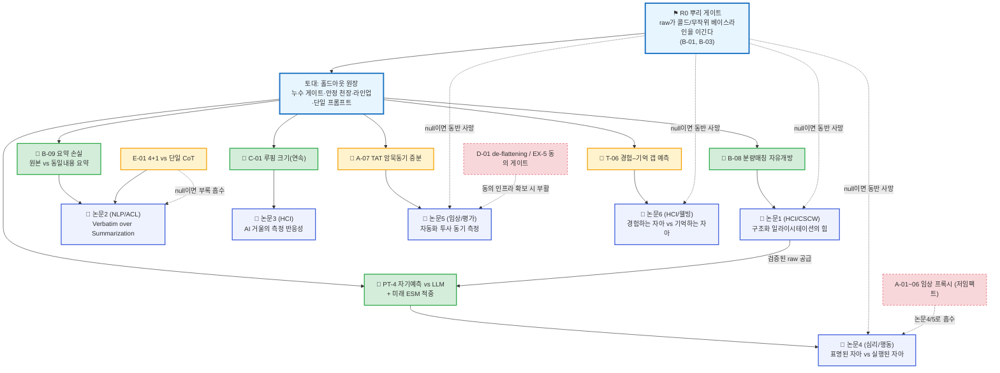

# 논문 전략 (Keystone Hypothesis → Paper DAG)

> **세 줄 요약:**
> - 검증 레지스트리(M/L/B/C/T/P/X/A/D/E 40여 개)를 **논문 단위로** 묶고, 각 논문을 단 하나의 *키스톤 가설*에 건다.
> - 키스톤이 양성이면 보조 가설을 붙여 단독 출판, null이면 **격하 또는 다른 논문의 ablation 부록으로 흡수**된다.
> - 핵심 통찰: 이 논문들은 *독립된 베팅이 아니다.* 다수가 뿌리 가정 하나(R0)를 공유하므로, 그 가정이 무너지면 동시에 죽는다.
>
> **설계 핵심:**
> - **목적:** "막연히 좋아 보이는 시스템"이 아니라 *실험 결과에 따라 조립/폐기되는 공장*으로 연구 프로그램을 구조화
> - **위치:** 이 문서는 *연구 계획서*이지 방법 개선이 아니다 — 논문 수를 늘리지 않고, 자책골(쪼개기·뿌리의존 간과)을 막는다. 실제 실험 명세는 [검증 모드](<검증 모드.md>) §6 레지스트리에 있다.

---

## 0. 냉혹한 전제 — 이 논문들은 상관된 베팅이다

레지스트리를 "40개 가능성"으로 읽으면 안 된다. 출판 가능한 *실질 기여*는 소수이고, 그마저도 서로 독립이 아니다. 진짜 의존 구조는 다음 계층이다.

- **R0 — 뿌리 게이트:** "raw_store가 콜드/무작위 베이스라인을 *애초에* 이긴다" (`B-01`, `B-03`). **이게 null이면 논문 1·2·4·5·6이 한꺼번에 죽는다.** 모든 예측 기반 논문의 단일 실패점이다.
- **토대 무결성:** 누수 게이트 작동, 안정 천장 계산 가능, 라인업이 우연과 분리. 깨지면 *모든* 숫자가 해석 불가([검증 모드](<검증 모드.md>) §1-2·§1-3).
- **공유 상류 자원:** 종단 패널(수개월), ESM 동시수집, 외부 척도, 인구통계 동의(EX-5). 데이터 산출 *속도*의 상한.
- **유일한 비상관 헤지:** **루핑(논문 3)** 만 R0와 무관하다 — "raw가 예측하는가"가 아니라 "사람이 AI 거울을 보고 변하는가"를 묻기 때문. R0가 불안하면 이 논문을 먼저 확보해 리스크를 분산한다.

---

## 1. 파이프라인 다이어그램

> 색: 파랑=뿌리/토대, 초록=데이터만 모이면 유력, 노랑=고위험(흡수 가능), 빨강 점선=보류/흡수.

---

## 2. 포트폴리오 (티어별)

| 티어 | 논문 | 키스톤 (생사) | null이면 | 보수적 평가 |
|---|---|---|---|---|
| **앵커** | **1 · 구조화 일라이시테이션** (HCI/CSCW) | `B-08` 분량매칭 자유개방 | 주장 B(soul.md)로 격하 — 테제 사망 | 강 1편 가능, B-08 불확실 |
| **앵커** | **2 · Verbatim over Summarization** (NLP/ACL) | `B-09` 요약 손실 | "원본 보존" 도그마 붕괴 → 요약 파이프라인 피봇 | 창립 명제 직접 검증 |
| **헤지** | **3 · 루핑(측정 반응성)** (HCI) | `C-01` 연속 dose-response | 흡수 안 됨 — 효과 약함으로 보고 | **R0와 비상관·신규**. 종단만 되면 유력 |
| **조건부** | **4 · 표명 vs 실행 자아** (심리/행동) | `PT-4` 자기예측 vs LLM + ESM | "LLM은 앵무새" 한계 보고로 선회 | picks 중 최강. R0 의존 |
| **조건부** | **5 · 자동화 투사 동기(TAT)** (임상/평가) | `A-07` 암묵동기 증분 + 코딩일치 | 자기보고와 중복 → 폐기 | 조건부. R0 의존 |
| **조건부** | **6 · 경험 vs 기억 자아(DRM)** (HCI/웰빙) | `T-06` 갭 예측 | DRM은 서사 데이터로만 잔존 | 조건부. ESM 동시수집 필수 |
| **흡수** | (인지엔진 4+1) | `E-01` vs 단일 CoT | **논문 2의 아키텍처 ablation 부록** | 고위험. 설계상 헤드라인 미오염(공짜 시도) |
| **보류** | (de-flattening) | `D-01` | — | EX-5 동의 인프라 선결, 그전엔 launch 불가 |
| **보류** | (임상 프록시) | `A-01~06` | — | 저임팩트 → 논문 4/5로 흡수 |

---

## 3. 논문별 상세

### 논문 1 — 구조화 일라이시테이션 (HCI/CSCW)
- **독립변수:** *어떻게 끌어내는가* (구조화 13종 배터리 vs 자유 서술). 내용은 둘 다 사용자 verbatim, **분량·시간 매칭.**
- **키스톤 `B-08`:** 분량매칭 자유개방보다 raw_store가 예측에서 앞서야 *구조가 활성 성분*임이 고립 입증된다(주장 A). soul.md 비교(B-04, 주장 B)는 보조.
- **보조:** M-01(메서드별 ablation), M-02(학습곡선), B-01/03(non-triviality).
- **💀 null:** 분량만 같으면 자유서술과 동등 → "구조의 힘"은 환상. "LLM 비용 절감형 고효율 자기보고 앱"으로 격하.

### 논문 2 — Verbatim over Summarization (NLP/ACL)
- **독립변수:** *어떻게 표현/주입하는가* (원본 verbatim vs 동일 내용 요약). 일라이시테이션은 고정.
- **키스톤 `B-09`:** 같은 raw를 요약하면 예측 신호가 손실됨을 보여야 한다. 이것이 "외부 해석이 원본을 덮어쓴다"는 창립 명제의 *유일한 직접 검증*이다.
- **보조:** 모델 크기 무관성(L-시리즈), n-AFC 라인업, 인지엔진 ablation(E-01) 흡수.
- **💀 null:** 인간/LLM 요약이 충분 → 원본 보존 철학 붕괴. 프로젝트 치명적 위기, 짧은 한계 보고로 종료.
- **⚠️ 쪼개기 관리:** 논문 1과 같은 패널·프로브를 쓰므로 *샐러미 위험*이 있다. B-08·B-09 둘 다 풍부하면 2편, 어느 하나가 얇으면 **"추출+표현" 단일 논문으로 병합**한다.

### 논문 3 — AI 거울의 측정 반응성 / 루핑 (HCI)
- **키스톤 `C-01`:** 활용 노출량과 raw 변화량 사이 단조 증가(dose-response). 단순 재검사 노이즈를 뺀 순 반응성.
- **보조:** C-02(도메인 특이성), C-03(워시아웃), C-05(positive looping).
- **💀 null:** 흡수되지 않음 — "효과 약함"으로 정직 보고. **R0 무관이라 다른 논문이 다 죽어도 살아남는 헤지.**

### 논문 4 — 표명된 자아 vs 실행된 자아 (심리/행동)
- **키스톤 `PT-4`+행동추적:** 사용자 자기예측보다 LLM(raw) 예측이 **실제 미래 ESM과 더 일치**해야 한다. (= 프로젝트 헤드라인 "LLM이 당신보다 당신을 더 아는가"의 직격)
- **보조:** 조절변수 — 고스트레스에서 가치(Superego)보다 본능(Id) 기반 예측이 행동에 더 부합(인지엔진 렌즈 활용). espoused–enacted 갭(CCRT vs ESM).
- **상류 의존:** 논문 1의 검증된 raw 공급 + ESM 종단.
- **💀 null:** LLM이 자기기만을 거울처럼 반사할 뿐 → "환각 한계" 논문으로 선회(조절변수 척도 폐기).
- **🎯 venue 톤다운:** JPSP는 비현실적(LLM 방법론 거의 안 받음). 현실 타겟은 *Psychological Science / Collabra / 계산사회과학(PNAS Nexus)* 급.

### 논문 5 — 자동화 투사 동기 측정 (TAT, 임상/평가)
- **키스톤 `A-07`:** TAT 투사에서 추출한 암묵 동기가 자기보고 가치를 *넘어* 행동을 예측 + LLM 동기코딩이 인간 분석가와 일치.
- **💀 null:** 자기보고와 중복 → 폐기. (임상 프록시 A-01~06는 여기로 흡수)

### 논문 6 — 경험하는 자아 vs 기억하는 자아 (DRM, HCI/웰빙)
- **키스톤 `T-06`:** raw만으로 기억 왜곡 방향·크기를 사전 예측.
- **상류 의존:** ESM·DRM 같은 기간 동시수집(없으면 갭 측정 불가).
- **💀 null:** DRM은 에피소드 서사 데이터로만 잔존.

---

## 4. 실행 순서 (리스크 분산 관점)

1. **토대 + R0 먼저.** B-01/03로 "raw가 애초에 예측하는가"를 확인하기 전엔 조건부 논문(4·5·6)에 자원을 쏟지 않는다.
2. **논문 3(루핑)을 병행 착수.** R0와 비상관이라, R0가 무너져도 건질 유일한 보험.
3. **앵커(1·2) 확보 후 조건부로 확장.** 논문 4는 논문 1의 검증된 raw에 의존하므로 1 다음.
4. **인지엔진(E-01)은 언제든 공짜 시도** — 설계상 헤드라인을 오염시키지 않으므로(결함 5 수정) 부담 없이 돌리고, 이기면 논문 2 보강, 지면 부록.

---

## 5. 채택 결정 로그 (제안본 대비)

| 항목 | 결정 | 사유 |
|---|---|---|
| 키스톤→null흡수 골격 | **채택** | 반증가능성 중심 구조가 프로젝트 철학과 정합 |
| 일라이시테이션(HCI) ↔ 표현/요약(NLP) 분리 | **채택(정제)** | IV·venue·커뮤니티가 실제로 다름. 단 제안본 P2의 soul.md 혼입을 제거, 순수 요약손실로 정제 |
| 요약 손실 직접 실험 | **신규 채택** | 창립 도그마를 직접 검증하는 실험이 레지스트리에 *없었음* → `B-09` 신설 |
| 행동 예측 논문(자기예측 vs LLM) | **채택·승격** | picks 중 헤드라인 질문 직격. 단 venue JPSP→현실 톤다운 |
| 루핑 논문 누락 | **되살림** | R0 비상관 유일 헤지. 누락 시 리스크가 R0 한 점에 집중 |
| 모든 키스톤 동일 '입증' 색 | **기각** | E-01·D-01의 고위험을 숨김. 위험 티어링으로 교체 |
| TAT·DRM 논문(신규 메서드) | **추가** | 직전 채택한 2종 메서드의 키스톤(A-07·T-06) 반영 |

---

> **정직한 한계:** 이 표는 *논문 수를 늘리지 않는다.* 천장은 데이터가 정한다(R0 양성 여부, 종단 수집 가능성). 이 문서가 하는 일은 (a) 무엇이 한 편이고 무엇이 부록인지 가려 쪼개기 감점을 막고, (b) 상관된 베팅을 드러내 R0에 자원을 몰지 않게 하는 것뿐이다. 실험 명세·채점·통계 프레임은 [검증 모드](<검증 모드.md>)에 있다.

**🔗 상위 맥락:** [Extracting the human mind](<Extracting the human mind.md>) · [검증 모드](<검증 모드.md>) · [README](<README.md>)
