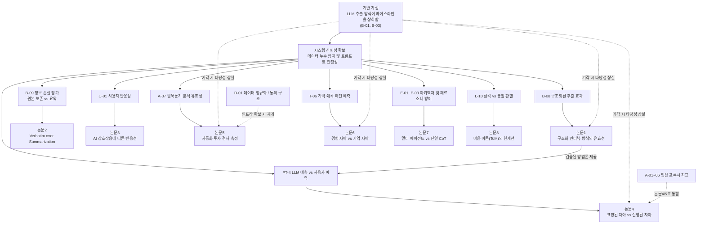

# 논문 출판 전략 및 연구 로드맵

> **세 줄 요약:**
> - 전체 실험 계획(검증 레지스트리 40여 개)을 **논문 단위로** 모듈화하고, 각 논문은 단 하나의 *핵심 가설(Core Hypothesis)*을 중심으로 구성한다.
> - 본 프로젝트의 모든 실험은 **양방향 출판 전략(Win-Win Experimental Design)**을 채택한다. 가설이 지지되면 새로운 프레임워크의 승리이며, 기각되면 인간에 대한 위대한 재발견이나 AI의 한계선을 긋는 논문이 된다.
> - 핵심 통찰: 제안된 논문들은 *독립적인 연구가 아니다.* 다수가 하나의 기반 가설(Baseline)을 공유하므로, 기초 전제가 기각되면 후속 연구들도 타당성을 잃게 된다.

> **설계 핵심:**
> - **목적:** "가능성 있는 시스템"을 넘어, *가설 검증 결과에 따라 유연하게 적응하는 체계적인 연구 프로그램*으로 구조화한다.
> - **위치:** 이 문서는 *전체 연구 로드맵*을 다룬다 — 무리하게 논문 수를 늘리는 것을 방지하고, 논문 간의 선후 관계를 명확히 한다. 실제 실험 명세는 [검증 모드](<검증 모드.md>) 문서에 있다.

---

## 0. 연구의 전제 조건 — 상호 의존적 연구 구조

다양한 실험 가능성들이 모두 출판 가능한 개별 기여점으로 이어지는 것은 아니다. 기여점들은 서로 긴밀하게 연결되어 있으며, 그 의존 구조는 다음과 같다.

- **기반 가설 (Baseline Hypothesis):** "LLM을 통한 원시 데이터(raw_store) 추출 방식이 단순 무작위 베이스라인이나 통상적인 챗봇보다 우수하다" (`B-01`, `B-03`). **이 가설이 기각되면 후속 논문(1·2·4·5·6)은 전면적인 재검토가 필요하다.** 이는 모든 예측 기반 연구의 공통된 출발점이다.
- **시스템 신뢰성:** 프라이버시 유지, 응답 안정성, 편향 통제 등 기본적인 프레임워크가 정상 작동해야 한다. 이것이 흔들리면 추출된 데이터를 학술적으로 해석할 수 없다.
- **공유 상류 자원:** 종단 데이터(수개월 추적), ESM 동시 수집, 외부 심리 척도 확보 등이 논문 산출의 속도를 결정짓는다.
- **독립적 연구 과제:** **루핑(논문 3)** 연구는 기반 가설과 독립적이다. "시스템이 얼마나 잘 예측하는가"가 아니라 "사용자가 AI의 피드백을 보고 어떻게 변화하는가"를 묻는 HCI적 접근이기 때문에 리스크를 분산시킬 수 있다.

---

## 1. 연구 파이프라인 및 의존성 다이어그램

---

## 2. 논문 포트폴리오 요약

| 분류 | 논문 | 핵심 가설 | 기각 시 출판 방향 (Win-Win) | 보수적 평가 |
|---|---|---|---|---|
| **주요 연구** | **1 · 구조화 추출 유효성** | `B-08` 구조화 방식의 우위성 | LLM 문맥 추론의 임계점(Sufficient Context Threshold) 실증 | 1편 출판 가능 |
| **주요 연구** | **2 · 원본 보존의 중요성** | `B-09` 요약에 따른 신호 손실 | 심리 데이터의 요약 압축 가능성과 정보 밀도 규명 | 핵심 전제 중 하나 |
| **독립 연구** | **3 · 사용자 반응성** | `C-01` 노출에 따른 반응성 변화 | 알고리즘적 자아 현상의 경계 조건(Boundary Condition) 및 저항성 입증 | 종단 연구 성공 시 유력 |
| **후속 연구** | **4 · 표명 vs 실행 자아** | `PT-4` 표명/실제 자아 불일치 | 매체 환경에서도 유지되는 자기보고 정합성 재확인 (파급력 낮음) | 기반 가설에 의존 |
| **후속 연구** | **5 · 자동화 투사 검사** | `A-07` 암묵동기 평가 일치도 | 임상 전문가의 암묵적 추론(Tacit Knowledge) 영역 정량화 및 AI 한계 입증 | 조건부 진행 |
| **후속 연구** | **6 · 경험 vs 기억 자아** | `T-06` 기억 갭 예측 | 사후 환경 변수의 통제 불가능성 및 한계 보고 | ESM 동시 수집 필수 |
| **신규 연구** | **7 · 아키텍처 유효성** | `E-01, E-03` 멀티 에이전트 우위 | 역할 분할 오버엔지니어링 무용론 및 단일 CoT 최적화 우위 실증 | 파급력 큼 |
| **신규 연구** | **8 · 마음 이론(ToM)** | `L-10` AI 통찰의 환각 여부 판별 | AI 심리분석의 '바넘 효과' 및 통계적 편향 한계성 경고 | 학술적 파급력 큼 |

---

## 3. 논문별 양방향(Win-Win) 세부 전략

### 📝 논문 1 — 구조화 인터뷰 방식의 유효성
- **핵심 가설 `B-08`:** 구조화된 심리 기법(16종 배터리 등)이 5분짜리 자유 대화보다 후속 행동 예측에 더 높은 신호를 제공한다.
- **양방향 출판 전략 (Win-Win):**
  - **가설 지지 시:** 파편화된 대화 분석을 뛰어넘는 '구조화된 AI 심리 추출'의 유효성 입증.
  - **가설 기각 시:** LLM이 표면적 대화(5분)만으로도 구조화된 심리 평가와 통계적으로 유사한 깊이의 컨텍스트를 추론해낼 수 있음을 입증. AI 심리 분석에서 구조화 배터리의 효용성 한계(Sufficient Context Threshold)를 규명하는 실증 연구.

### 📝 논문 2 — Verbatim over Summarization
- **핵심 가설 `B-09`:** 사용자의 원본 데이터(날것)를 요약할 경우, 내포된 미묘한 심리적 뉘앙스와 신호가 유실된다.
- **양방향 출판 전략 (Win-Win):**
  - **가설 지지 시:** 심리학적 AI 시스템에서 함부로 요약 파이프라인을 도입하면 안 된다는 데이터 아키텍처 기준선 제시.
  - **가설 기각 시:** 최신 LLM의 요약 파이프라인이 인간의 심리적 뉘앙스를 통계적으로 유의미한 손실 없이 압축(Lossless Compression)할 수 있음을 규명. 심리 데이터의 정보 밀도와 압축 한계를 증명하는 논문.

### 📝 논문 3 — AI 상호작용에 따른 반응성
- **핵심 가설 `C-01`:** AI가 제공하는 분석 피드백에 노출될수록 사용자의 후속 답변이나 행동이 그 분석에 동기화되거나 반발하는 양상을 보인다 (알고리즘적 자아).
- **양방향 출판 전략 (Win-Win):**
  - **가설 지지 시:** AI의 피드백이 인간의 자아 정체성에 실시간으로 개입하는 '루핑(Looping)' 현상 실증.
  - **가설 기각 시:** 알고리즘적 자아(Algorithmic Self) 현상이 모든 맥락에서 발생하지 않으며, 사용자의 핵심 정체성은 AI의 라벨링에 강한 저항성을 지닌다는 점을 밝히는 '경계 조건(Boundary Condition)' 규명 연구.

### 📝 논문 4 — 표명된 자아 vs 실행된 자아
- **핵심 가설 `PT-4`:** 사용자의 자기 예측보다 LLM이 분석한 예측이 실제 행동(ESM 데이터)과 더 높은 상관을 보인다 (즉, 표명된 자아와 실제 행동이 일치하지 않는다).
- **양방향 출판 전략 (Win-Win):** 
  - **가설 지지 시:** 인간의 자기 인식에는 거대한 사각지대가 존재하며, LLM이 이를 더 정확히 관통한다는 파괴적 결론.
  - **가설 기각 시:** 디지털 텍스트 기반 추출 환경에서도 인간의 자기보고(표명된 자아)가 실제 행동과 높은 정합성을 유지함을 재확인. (단, 기존 심리학의 전제를 재확인하는 수준이므로 단독 논문으로서의 파급력은 상대적으로 낮음)

### 📝 논문 5 — 자동화 투사 검사
- **핵심 가설 `A-07`:** 자동화된 검사(TAT 프록시 등)에서 추출한 무의식 동기가 실제 임상 전문가의 코딩 결과와 높은 일치도를 보인다.
- **양방향 출판 전략 (Win-Win):**
  - **가설 지지 시:** 고비용의 전문가 훈련을 요구하는 투사 검사 채점 과정을 AI가 신뢰도 높게 자동화할 수 있다는 임상 혁신.
  - **가설 기각 시:** 자동화 알고리즘이 포착하지 못하는 임상 전문가 고유의 '암묵적 추론(Tacit Knowledge)' 영역을 정량적으로 규명. AI 심리치료의 명확한 한계와 전문가의 대체 불가능성을 입증하는 연구.

### 📝 논문 6 — 경험하는 자아 vs 기억하는 자아
- **핵심 가설 `T-06`:** 사전 추출된 원시 데이터를 통해, 사용자가 사건을 겪은 후 기억을 어떻게 왜곡할지 방향성을 예측할 수 있다.
- **의존성:** 실시간 경험(ESM)과 사후 회상(DRM) 데이터의 동시 수집 필수. (기각 시 개별 환경 변수 요인으로 한계 설정)

### 📝 논문 7 — 아키텍처 및 페르소나 방어 *[신규]*
- **핵심 가설 `E-01, E-03`:** 4+1 블랙보드 아키텍처(역할 분할 멀티 에이전트)가 단일 프롬프트 에이전트보다 장기 시뮬레이션 시 페르소나 붕괴(캐리커처화)를 더 잘 방어한다.
- **양방향 출판 전략 (Win-Win):**
  - **가설 지지 시:** 심리학 이론(내면가족체계 등)을 본뜬 아키텍처가 단순 프롬프트 엔지니어링의 구조적 한계를 뚫어낸다는 AI 아키텍처 실증.
  - **가설 기각 시:** 심리학 이론을 차용한 복잡한 아키텍처(멀티 에이전트)가 단일 프롬프트 최적화(Single CoT)에 비해 유의미한 이득이 없음을 실증. AI 에이전트 설계에서 오버엔지니어링 무용론을 뒷받침하는 연구.

### 📝 논문 8 — 마음 이론(ToM)의 한계선 *[신규]*
- **핵심 가설 `L-10`:** LLM이 명시적으로 주어지지 않은 사용자의 내면적 약점을 짚어냈을 때, 이는 스테레오타입에 기반한 환각이 아니라 실제 진실(통찰)이다.
- **양방향 출판 전략 (Win-Win):**
  - **가설 지지 시:** LLM이 방어기제를 뚫고 인간의 무의식을 역추적할 수 있는 진정한 의미의 '마음 이론'을 갖추고 있음을 증명.
  - **가설 기각 시:** LLM의 '통찰'이라 여겨지는 결과물이 사실은 훈련 데이터의 통계적 편향과 바넘 효과(Barnum Effect)에 불과함을 실증. AI 심리분석의 환각적 한계를 경고하는 비판적 연구.

---

## 4. 실행 순서 및 리스크 관리

1. **기반 가설(R0) 최우선 검증:** 가장 기본적인 데이터 추출 품질을 확인하기 전에는 후속 연구(논문 4·5·6)에 리소스를 투입하지 않는다. 최소 기능 단위(MVP)를 통해 유의미성을 먼저 입증한다.
2. **논문 3(사용자 반응성) 병행 착수:** 기반 가설이 기각되더라도 학술적 가치를 지니는 독립 과제이므로, 리스크 분산 차원에서 조기 착수한다.
3. **주요 연구 확보 후 확장:** 1, 2번 연구가 안정궤도에 오르면, 그 데이터를 바탕으로 조건부 후속 연구(논문 4~8)를 진행한다.

> **작성 의도:** 이 문서는 무리하게 다수의 논문을 쓰기 위한 계획이 아닙니다. 연구의 중심축(기반 가설)을 명확히 하고, 해당 가설이 기각되었을 때 오히려 더 가치 있는 발견이 되도록 '양방향(Win-Win)'으로 직조해 놓은 방어적 연구 로드맵입니다. 상세한 실험 명세와 통계 검증 계획은 [검증 모드](<검증 모드.md>)에 기술되어 있습니다.

**🔗 관련 문서:** [Extracting the human mind](<Extracting the human mind.md>) · [검증 모드](<검증 모드.md>) · [README](<README.md>)
