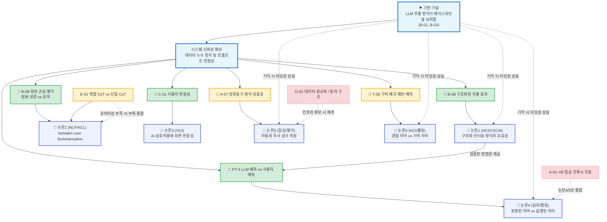

# 논문 출판 전략 및 연구 로드맵

> **세 줄 요약:**
> - 전체 실험 계획(검증 레지스트리 40여 개)을 **논문 단위로** 모듈화하고, 각 논문은 단 하나의 *핵심 가설(Core Hypothesis)*을 중심으로 구성한다.
> - 핵심 가설이 지지(Supported)되면 보조 가설을 더해 단독 논문으로 출판하고, 기각(Null)될 경우 **연구 방향을 수정하거나 다른 연구의 한계점 논의로 흡수**한다.
> - 핵심 통찰: 제안된 논문들은 *독립적인 연구가 아니다.* 다수가 하나의 기반 가설(Baseline)을 공유하므로, 기초 전제가 기각되면 후속 연구들도 타당성을 잃게 된다.

> **설계 핵심:**
> - **목적:** "가능성 있는 시스템"을 넘어, *가설 검증 결과에 따라 유연하게 적응하는 체계적인 연구 프로그램*으로 구조화한다.
> - **위치:** 이 문서는 *전체 연구 로드맵*을 다룬다 — 무리하게 논문 수를 늘리는 것을 방지하고, 논문 간의 선후 관계를 명확히 한다. 실제 실험 명세는 [검증 모드](<검증 모드.md>) 문서에 있다.

---

## 0. 연구의 전제 조건 — 상호 의존적 연구 구조

다양한 실험 가능성들이 모두 출판 가능한 개별 기여점으로 이어지는 것은 아니다. 기여점들은 서로 긴밀하게 연결되어 있으며, 그 의존 구조는 다음과 같다.

- **기반 가설 (Baseline Hypothesis):** "LLM을 통한 원시 데이터(raw_store) 추출 방식이 단순 무작위 베이스라인이나 통상적인 챗봇보다 우수하다" (`B-01`, `B-03`). **이 가설이 기각되면 후속 논문(1·2·4·5·6)은 전면적인 재검토가 필요하다.** 이는 모든 예측 기반 연구의 공통된 출발점이다.
- **시스템 신뢰성:** 프라이버시 유지, 응답 안정성, 편향 통제 등 기본적인 프레임워크가 정상 작동해야 한다. 이것이 흔들리면 추출된 데이터를 학술적으로 해석할 수 없다.
- **공유 상류 자원:** 종단 데이터(수개월 추적), ESM 동시 수집, 외부 심리 척도 확보 등이 논문 산출의 속도를 결정짓는다.
- **독립적 연구 과제:** **루핑(논문 3)** 연구는 기반 가설과 독립적이다. "시스템이 얼마나 잘 예측하는가"가 아니라 "사용자가 AI의 피드백을 보고 어떻게 변화하는가"를 묻는 HCI적 접근이기 때문에 리스크를 분산시킬 수 있다.

---

## 1. 연구 파이프라인 및 의존성 다이어그램

---

## 2. 논문 포트폴리오 요약

| 분류 | 논문 | 핵심 가설 | 기각 시 대응 | 보수적 평가 |
|---|---|---|---|---|
| **주요 연구** | **1 · 구조화 추출 유효성** (HCI/CSCW) | `B-08` 구조화 방식의 우위성 | 단순 효율성 논의로 축소 | 1편 출판 가능, 입증 난이도 보통 |
| **주요 연구** | **2 · 원본 보존의 중요성** (NLP/ACL) | `B-09` 요약에 따른 신호 손실 | 요약 파이프라인의 필요성으로 방향 수정 | 핵심 전제 중 하나 |
| **독립 연구** | **3 · 사용자 반응성 (루핑)** (HCI) | `C-01` 노출량에 따른 반응성 변화 | 유의미한 효과 없음으로 결과 보고 | **기반 가설과 독립적**. 종단 연구 성공 시 유력 |
| **후속 연구** | **4 · 표명 vs 실행 자아** (심리/행동) | `PT-4` LLM 예측과 실제 행동의 일치도 | 모델의 환각적 한계 분석 논문으로 선회 | 기반 가설에 강하게 의존 |
| **후속 연구** | **5 · 자동화 투사 검사** (임상/평가) | `A-07` 암묵동기 평가 일치도 | 기존 자가보고와 차별성 부족 시 폐기 | 조건부 진행 |
| **후속 연구** | **6 · 경험 vs 기억 자아** (HCI/웰빙) | `T-06` 기억 갭 예측 | 서사 분석 데이터로 활용 범위 축소 | ESM 동시 수집 필수 |

---

## 3. 논문별 세부 전략

### 논문 1 — 구조화 인터뷰 방식의 유효성 (HCI/CSCW)
- **독립변수:** 구조화된 문항(16종 배터리) vs 자유 서술 방식.
- **핵심 가설 `B-08`:** 구조화된 방식이 자유 서술보다 후속 행동 예측에 더 유의미한 신호를 제공해야 한다.
- **기각 시:** "구조의 힘"이 입증되지 않는다면, "비용을 절감하는 LLM 기반 자기보고 앱" 수준의 한계점으로 축소 보고한다.

### 논문 2 — Verbatim over Summarization (NLP/ACL)
- **독립변수:** 사용자 원본 데이터 보존 vs 요약된 데이터 활용.
- **핵심 가설 `B-09`:** 원본을 요약할 경우 사용자의 미묘한 심리적 신호가 유실됨을 입증해야 한다.
- **기각 시:** 기존의 요약 기술로 충분하다는 결론에 도달하며, 시스템 구조의 경량화를 꾀하는 방향으로 수정한다. 두 가설(B-08, B-09) 간의 연관성이 높으므로 결과에 따라 논문 1과 통합될 수 있다.

### 논문 3 — AI 상호작용에 따른 반응성 (HCI)
- **핵심 가설 `C-01`:** AI가 제공하는 피드백 노출량과 사용자의 데이터 입력 양상 간의 유의미한 상관관계.
- **기각 시:** 단순한 노이즈로 처리하며 정직하게 효과 없음을 보고한다. **기반 가설의 성공 여부와 무관하게 독자적으로 진행할 수 있는 핵심 독립 과제다.**

### 논문 4 — 표명된 자아 vs 실행된 자아 (심리/행동)
- **핵심 가설 `PT-4`:** 사용자의 자기 예측보다 LLM이 파악한 행동 예측이 실제 사용자 행동(ESM 데이터)과 더 높은 상관을 보인다.
- **의존성:** 논문 1에서 검증된 구조화 데이터를 공급받아야 진행 가능하다.
- **기각 시:** LLM이 사용자의 자기 기만적인 응답을 그대로 반사하는 한계를 지닌다는 '환각 한계 논문'으로 방향을 튼다.

### 논문 5 — 자동화 투사 검사 (임상/평가)
- **핵심 가설 `A-07`:** 자동화된 검사(TAT 프록시)에서 추출한 동기가 실제 전문가의 코딩 결과와 높은 일치도를 보인다.
- **기각 시:** 기존 자기보고식 검사를 대체할 실효성이 부족하므로 연구 대상에서 제외한다.

### 논문 6 — 경험하는 자아 vs 기억하는 자아 (HCI/웰빙)
- **핵심 가설 `T-06`:** 원시 데이터를 통해 사용자의 기억 왜곡 방향을 사전 예측할 수 있다.
- **의존성:** 실시간 경험(ESM)과 사후 회상(DRM) 데이터의 동시 수집이 필수적이다.

---

## 4. 실행 순서 및 리스크 관리

1. **기반 가설(R0) 최우선 검증:** 가장 기본적인 데이터 추출 품질을 확인하기 전에는 후속 연구(논문 4·5·6)에 리소스를 투입하지 않는다. 최소 기능 단위(MVP)를 통해 유의미성을 먼저 입증한다.
2. **논문 3(사용자 반응성) 병행 착수:** 기반 가설이 기각되더라도 학술적 가치를 지니는 독립 과제이므로, 리스크 분산 차원에서 조기 착수한다.
3. **주요 연구 확보 후 확장:** 1, 2번 연구가 안정궤도에 오르면, 그 데이터를 바탕으로 조건부 후속 연구(4번 등)를 진행한다.

> **작성 의도:** 이 문서는 무리하게 다수의 논문을 쓰기 위한 계획이 아닙니다. 연구의 중심축(기반 가설)을 명확히 하고, 해당 가설이 기각되었을 때 전체 프로젝트가 흔들리지 않도록 논문 간의 선후 관계와 대비책을 정리한 방어적 연구 로드맵입니다. 상세한 실험 명세와 통계 검증 계획은 [검증 모드](<검증 모드.md>)에 기술되어 있습니다.

**🔗 관련 문서:** [Extracting the human mind](<Extracting the human mind.md>) · [검증 모드](<검증 모드.md>) · [README](<README.md>)
