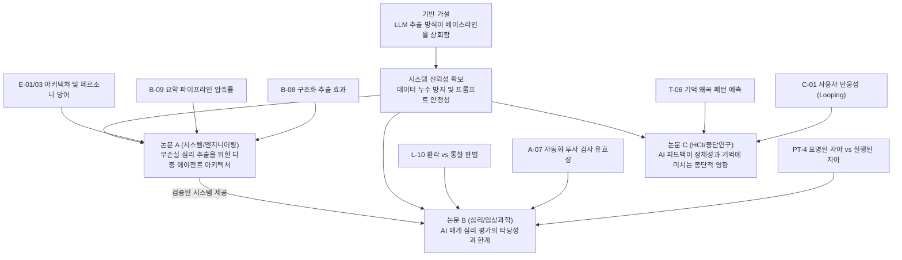

# 논문 출판 전략 및 연구 로드맵

> **세 줄 요약:**
> - 가설 단편화(LPU)를 방지하기 위해, 개별 가설들을 3개의 통합 논문으로 재구성한다.
> - 모든 실험은 가설 지지 여부와 무관하게 학술적 가치를 지니도록 설계한다 (Win-Win).
> - 3개의 통합 논문은 각각 '시스템(엔지니어링)', '임상적 타당성(심리)', '종단적 상호작용(HCI)'에 초점을 맞춘다.

---

## 0. 연구의 전제 조건 — 상호 의존적 연구 구조

실험 간의 의존 구조는 다음과 같다.

- **기반 가설 (Baseline Hypothesis):** "LLM을 통한 원시 데이터(raw_store) 추출 방식이 단순 무작위 베이스라인이나 통상적인 챗봇보다 우수하다" (`B-01`, `B-03`). 이 가설이 기각될 경우 논문 A와 B의 후속 실험 설계는 전면 재검토된다.
- **시스템 신뢰성:** 프라이버시 유지, 응답 안정성, 편향 통제 등 기본적인 프레임워크가 정상 작동해야 한다.
- **독립적 연구 과제:** 논문 C(반응성/루핑)는 시스템의 추출 능력 자체와는 독립적인 HCI 과제로 진행된다.

---

## 1. 연구 파이프라인 및 의존성 다이어그램

---

## 2. 통합 논문 포트폴리오 요약

| 분류 | 통합 논문 | 포함된 가설 그룹 | 기각 시 출판 방향 |
|---|---|---|---|
| **시스템** | **A. 심리 추출 아키텍처** | `B-08`, `B-09`, `E-01/03` | 심리 AI 설계 시 오버엔지니어링 불필요성 및 추출 임계점 실증 |
| **발견** | **B. 임상 평가 타당성** | `PT-4`, `A-07`, `L-10` | 자기보고 정합성 재확인, 임상 전문가의 대체 불가성 및 통계적 환각 한계 입증 |
| **상호작용** | **C. 종단적 반응성** | `C-01`, `T-06` | 알고리즘적 반응성의 경계 조건(Boundary Condition) 및 환경 변수 영향력 보고 |

---

## 3. 논문별 세부 전략

### 📝 논문 A — 심리 추출 아키텍처 (시스템/엔지니어링)
- **통합 가설:** 4+1 다중 에이전트 아키텍처(`E-01/03`)와 구조화된 배터리(`B-08`)를 통해 수집된 날것의 데이터(`B-09`)는 모델의 페르소나 붕괴를 막고 심리적 컨텍스트를 보존한다.
- **양방향 출판 전략:**
  - **가설 지지 시:** 기존 단일 프롬프트 및 요약 기반 시스템 대비 다중 에이전트 아키텍처의 유효성 검증.
  - **가설 기각 시:** LLM이 표면적 대화만으로도 문맥을 추론하며, 요약에 따른 정보 손실이 통계적으로 유의미하지 않음을 입증. AI 시스템 설계의 비용 효율성 한계점 규명.

### 📝 논문 B — 임상 평가 타당성 (심리/임상과학)
- **통합 가설:** 논문 A의 시스템을 통해 추출된 데이터는 사용자의 실제 행동을 예측(`PT-4`)하고, 임상 전문가의 평가(`A-07`)와 일치하며, 환각을 배제한 유의미한 분석(`L-10`)을 제공한다.
- **양방향 출판 전략:** 
  - **가설 지지 시:** 텍스트 추출 기반 심리 분석이 지니는 임상적 예측력과 타당성 입증.
  - **가설 기각 시:** LLM 분석 결과가 통계적 편향과 바넘 효과(Barnum Effect)에 머무름을 실증하고, 임상 전문가 고유의 추론 영역(Tacit Knowledge) 한계선 규명.

### 📝 논문 C — 종단적 반응성 (HCI/종단연구)
- **통합 가설:** AI 피드백에 노출될 경우 사용자의 후속 행동이 알고리즘에 동기화되는 루핑 현상(`C-01`)이 발생하며, 이는 과거 사건의 기억 방식(`T-06`)에도 영향을 미친다.
- **양방향 출판 전략:**
  - **가설 지지 시:** AI 상호작용이 사용자의 정체성과 기억에 개입하는 양상을 실증적 데이터로 분석.
  - **가설 기각 시:** 루핑 현상이 발현되지 않는 경계 조건 및 사용자의 회복탄력성(Resilience)을 규명. 사후 환경 변수가 알고리즘 피드백보다 기억에 미치는 영향력이 더 큼을 보고.

---

## 4. 실행 순서

1. **논문 A (시스템 검증) 선행:** 추출, 요약 방지, 아키텍처 검증을 최우선으로 진행하여 후속 연구의 기반 데이터를 확보한다.
2. **논문 C (종단 반응성) 병행 착수:** 장기 데이터 수집(Longitudinal)이 요구되므로, 독립 과제로서 조기 착수한다.
3. **논문 B (임상 타당성) 후속 착수:** 검증된 시스템과 수집된 데이터를 바탕으로 임상적 타당성 검증을 진행한다.
