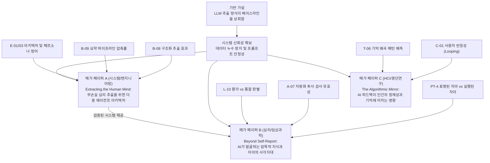

# 논문 출판 전략 및 연구 로드맵

> **세 줄 요약:**
> - 파편화된 다수의 가설(LPU, 살라미 출판)을 지양하고, **거대한 학술적 임팩트를 지닌 3개의 메가 페이퍼(Mega-Paper)**로 전체 연구를 통합한다.
> - 본 프로젝트의 모든 실험은 **양방향 출판 전략(Win-Win Experimental Design)**을 채택한다. 가설이 지지되면 새로운 프레임워크의 승리이며, 기각되면 인간에 대한 위대한 재발견이나 AI의 한계선을 긋는 논문이 된다.
> - 핵심 통찰: 세 개의 메가 페이퍼는 각각 **'시스템(엔지니어링)', '심리 파편 분석(발견)', '상호작용(HCI)'**이라는 거대한 줄기를 담당하며 서로 겹치지 않는 타겟 학계를 조준한다.

> **설계 핵심:**
> - **목적:** "가능성 있는 시스템"을 넘어, LPU 비판을 원천 차단하는 압도적인 증거량의 *System Paper*를 구축한다.
> - **위치:** 이 문서는 *전체 연구 로드맵*을 다룬다. 실제 실험 명세는 [검증 모드](<검증 모드.md>) 문서에 있다.

---

## 0. 연구의 전제 조건 — 상호 의존적 연구 구조

다양한 실험 가능성들이 모두 출판 가능한 개별 기여점으로 이어지는 것은 아니다. 기여점들은 서로 긴밀하게 연결되어 있으며, 그 의존 구조는 다음과 같다.

- **기반 가설 (Baseline Hypothesis):** "LLM을 통한 원시 데이터(raw_store) 추출 방식이 단순 무작위 베이스라인이나 통상적인 챗봇보다 우수하다" (`B-01`, `B-03`). **이 가설이 기각되면 메가 페이퍼 A와 B는 전면적인 재검토가 필요하다.**
- **시스템 신뢰성:** 프라이버시 유지, 응답 안정성, 편향 통제 등 기본적인 프레임워크가 정상 작동해야 한다.
- **독립적 연구 과제:** **루핑(메가 페이퍼 C)** 연구는 시스템의 추출 능력 자체와는 독립적이다. "시스템이 얼마나 잘 예측하는가"가 아니라 "사용자가 AI의 피드백을 보고 어떻게 변화하는가"를 묻는 HCI적 접근이다.

---

## 1. 연구 파이프라인 및 의존성 다이어그램

---

## 2. 메가 페이퍼(Mega-Paper) 포트폴리오 요약

여러 가설을 하나의 논문으로 묶음으로써, "단순한 현상 보고"를 넘어 "다각도로 검증된 거대한 통찰"을 제시한다.

| 분류 | 메가 페이퍼 | 포함된 가설 그룹 | 기각 시 출판 방향 (Win-Win) |
|---|---|---|---|
| **시스템** | **A. 무손실 심리 추출 아키텍처** | `B-08`, `B-09`, `E-01/03` | 다중 에이전트 및 구조화가 불필요하다는 **'비용 파괴적 최적화' 및 'LLM 압축 한계 실증' 논문** |
| **발견** | **B. 자아의 사각지대 발굴** | `PT-4`, `A-07`, `L-10` | 텍스트 환경에서도 유지되는 자기보고 정합성과 **전문가의 대체 불가성, 바넘 효과 한계 입증** |
| **상호작용** | **C. 알고리즘 거울과 자아** | `C-01`, `T-06` | 알고리즘 라벨링에 대한 인간의 닻(Anchor) 및 **회복탄력성 증명, 환경 변수의 통제 불가능성 보고** |

---

## 3. 논문별 양방향(Win-Win) 세부 전략

### 📝 메가 페이퍼 A — 무손실 심리 추출 아키텍처 (시스템/엔지니어링)
- **통합 가설:** 4+1 다중 에이전트 아키텍처(`E-01/03`)와 구조화된 배터리(`B-08`)를 통해 수집된 날것의 데이터(`B-09`)는 모델의 페르소나 붕괴를 막고 가장 높은 수준의 심리적 컨텍스트를 보존한다.
- **양방향 출판 전략 (Win-Win):**
  - **가설 지지 시:** 기존의 단일 프롬프트 챗봇이나 요약 기반 시스템이 가진 구조적 한계를 뚫어내는 혁신적인 AI 아키텍처 방법론을 제시한다.
  - **가설 기각 시:** LLM이 표면적 대화(5분)만으로도 문맥을 완벽히 추론하며, 요약 파이프라인의 정보 손실이 유의미하지 않고, 단일 프롬프트(CoT)가 효율적임을 입증. 즉, **"심리 AI 설계 시 오버엔지니어링(구조화, 다중 분할, 무가공 보존)은 불필요하다"는 AI 시스템의 비용 파괴적 한계선(Sufficient Context Threshold)을 규명하는 대형 논문**이 된다.

### 📝 메가 페이퍼 B — 자아의 사각지대 발굴 (심리/임상과학)
- **통합 가설:** 메가 페이퍼 A의 시스템을 통해 추출된 데이터는, 사용자의 자기 예측(`PT-4`)보다 실제 행동을 잘 예측하고, 임상 전문가의 평가(`A-07`)와 일치하며, 단순한 환각을 넘어선 통찰(`L-10`)을 제공한다.
- **양방향 출판 전략 (Win-Win):** 
  - **가설 지지 시:** 인간 자기 인식의 사각지대(표명된 자아 vs 실행된 자아)를 AI가 뚫어낼 수 있음을 입증하는 파괴적 임상/심리학 논문.
  - **가설 기각 시:** LLM의 '통찰'은 바넘 효과(Barnum Effect)에 불과하며, 여전히 임상 전문가의 '암묵적 추론(Tacit Knowledge)'을 모방할 수 없고, 인간의 자기보고는 정합성을 유지함을 입증. **AI 심리치료의 허상을 깨고 전문가의 고유성을 수호하는 매우 비판적이고 날카로운 한계 증명 논문**이 된다.

### 📝 메가 페이퍼 C — 알고리즘 거울과 자아 (HCI/종단연구)
- **통합 가설:** AI의 심리 분석 피드백에 지속적으로 노출될 경우, 사용자의 후속 행동이나 정체성이 알고리즘에 동기화되는 루핑 현상(`C-01`)이 발생하며, 이는 과거 사건을 기억하는 방식(`T-06`)의 왜곡 패턴으로까지 이어진다.
- **양방향 출판 전략 (Win-Win):**
  - **가설 지지 시:** AI가 인간의 자아 정체성과 기억에 실시간으로 개입하는 '알고리즘적 자아(Algorithmic Self)' 현상을 뇌관부터 증명하는 압도적인 HCI 논문.
  - **가설 기각 시:** 알고리즘적 자아 현상이 발생하는 **경계 조건(Boundary Condition)**이 매우 까다로움을 규명. 인간의 핵심 정체성은 외부 AI의 라벨링에 강한 저항성(Resilience)을 지니고 있으며, 사후 환경 변수가 AI의 예측보다 기억 왜곡에 훨씬 강하게 작용한다는 '인간 닻(Anchor)'의 존재를 입증하는 논문이 된다.

---

## 4. 실행 순서

1. **메가 페이퍼 A(시스템 검증) 최우선 착수:** 엔진의 기초체력(추출, 요약 방지, 아키텍처)을 하나로 묶어 가장 먼저 검증한다. 이 아키텍처가 흔들리면 B 논문의 발견들이 오염된다.
2. **메가 페이퍼 C(종단 반응성) 병행 착수:** 시스템 완성도와 무관하게 즉각적으로 데이터 수집(Longitudinal)을 시작해야 하므로 리스크 분산 차원에서 병행 착수한다.
3. **메가 페이퍼 B(임상/발견) 최종 착수:** A 논문을 통해 정립된 '무결한 데이터'를 바탕으로 가장 심오한 심리학적 가설들을 일제히 타격한다.
