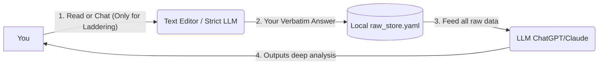

# 수동 실험 가이드

## First: what this repository is (and isn't)

> [!IMPORTANT]
> **This is a methodology wiki (protocol), not a runnable app.**
> 이 프로젝트는 버튼 하나 누르면 실행되는 앱이 아닙니다. 
> 
> *실제 앱 서비스 형태의 구조가 궁금하다면 [아키텍처 (App Blueprint)](<아키텍처.md>)를 참조하십시오.*
> 
> *(※ 단, Proof of Concept 목적으로 아래의 안내에 따라 종이와 펜, 로컬 파이썬 환경, 그리고 LLM을 이용해 이론상 수동으로 심리 추출 전 과정을 진행해 볼 수 있습니다. 자동화된 UI 없이 진행하므로 절차가 다소 번거로울 수 있습니다.)*

이 가이드는 수동 환경에서 챗봇(LLM)과 파이썬 코드를 교차로 통제하여, 자신의 심리 데이터를 오염 없이 추출하는 **'수동 오케스트레이션(Manual Orchestration)'** 방법을 설명합니다.

---

## 🛠️ 준비물 (What you need)

수동 실험을 위해 다음의 세 가지 환경을 브라우저에 띄워두세요.

1. **로컬 텍스트 에디터 (메모장 등):** 
   - `raw_store.yaml` 파일을 만들어 내 대답(날것의 텍스트)을 보관할 곳입니다.
2. **LLM 챗봇 (ChatGPT, Claude 등):** 
   - 동적 검사(래더링) 시 꼬리질문을 던져주는 '퍼실리테이터' 역할을 합니다.
3. **파이썬 실행 환경 (Google Colab, Jupyter Notebook 등):** 
   - 복잡한 수치 연산(삼항 도출의 분산 등)을 LLM에게 맡기지 않고 직접 정확하게 계산하기 위한 환경입니다. 브라우저에서 바로 실행 가능한 **[Google Colab](https://colab.research.google.com/)**을 강력히 권장합니다.

---

## 🧠 핵심 원칙: 추출 단계의 LLM 개입 통제 (Manual Orchestration)

> [!WARNING]
> **데이터를 뽑아낼 때(추출 단계) 챗봇(LLM)에게 분석이나 요약을 맡기지 마세요!**
> "내 대답을 분석해서 삼항 도출 점수를 매겨줘"라거나 "내 대답을 정리해 줘"라고 시키면, LLM은 은연중에 자신의 편향을 섞어 대답을 요약하거나 환각(Hallucination)으로 잘못된 수치를 도출합니다. 이 프로젝트의 핵심은 **개입 없는 순수한 원본(Raw-ness)**입니다.

검사의 성격에 따라 두 가지 방식으로 진행합니다.

**1. 정적 검사 (Static Extraction) - 예: CCRT, 두려운 자기**
*   질문이 고정되어 있으므로 **LLM을 아예 쓰지 마세요.** 종이나 텍스트 에디터에 혼자 생각하며 답을 적어 `raw_store.yaml`에 바로 저장합니다.

**2. 동적 검사 (Facilitated Extraction) - 예: 래더링(Laddering)**
*   "왜 그것이 중요하죠?" 하고 계속 파고들어야 하므로 **LLM(챗봇)의 보조(Facilitation)가 필수적**입니다.
*   단, 이때 LLM은 엄격하게 훈련된 **'멍청한 질문 기계'** 역할만 수행해야 합니다. 사용자의 대답을 지레짐작해 요약하지 못하게 프롬프트로 통제한 뒤, 대화가 끝나면 **당신이 입력한 원본 텍스트(Verbatim)만 발췌하여** 저장합니다.

수동 실험 환경에서는 앱의 백엔드 서버 대신 **당신이 직접 역할(Toggle)을 통제해야 합니다.**

*   **수식 연산 및 게이트 판정 👉 파이썬(`계산 절차.md` 복붙)**
*   **단순 꼬리질문 및 퍼실리테이팅 👉 LLM 챗봇**


*(추출은 오직 당신의 날것 그대로 기록되어야 하며, LLM의 지능은 데이터가 다 모인 후 분석(활용) 단계에서만 100% 사용합니다!)*

---

## 🌟 워크플로우 예시: 삼항 도출에서 래더링으로

어떻게 텍스트 에디터, 파이썬, 챗봇을 오가는지 **가장 복잡한 '삼항 도출 → 래더링' 파이프라인**을 예시로 보여드립니다.

### Phase 1. 삼항 도출 (수동 기록)
1. [삼항 도출](<삼항 도출.md>) 문서를 읽고, 9가지 원소를 뽑습니다.
2. 각 원소를 3개씩 묶어 "2개는 비슷하고 1개는 다른 이유"를 스스로 생각합니다. (LLM 챗봇 개입 없음)
3. 텍스트 에디터의 `raw_store.yaml`에 내가 만든 축(예: "통제감 vs 무력감")과 점수들을 직접 기입합니다.

### Phase 2. 수학적 타당성 계산 (Python)
1. **Google Colab**을 켭니다.
2. [계산 절차](<계산 절차.md>) 문서에 있는 파이썬 코드 블록(`dispersion_score`, `construct_deviation_sum`, `get_laddering_targets` 등)을 모두 복사해서 Colab 셀에 붙여넣고 실행합니다.
3. 내가 방금 `raw_store.yaml`에 적었던 점수 행렬(Grid) 데이터를 파이썬의 입력값으로 넣고 실행합니다.
4. **결과 확인:** 파이썬이 "가장 편차가 높은 축(Target_S)은 '통제감 vs 무력감' 입니다" 라고 정확한 타겟을 출력해 줍니다.

### Phase 3. 챗봇에 타겟 주입 (LLM)
1. 파이썬이 계산해준 1위 타겟("통제감 vs 무력감")을 들고 **ChatGPT/Claude** 창으로 이동합니다.
2. [래더링](<래더링.md>) 문서에 있는 '시스템 프롬프트(Facilitator Prompt)'를 복사하여 챗봇에게 입력해 줍니다.
3. 챗봇에게 이렇게 말합니다. *"내가 삼항 도출에서 뽑은 가장 중요한 가치는 '통제감'이야. 자, 이제 이 가치에 대해 래더링 꼬리질문을 시작해 줘."*
4. 챗봇이 "왜 통제감이 당신에게 중요한가요?"라고 물어보면 대답을 이어갑니다. 

### Phase 4. 최종 적재
대화가 4단계 깊이까지 끝나면, 챗봇이 내뱉은 요약이 아니라 **'내가 타이핑한 대답 원본(Verbatim)'** 만을 복사하여 `raw_store.yaml`에 붙여넣어 보존합니다.

---

## Step-by-Step 시작하기

**1. `raw_store.yaml` 파일 세팅**
자신의 컴퓨터 아무 곳에나 폴더를 만들고 `raw_store.yaml`을 생성하세요. 
```yaml
entries: []
```
> [!CAUTION]
> **Keep your data off git:** 여러분의 답변은 매우 내밀한 사적 데이터입니다. 만약 이 저장소를 클론받아 쓴다면, 절대 이 파일을 commit 하지 마세요. (`.gitignore` 파일에 `raw_store.yaml`이 기본적으로 차단 설정되어 있습니다.)

**2. 메서드 선택 및 수행**
원하는 기법을 하나 선택하세요.

| Method | 특성 | 문서 링크 |
|---|---|---|
| CCRT | 정적 (혼자 생각하고 적기) | [핵심 갈등 도식 (CCRT)](<핵심 갈등 도식 (CCRT).md>) |
| Feared Self | 정적 (혼자 생각하고 적기) | [두려운 자기와 조기 경보](<두려운 자기와 조기 경보.md>) |
| Triadic Elicitation | 정적 + 수치 연산 (파이썬 필요) | [삼항 도출](<삼항 도출.md>) |
| Laddering | 동적 (LLM 챗봇 꼬리질문 필요) | [래더링](<래더링.md>) |

**3. 최종 분석 (데이터가 모인 후)**
충분한 데이터가 모였다면, **가장 마지막에만 LLM의 지능을 100% 활용해 분석**합니다. 새로운 챗봇 창을 열고 `raw_store.yaml` 전체를 복사해 붙여넣은 뒤, 패턴을 찾아달라고 요청하세요. (`examples/analysis_prompt.md` 참조)

---

## 📝 Worked example: one CCRT session

**추출 질문 읽기** (CCRT 문서에서 질문을 읽고 텍스트 에디터에 타이핑합니다):

> 최근 6개월 이내의 실제 관계 장면 하나를 떠올려주세요. 그 장면에서 당신이 원한 게 뭐였나요? 상대는 실제로 어떻게 했나요? 그 순간 당신은 어떻게 반응했나요?

**내 답변(Verbatim)을 `raw_store.yaml`에 넣기 (요약 금지):**

```yaml
entries:
  - id: ccrt0001
    ts: 2026-06-20T14:00:00+09:00
    method: ccrt
    object_tag: "동료"           # 관계 유형만 적고 실명은 마스킹
    raw_wish: "내가 힘든 걸 굳이 말 안 해도 알아봐 주길"
    raw_response_other: "전혀 눈치 못 채고 평소처럼 일 얘기만 함"
    raw_response_self: "혼자 서운해하다 더 무뚝뚝하게 굴어서 사이가 멀어짐"
```

**❌ 절대 하면 안 되는 방식 (사전 해석 금지):**
```yaml
# ❌ 틀림 — 이건 내 대답이 아니라 해석된 요약임
raw_wish: "인정 욕구가 강함, 의존적 성향"
```
핵심 원칙: `raw_*` 필드에는 **"내가 실제로 한 생각과 말"**만 들어갑니다. 해석은 나중에 LLM이 한꺼번에 합니다.

---

## 🧪 Step 5 (Optional) — 수동 Hold-out 검증 테스트

LLM이 내 심리 패턴을 진짜로 이해했는지 '찍어 맞춰보라고' 할 수 있습니다. 순서가 매우 중요합니다.

1. **새 챗봇 창 열기:** `raw_store.yaml`을 모두 붙여넣고 질문합니다. *"이 데이터를 바탕으로 내가 새로운 CCRT 에피소드에서 어떤 반응(Response-Self)을 보일지 구체적으로 예측해 봐."*
2. **독립적 작성 (오염 방지):** LLM의 예측을 읽기 **전에**, 반드시 종이에 내 진짜 대답을 먼저 적어두세요.
3. **비교 채점:** 내가 종이에 적은 진짜 대답과 LLM이 예측한 텍스트가 논리적으로 일치하는지 비교합니다.

이것이 이 시스템이 환각이나 바넘 효과(Barnum Effect)에 기대지 않는다는 것을 증명하는 **[검증 모드](<검증 모드.md>)**의 핵심 로직입니다. 

---

## 🏷️ 필드 네이밍 규칙

| Field prefix | Meaning |
|---|---|
| `raw_*` | 내 답변 원문 (Verbatim) — 절대 의역 금지 |
| `id` | 메서드 접두사 + 4자리 일련번호 (예: `ccrt0001`, `l0001`) |
| `ts` | ISO 8601 타임스탬프 |
| `method` | `ccrt` / `laddering` / `triadic` / `feared_self` / `esm` / 등 |
| `object_tag` | **관계 유형 태그 (예: "동료", "부모").**<br>💡 *답변 중 실명(예: "김철수")이 들어갔다면, 반드시 `raw_store.yaml`에 저장하기 전에 관계 태그로 치환(가명화)해야 합니다.* |

전체 포맷은 `examples/raw_store.template.yaml`를 참조하세요.
