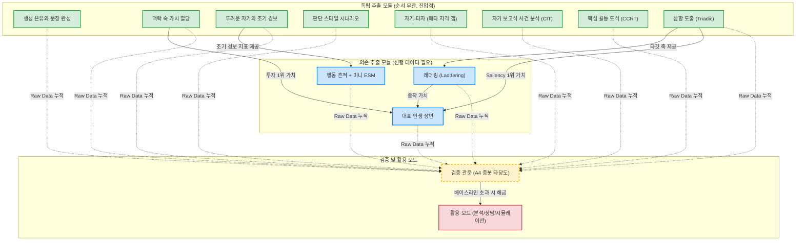

# 추출 파이프라인 의존성 도표 (Extraction DAG)

11가지 심리 추출 방법론과 검증 관문 간의 선후 관계(의존성)를 시각화한 DAG(Directed Acyclic Graph)입니다. 이 도표를 통해 어떤 데이터를 먼저 수집해야 다음 단계가 해금되는지 한눈에 파악할 수 있습니다.

## 핵심 요약
1. **독립 모듈 (초록색):** 아무런 선행 조건 없이 언제든 시작할 수 있습니다. 피로도가 낮은 은유/문장 완성을 먼저 시작하는 것이 권장됩니다.
2. **의존 모듈 (파란색):** 
   - `래더링`은 반드시 `삼항 도출`이 완료되어야 진입할 수 있습니다.
   - `대표 인생 장면`은 `삼항 도출`, `래더링`, `맥락 속 가치 할당` 중 하나라도 완료되어 **최상위 핵심 가치(앵커)**가 확보되어야 진입할 수 있습니다.
   - `미니 ESM`은 `두려운 자기`를 통해 조기 경보 지표가 설정되어야만 트래킹이 시작됩니다.
3. **검증 관문 (노란색):** 
   - 데이터가 쌓일 때마다 개별 문항 검증(봉인 예측 등)은 언제든 수행할 수 있습니다. 
   - 그러나 최종적으로 활용 모드를 오픈하기 위한 **증분 타당도 관문 통과**를 위해서는 "해당 도메인에서 삼항+래더링 최소 1세트 완료" 수준의 충분한 Raw Data 누적이 필수적입니다.

## 4. 모듈별 예상 소요 시간 (UX 피로도 관리)
전체 파이프라인을 한 번에 수행하는 것은 권장하지 않습니다. 모듈별 예상 소요 시간을 참고하여 세션을 나누어 진행해야 이탈(Drop-off)을 방지할 수 있습니다.

* **Core Heavy (15~20분):** 삼항 도출
* **Medium (5~10분):** 자기-타자, 판단 스타일 시나리오, 래더링, 대표 인생 장면, CIT, CCRT
* **Light (3~8분):** 생성 은유와 문장 완성, 맥락 속 가치 할당, 두려운 자기와 조기 경보
* **Micro (초 단위):** 행동 흔적 + 미니 ESM (1회당 15~30초)

## 5. 정적 추출 vs 동적(LLM 보조) 추출
저자의 철학에 따라, 데이터 추출 단계에서의 LLM 개입은 **최소화**되어야 합니다. 모듈의 성격에 따라 추출 방식을 두 가지로 엄격히 구분합니다.

*   **정적 검사 (Static Extraction):** 질문이 고정되어 있으므로 **LLM을 챗봇으로 사용하지 않습니다.** 종이나 텍스트 에디터에 스스로 답을 적어 `raw_store`에 저장합니다.
    *   *해당 모듈:* 생성 은유와 문장 완성, 맥락 속 가치 할당, 두려운 자기와 조기 경보, 판단 스타일 시나리오, 자기-타자, CIT, CCRT, 대표 인생 장면, 미니 ESM, **삼항 도출(Triadic Elicitation)**.
    *   *참고:* 삼항 도출에서 LLM이 쓰이긴 하지만, 대화를 이끄는 보조자가 아니라 추출이 끝난 뒤 텍스트를 거르는 **최종 판정자(Judge/Tiebreaker)** 로서 백엔드에서만 기능합니다.
*   **동적 검사 (Facilitated Extraction):** 사용자의 대답에 맞춰 꼬리질문("왜 그것이 중요하죠?", "두 개념의 차이가 뭐죠?")을 이어가야 하므로 **LLM(챗봇)의 보조가 필수적**입니다.
    *   *해당 모듈:* **래더링(Laddering)**.
    *   *주의사항:* 이때 LLM은 당신의 대답을 요약하거나 해석하는 것이 금지되며, 오직 '멍청한 질문 기계' 역할만 수행해야 합니다. 대화 종료 후에는 LLM의 말이 아닌 당신의 원본 텍스트(Verbatim)만 발췌하여 저장해야 합니다.
