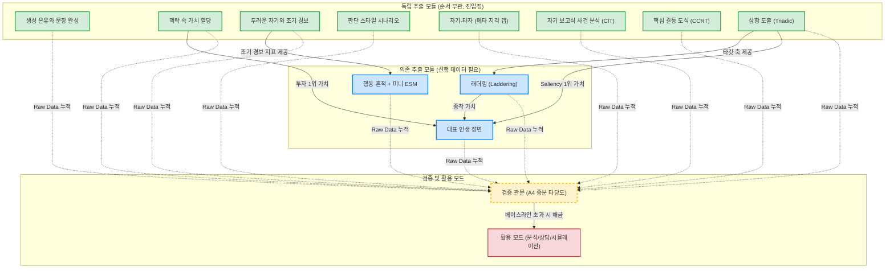

# 추출 파이프라인 의존성 도표 (Extraction DAG)

11가지 심리 추출 방법론과 검증 관문 간의 선후 관계(의존성)를 시각화한 DAG(Directed Acyclic Graph)입니다. 이 도표를 통해 어떤 데이터를 먼저 수집해야 다음 단계가 해금되는지 한눈에 파악할 수 있습니다.

## 핵심 요약
1. **독립 모듈 (초록색):** 아무런 선행 조건 없이 언제든 시작할 수 있습니다. 피로도가 낮은 은유/문장 완성을 먼저 시작하는 것이 권장됩니다.
2. **의존 모듈 (파란색):** 
   - `래더링`은 반드시 `삼항 도출`이 완료되어야 진입할 수 있습니다.
   - `대표 인생 장면`은 `삼항 도출`, `래더링`, `맥락 속 가치 할당` 중 하나라도 완료되어 **최상위 핵심 가치(앵커)**가 확보되어야 진입할 수 있습니다.
   - `미니 ESM`은 `두려운 자기`를 통해 조기 경보 지표가 설정되어야만 트래킹이 시작됩니다.
3. **검증 관문 (노란색):** 
   - 데이터가 쌓일 때마다 개별 문항 검증(봉인 예측 등)은 언제든 수행할 수 있습니다. 
   - 그러나 최종적으로 활용 모드를 오픈하기 위한 **증분 타당도 관문 통과**를 위해서는 "해당 도메인에서 삼항+래더링 최소 1세트 완료" 수준의 충분한 Raw Data 누적이 필수적입니다.
